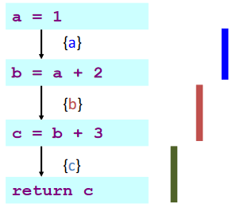
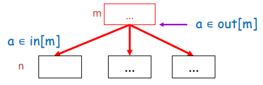
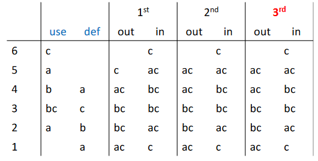

# 活跃变量分析

低级 IR 假定存在无限数量的“抽象寄存器”

- 有利于代码生成
- 但不利于在真实机器上执行：寄存器数目是有限的

寄存器分配的目标是将无限变量放入有限的机器寄存器中，这其中有许多寄存器分配算法，但也需要活跃变量分析

??? example "寄存器分配前瞻"
    考虑情况：存在三个变量 `a`、`b` 和 `c`，并假设目标机器只有一个寄存器 `r`，需要利用 `r` 来轮流存储这三个变量以完成如下计算

    ```
    a = 1
    b = a + 2
    c = b + 3
    return c
    ```

    我们需要计算在一个的给定程序位置哪个变量是“活动的”，也就需要本章的 *liveness* 信息给出变量的生存范围

    

    由上图可知，三个变量生存范围不重叠，因此所有三个变量都可以放入一个寄存器中，从而可以将代码重写为

    ```
    r = 1
    r = r + 2
    r = r + 3
    return r
    ```

## *Compiler Optimizations

在 Clang 中，不同优化等级对应的优化项如下：

|优化等级|简要说明|
|:-:|:-:|
|-Ofast|在 -O3 级别的基础上，开启更多激进优化项，该优化等级不会严格遵循语言标准|
|-O3|在 -O2 级别的基础上，开启了更多的高级优化项，以编译时间、代码大小、内存为代价获取更高的性能|
|-Os|在 -O2 级别的基础上，开启降低生成代码体量的优化|
|-O2|开启了大多数中级优化，会改善编译时间开销和最终生成代码性能|
|-O/-O1|优化效果介于 -O0 和 -O2 之间|
|-O0|默认优化等级，即不开启编译优化，只尝试减少编译时间|

通常来说，编译器优化包含一下几个方面

- 空间优化：减少内存使用
- 时间优化：减少执行时间
- 功耗优化：减少功耗


??? example "Compiler Optimizations"

    ```c
    int bar(){
        int a = 10*10;  //这里在编译时可以直接计算出100这个值，这叫做“常数折叠”
        int b = 20;     //这个变量没有用到，可以在代码中删除，这叫做“死代码删除”
        if (a>0){       //因为a一定大于0，所以判断条件和else语句都可以去掉
            return a+1; //这里可以在编译器就计算出是101
        }
        else {
            return a-1; //死分支，编译器会将该分支删除掉
        }
    }
    int a = bar();      //这里可以直接换成a=1
    ```

优化的粒度/范围上，包括

- Local
    - Work on a single basic block
    - Consider multiple blocks, but less than whole procedure
- Intraprocedural (or "global")
    - Create on an entire procedure
- Interprocedural (or "whole-program")
    - Operate on > 1 procedure, up to whole program
    - Sometimes, at link time (LTO, link time optimization)

为了实现上述优化，编译器会对代码做一些分析。常见的优化分析方法总结如下：


在每个范围内，编译器使用各种中间表示（IR）来执行分析和优化

- Local
    - E.g., dependence graph
- Intraprocedural (or global)
    - E.g., control-flow graph
- Interprocedural (or who-program)
    - E.g., Call graph

## Dataflow Analysis

### 控制流图

控制流图（Control Flow Graph, CFG）是一个有向图，在此处和 [基本块和 Traces](../ch8/#basic-blocks) 处不同

- 每个结点代表**一条语句**，且每个结点有
    - out-edges: 通向后继结点的边
    - in-edges: 来自前驱结点的边
    - pred[n]: 结点 n 的前驱
    - succ[n]: 结点 n 的后继
- 边代表控制流

??? exmaple "Control Flow Graph 结点属性"
    

    - out-edges of node 5: 5->6, 5->2
    - succ[5] = {2, 6}
    - in-edges of 2 are 5->2, 1->2
    - pred[2] = {1, 5}

语句可以是

- 赋值语句：`x := y op z` 或 `x := op z`
- 复制语句：`x := y`
- 分支语句：`goto L` 或 `if x relop y goto L`
- ...

??? example "Control Flow Graph 的例子"
    对于

    ```
    x := a + b;
    y := a * b;
    while (y > a) {
        a := a + 1;
        x := a + b;
    }
    ```

    其 CFG 如下

    

### 数据流分析

数据流分析（Dataflow Analysis）：一个框架，用于在不运行程序的情况下获取有关程序动态行为的信息

- Dataflow facts: liveness, types, ...
- 在优化/验证等领域中都有应用


为了计算 Dataflow facts (e.g. liveness)

- 在每个 CFG 结点处建立局部方程（local equations）
    - 对于 CFG 结点 n，我们写
        - in[n]：在结点的所有入边上都为真的事实
        - out[n]：所有出边上的事实均为真
    - 定义将信息从一个结点传输到另一个结点的传输函数（transfer functions）
- 求解方程以计算所需信息
    - 迭代更新 in[n] 和 out[n]

## Liveness Analysis

### Liveness Variables

我们称变量 `x` 在语句 `s` 中存在，如果

- 存在使用（use） `x` 的语句 `s'`
- 存在从 `s` 到 `s'` 的路径
- 该路径没有对 `x` 的中间赋值（assignment）/定义（definition）

??? example "Liveness Variables"
    

其中

- 定义（def）指对变量或临时变量的赋值
    - 一个变量的 def 指定义它的图结点集合
    - 一个图结点的 def 指它定义的变量集合
- 使用（use）指赋值右侧（或其他表达式中）出现了该变量
    - 一个变量的 use 指使用它的图结点集合
    - 一个图结点的 use 指它使用的变量集合

??? example "Uses and Defs"
    

    - def(3) = {c}, def(a) = {1, 4}
    - use(3) = {b, c}, use(a) = {2, 5}

变量的活跃信息可以用于

- 寄存器分配
- 冗余指令消除（删除未使用的赋值）
- IR 构建
    - 优化 SSA 构建
- 安全
    - 检测未初始化变量的使用
- ...

### Dataflow Equations for Liveness

#### （静态）程序分析的不可判定性

我们无法精确计算实时的变量活跃性，例如对于如下代码

```
1: x = 10; // is x live here?
2: f();
3: return x;
```

似乎 `x` 在第 1 行是活跃的，但是假设 `f()` 永远不会返回，那么 `x` 的值不被需要，即**如果 `f()` 可停机，则 `x` 是活跃的**

由于停止问题是不可判定的，因此精确的实时变量问题也是不可判定的。也因此，当我们进行（静态）程序分析时，我们通常会对有关程序的事实做近似

对于活跃变量分析，可以通过查找以后可能需要的所有变量来保守近似真实的活跃变量集合，通常可以表述为数据流分析问题

#### Liveness Facts

我们定义 Liveness Facts 的相关内容：

- Live on an edge：如果存在从该边（edge）到该变量 use，且不经过任何该变量 def 的一条有向路径，则该变量在该边上 live
    - 该变量稍后会被使用
    - 该变量在使用前不会被重新定义
- Live-in: 如果变量在该结点的任何入边上 live，则该变量在该结点上 live-in
- Live-out: 如果变量在该结点的任何出边上 live，则该变量在该结点上 live-out
- in[n]: 在结点 n 的 live-in 的集合
- out[n]: 在结点 n 的 live-out 的集合

此外，在这些定义的基础上定义活跃（liveness）分析的数据流方程

- 规则 1：如果 $a \in in[n]$，则对于 $\forall m \in pred[n]$，$a \in out[m]$
    - 如果一个变量是结点 n 的 live-in，则它在 n 的所有前驱结点上都是 live-out

    

- 规则 2：如果 $a \in use[n]$，则 $a \in in[n]$
    - 如果语句 n 使用变量 a，则 a 在 n 的入边上 live

    

- 规则 3：如果 $a \in out[n]$ 且 $a \notin def[n]$，则 $a \in in[n]$
    - 如果 a 在 n 之后 live 并且未被 n 定义，则 a 在 n 的入边上 live

    

基于上述规则，我们可以定义活跃分析的数据流方程

$$
\begin{aligned}
in[n] &= use[n] \cup (out[n] - def[n])\\
out[n] &= \bigcup_{s \in succ[n]} in[s]
\end{aligned}
$$

### Solving the Equations

基于上述的数据流方程，我们可以通过迭代更新 in[n] 和 out[n] 来计算活跃变量

!!! info "关于算法中使用的 use 和 def"
    use 和 def 的值可以直接从控制流图计算出来，因此在方程中作为已知量

<i id="Solving-Dataflow-Equations-for-Liveness"></i>
<pre class="pseudocode">
\begin{algorithm}
\caption{Solving Dataflow Equations for Liveness}
\begin{algorithmic}
\For{each $n$}
    \State $in[n] \gets \emptyset$; $out[n] \gets \emptyset$
\EndFor
\Repeat
    \For{each $n$}
        \State $in'[n] \gets in[n]$; $out'[n] \gets out[n]$
        \State $in[n] \gets use[n] \cup (out[n] - def[n])$
        \State $out[n] \gets \bigcup_{s \in succ[n]} in[s]$
    \EndFor
\Until{$in'[n] = in[n]$ and $out'[n] = out[n]$ for all $n$}
\end{algorithmic}
\end{algorithm}
</pre>

??? example "求解数据流方程-顺控制流"
    对于如下的控制流图

    

    可以先从其中获取 use 和 def 信息

    

    然后进行根据控制流方程进行第一轮迭代

    

    继续迭代，直到收敛

    

在上述的例子中，我们可以感觉到迭代速度较慢，这是因为信息从一个结点传播到另一个结点的唯一方式是使用 $out[n] = \bigcup_{s \in succ[n]} in[s]$，在这种**向后传播**的特性下，如果使用顺控制流的方向，迭代速度会较慢，因此可以

- 跟踪哪个结点的后继者发生了变化
- 以与控制流相反的顺序进行计算，并先算 out 再算 in

??? example "求解数据流方程-逆控制流"
    对于如下的控制流图

    

    迭代，直到收敛

    

### 总结

通过类似 [Algorithm 1](#Solving-Dataflow-Equations-for-Liveness) 迭代求解数据流方程时，计算顺序应遵循控制流的方向

而活跃分析时可以沿着控制流箭头向后流动，从 out 到 in 以加快计算

## 更多讨论

### 改进

- Ordering the nodes
- Use variants of Control-flow graph (CFG)
- Once a variable
- Careful selection of set representation
- Use other intermediate representation (IR)
- ...

#### Use different CFGs

基本块：只有一个前驱和一个后继的流图结点不是很有趣

- 可以将它们与它们的前任和后继合并
- 获得具有较少结点的图，其中每个结点代表一个基本块


#### Variants of the Calculation

一次计算一个变量：需要有关某变量的信息时，一次计算只计算该变量的数据流

#### Representations of Sets

更好地表示 in[n] 和 out[n]

- Bit Arrays（用于密集集）
    - 假设：程序中有 N 个变量，每个字 K 位
    - 每个集合 N 位
    - 两个集合的并集：对每个位置的相应位进行或运算。
    - 一次集合并集运算需要 N/K 次运算
- Sorted Lists（对于稀疏集）
    - 按任何全序键（例如变量名）排序
    - 联合操作：合并列表

当集合稀疏时（平均少于 N/K 个元素），排序列表表示速度更快。

### 理论结果

#### Decidability

没有哪个编译器能够完全理解每个程序中的所有控制流将如何工作，这可以通过停机问题证明

!!! theorem "停机问题"
    对于任何程序 $P$ 和输入 $I$，是否 $P$ 在输入 $I$ 上停机是不可判定的

!!! corollary "标号是否可达"
    对于任何程序 P 和 P 中的标号 L，没有程序 H'(P, L) 可以判断 P 的执行是否到达了标号 L

该定理并不意味着我们永远无法判断是否达到给定标号，只是没有一种**通用**算法可以**始终**（准确地）判断，所以我们必须采用保守的近似方法

#### Time Complexity

大小为 $N$ 的程序：最多 $N$ 个结点和最多 $N$ 个变量

- 每个集合并集操作都需要 $O(N)$ 时间
- For 循环：计算每个结点具有恒定数量的集合操作，即有 $O(N)$ 个结点 => $O(N^2)$ 时间
- Repeat 循环：所有输入和输出集的大小之和为 $2N^2$，这是重复循环可以迭代的最大数量
    - 因为输入和输出集是单调的，为了不停止每次必须增长一个且不能无限增长

综上，Worst-case 下，活跃变量分析的时间复杂度为 $O(N^4)$

在实际中，如有合适的计算顺序和优化，可以达到 $O(N)$ 到 $O(N^2)$ 的时间复杂度

#### Least Fixed Points


该片段中还有另一个程序变量 d 未使用，但是不影响 Y 也是一个解

数据流方程的任何解都是守恒近似的

- 如果在某些执行中结点 n 之后需要 a，我们可以确保在方程的任何解中都有 $a \in out[n]$
- 但反之则不然，$a \in out[n]$ 并不意味着它的值会真正被使用

!!! theorem "最小不动点"
    一数据流方程具有不止一个解，假设 X 是该方程的一个解且所有其他解都包含 X，则 X 是该方程的最小不动点（最小解）

    我们上述的算法始终计算最小不动点

### 静态与动态活跃度

- Static liveness (over-approximation，保守，一定包含所有活跃变量)
    - 如果存在从 n 到 a 的 use 的某个结点，且不经过 a 的 def 的某条控制流边路径，则变量 a 在结点 n 处 staticall live
- Dynamic liveness (under-approximation，不一定包含所有活跃变量)
    - 如果程序的某些执行从 n 转到 a 的 use 而不经过 a 的任何 def，则变量 a 在结点 n 处 dynamic live

如果 a 是 dynamic live 的，那么它也是 staticall live 的