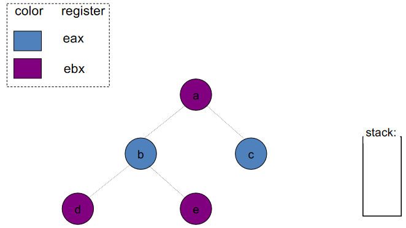
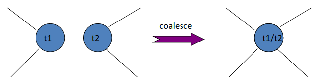
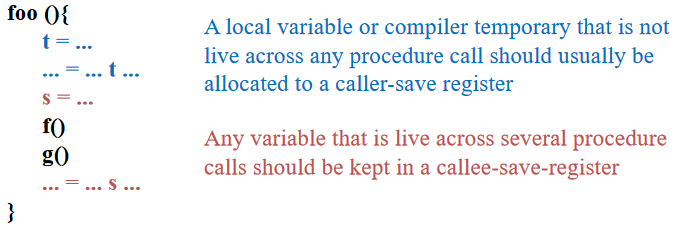

# 寄存器分配

## 简介

先前的 IR 使用了无限数目的虚拟寄存器，而实际物理机器上只有有限的物理寄存器（假定 K 个），因此在这一章中，我们将讨论如何将无限数量的虚拟寄存器映射到有限数量的物理寄存器上

- 使用 K 个或更少的寄存器生成正确的代码
- 最小化负载、存储和保存溢出值的空间
- 高效的寄存器分配
    - 通常要求 $O(n)$ 或 $O(n\log n)$

寄存器分配算法发展如下


以 LLVM 为例，有如下几种

- Basic：线性扫描算法的改进，使用启发式的顺序对寄存器进行生存期赋值
- Fast：顺序扫描每条指令，对其中的变量进行寄存器分配，当没有寄存器可以分配时，选择溢出代价最小的寄存器进行溢出操作
- Greedy：线性扫描算法的改进，Basic 分配器的高度优化的实现，合并了全局生存期分割，努力最小化溢出代码的成本
- PBQP：基于分区布尔二次编程（PBQP）的寄存器分配器，构造一个表示寄存器分配问题的 PBQP 问题，使用 PBQP 求解器解决该问题，并将该解决方案映射回寄存器分配

就寄存器分配算法的分类上，又可以分为

- "Naïve" register allocation
- Local register allocation
    - Basic block level
    - Does not capture reuse of values across multiple basic blocks
- Global register allocation
    - Function-level
    - Often uses the **graph-coloring** paradigm

全局寄存器分配通常使用图着色（graph-coloring）范例，也将是我们讲述的重点，通常步骤为

- 构建冲突/干扰图
- 找到图形的 K 着色，或小幅修改代码

## 图着色

### 干扰图

!!! question "目的问题"
    我们有一组临时寄存器（虚拟寄存器）a、b、c、... 和物理寄存器 r1、...、rk，如何将物理寄存器分配给临时寄存器

干扰：阻止 a 和 b 分配到同一寄存器的条件称为**干扰**，有两种类型

-  生命周期重叠
-  当 a 必须由无法访问寄存器 r1 的指令生成时，a 和 r1 会发生干扰

干扰图：将干扰关系表示为图，图中的节点是临时寄存器，边表示临时寄存器之间的干扰关系


??? example "干扰图的一个例子<i id="interference-graph-example"></i>"
    对于如下的指令序列（前为指令，后为活跃变量）

    ```
    1: b = a + 2        // a
    2: c = b * b        // a, b
    3: b = c + 1        // a, c
    4: return b * a     // a, b
    ```

    干扰图为

    

此外，需要特别注意 MOVE 指令，例如

```
t := s          (copy)
...
x := ... s ...  (use of s)
...
y := ... t ...  (use of t)
```

我们不需要为 s 和 t 使用单独的寄存器，因为它们包含相同的值，所以这种情况下不要添加干扰边 (s, t)。但是，如果在 MOVE 之后 s 或 t 的值发生了非二者之间 MOVE 的改变，应该添加干扰边

综上，为每个新定义添加干扰边的方式如下

- 在任何定义变量 a 的非移动指令 n 处，其中 out[n] = {b1, ..., bj}
    - 添加干扰边 (a, b1), ..., (a, bj)
- 在移动指令 a := c 处，其中 out[n] = {b1, ..., bj}
    - 为任何不为 c 的 bi 添加干扰边 (a, bi)

### 寄存器分配

!!! note "两个经典问题"
    Vertex Coloring：为每个顶点分配一种颜色，使得没有边连接具有相同颜色的顶点

    K-Coloring：最多使用k种颜色的着色

寄存器分配问题可以通过将图顶点映射到虚拟寄存器上、将颜色映射到物理寄存器上的方式，转化为 K-Coloring 问题，基本思路为

- 从活跃范围构建干扰图
- 给图上色，确保没有两个邻居具有相同的颜色
- 如果图表需要超过 K 种颜色，此时需要溢出（Spilling，后续会介绍）

??? example "寄存器分配的 K 着色"
    在 [干扰图的一个例子](#interference-graph-example) 中，我们可以使用 2 种颜色进行着色

    

但是因为“找到最小的 K 使得该图是 K 可着色的”是 NP-hard 问题，“K-Coloring：给定常数k，决定图是否可k着色”是 NP-complete 问题，图着色很困难，需要启发式（heuristics）算法

接下来我们将引入一种线性时间近似算法（Coloring By Simplification），该算法可以给出良好的结果，包含四个主要部分

- Build
- Simplify
- Spill
- Select

## Coloring By Simplification

### Build

构建干扰图（Build）：使用活跃分析构建干扰图

- 每个节点代表一个临时值
- 边 (t1，t2) 表示一对不能分配给同一寄存器的临时值
- 分析所有程序点

### Simplify

简化（Simplify）：使用简单的启发式为图表着色

- 假设图 G 包含一个节点 m，其邻居少于 K 个（K：机器寄存器的数量）
- 令 G' 为去除 m 得到的图（即 G' = G – {m}）
- 如果 G' 可以着色，那么 G 也可以（因为 m 的邻居取的颜色少于 K 个，所以 m 可以另取一个颜色）
- 这就会产生基于栈的着色算法
    - 重复删除（并压入栈）度数小于 K 的节点
    - 每次这样的简化都会降低其他节点的度数，从而带来更多的简化机会

!!! note "significant degree & insignificant degree"
    一个节点的**显著度数**（significant degree）是指其邻居的数量不小于 K，而**不显著度数**（insignificant degree）是指其邻居的数量小于 K


??? example "Simplify 算法压栈"
    

### Select

选择（Select）：假设简化有效，即在每一步中，我们可以选择一个节点来删除，直到图为空，那么我们可以开始为图中的节点分配颜色

- 从空图开始，通过重复从栈顶部弹出节点来重建原始图
- 添加节点时，为其指定颜色

??? example "Select 算法着色"
    

至此我们构建了这么一个算法


这样的算法快速（线性时间）的启发式算法，当失败时，并不意味着该图不可 K 着色，而是该算法无法找到 K 着色的解，此时需要溢出（Spilling）

### Spill

#### Possible/Potential Spill

假设在在简化过程中的某个时刻，图 G 仅具有显著度数的节点（即度数 ≥ K 的节点），此时之前的算法会失效


潜在溢出（Possible/Potential Spill）：我们可能需要选择图中的某个节点并决定将其表示在内存中，而不是寄存器中，这个过程称为溢出

这时，我们可以采用一种乐观的方式来解决这个问题，即 **Optimistic Coloring** [Chaitin-Briggs Algorithm]

- 对溢出影响的乐观近似：溢出的节点不会干扰图中剩余的任何其他节点
- 因此可以将其删除并压入栈中，并继续简化过程

??? example "Optimistic Coloring 算法"
    例如在上图中，我们可以选择 b 作为溢出的候选节点，压入栈中，继续简化过程

    

    直到所有压入栈中

    

    假设我们很乐观，不考虑失败的情况，继续使用上述算法，最终很幸运可以得到一个着色方案

    

#### Actual Spill

然而，乐观着色的启发式方法可能会失败，例如下图


实际溢出（Actual Spill）：因此，在 Select 的基础上，如果 Select 失败，即弹出的潜在溢出节点 n 的邻居被已经涂上了 K 种不同的颜色，此时需要进行实际溢出

- 将程序改写，即对于 n 对应的虚拟寄存器，将其存入内存中，在每次使用之前从内存中读取它，并且在每次定义之后将它存入内存
    - 以必须溢出变量 f 为例，通常将其储存在当前栈帧中（将此地址称为 fa）
    - 在每个使用 f 的操作之前，插入 fx := load fa
    - 每个定义 f 的操作之后，插入 store fx, fa
    - 这样溢出的临时对象将变成几个生命范围很小的新临时对象，使后续步骤中的新干扰图“更简单”
- 在这个重写的程序上重复整体算法，即重新计算活跃变量，重新运行着色算法

此时算法如下：


??? example "Actual Spill 加入后算法示例"
    以如下片段为例，K = 4

    ```
    Live in: k j
        g := mem[j+12]
        h := k-1
        f := g*h
        e := mem[j+8]
        m := mem[j+16]
        b := mem[f]
        c := e+8
        d := c
        k := m+4
        j := b
    Live out: d k j
    ```

    可构建如下干扰图

    

    中间过程省略，最终

    

### Coalesc

合并（Coalesce）：如果 MOVE 的源和目标之间的干扰图中没有边，那么移动指令可以被消除，并且源节点和目标节点合并为一个新节点，其边是被替换节点的边的并集



但随之带来一个问题：合并可能会增加干扰边的数量并使图形无法着色。因此，合并应保守些，加入如下两个启发性条件之一（看个人喜好）

- Briggs：ab 邻居中具有显著度数的节点的数量小于 K
    - 保证不会将 K 可着色图变得不可 K 着色，因为简化阶段已从图中删除了所有不显著节点
- George：a 的每个邻居要么是 b 的邻居，要么度数小于 K（即不显著）
    - 保证不会将 K 可着色图变得不可 K 着色，因为如果 t 已经干扰 b，则 (a, t) 和 (b, t) 将合并为 (ab ，t)，不会导致度数的增加；如果 t 的度数不显着，则 t 将被简化阶段删除，也不会导致阶数的增加

加入合并之后，构建干涉图的过程中 MOVE 相关的节点之间用虚线连接，且简化过程中不会再去简化和 MOVE 有关的节点

### Freeze

冻结（Freeze）：如果简化和合并都不适用，我们会寻找低度数的 MOVE 相关节点，冻结该节点所涉及的 MOVE 关系

- 我们放弃了合并这些举措的希望
- 这些节点被认为与移动无关

最后恢复简化和合并

### 最终算法

最终算法如下


抑或表示为


- 构建 Build
    - 构建干涉图
    - 将每个节点分类为移动相关（用虚线连接）或非移动相关
        - 与移动相关的节点是移动指令的源或目标节点
- 简化 Simplify
    - 一次一个，从图中删除与移动无关的低度（< K）节点
- 合并 Coalesce
    - 对简化图执行保守合并
    - 生成的节点不再与移动相关，并将可用于下一轮简化
    - 重复简化和合并，直到只剩下显着度或移动相关的节点
- 冻结 Freeze
    - 如果简化和合并都不适用，我们会寻找低度的移动相关节点，冻结该节点所涉及的动作
        - 我们放弃了合并这些举措的希望
        - 这些节点被认为与移动无关
    - 恢复简化和合并
- 溢出 Spill
    - 如果没有低度节点，我们选择一个潜在溢出的显着度节点并将其压入栈
- 选择 Select
    - 弹出整个栈，分配颜色
- 改写/实际溢出 Rewrite/Actual Spill
    - 如果有任何实际溢出，重建图表并重新运行算法

??? example "最终算法的一个例子"
    以如下片段为例，K = 4

    

### 预着色节点

一些实际寄存器用于特殊目的，如

- 栈指针、帧指针
- 参数寄存器
- 返回值、返回地址
- ...

对于每个这样的寄存器，需要将特定临时值永久绑定到该寄存器

预着色（precolored）：此类临时材料是预着色的

- 每种颜色只有一个预着色节点
- 预着色节点都互相干扰

对于这些预着色节点，有如下特性：

- 可以给普通的临时值分配和预着色节点相同的颜色，只要二者不干扰即可
    - 也可以看作标准调用约定寄存器可以在过程中作为临时变量重用
- 无法简化预着色节点
    - 否则影响其正常功能
- 不可将预着色的节点溢出到内存中
    - 机器寄存器根据定义是寄存器，不能溢出到内存中

着色算法通过调用简化、合并和溢出，直到只剩下预着色的节点

#### 机器寄存器的临时副本

由于预着色节点不会溢出，前端必须小心保持其生命范围较短，可以使用的方式是通过生成 MOVE 指令将值移入和移出预着色节点，例如假设 r7 是 callee-save 寄存器


如果该功能中有寄存器压力（对寄存器要求较高），则 t231 溢出；否则 t231 将与 r7 合并并且 MOVE 指令将被消除

#### Caller-Save 和 Callee-Save 寄存器



如果变量 x 在过程调用中处于活动状态

- 那么它会干扰所有 caller-save（预着色）寄存器
- 并且它会干扰为 callee-save 寄存器创建的所有新临时变量（例如 t231）
- 将会发生溢出

## 总结

寄存器分配包含三个主要部分

- Liveness analysis
- Graph coloring
- Program transformation (move coalescing and spilling)

通过图着色进行寄存器分配

- Build
- Simplify
- Coalesce
- Freeze
- Spill
- Select
- Rewrite

??? example "将所有内容放在一起示例（K=3）"
    对于如下的程序

    ```c
    int f(int a, int b) {
        int d = 0;
        int e = a;
        do {
            d = d + b;
            e = e - 1;
        } while (e > 0);
        return d;
    }
    ```

    和其对应的 IR

    ```
    enter:  c <- r3
            a <- r1
            b <- r2
            d <- 0
            e <- a
    loop:   d <- d + b
            e <- e – 1
            if (e > 0) goto loop
            r1 <- d
            r3 <- c
            return (r1, r3 live out)
    ```

    假定机器有 3 个寄存器，其中 r1 r2 是 caller-save，r3 是 callee-save

    没有机会进行简化或冻结（所有非预着色节点的度数 >= K），我们必须溢出一些节点，选择度数最多但是使用最少的节点

    
    
    - 溢出节点 c
    - 不可能进行简化
        - 所有非预着色节点都与移动相关
    - 执行合并

    

    - 继续执行合并 r1 和 ae
    - 接下来 r1ae 和 d 有干扰，不可以合并
        - 我们将其从进一步的考虑中删除
        - d 不再被视为与移动相关

    

    - 简化 d，只留下预着色节点

    

    - 进行选择，从栈中弹出节点并为其指定颜色
        - 选择 d，指定颜色 r3
        - 节点 a、b、e 已通过合并指定颜色
        - 弹出 c：c 变成实际溢出

    

    - 改写
        - 存在溢出，必须重写程序以包含溢出指令

    ```
    enter:  c1 <-r3
            M[cloc] <- c1
            a <- r1
            b <- r2
            d <- 0
            e <- a
    loop:   d <- d + b
            e <- e – 1
            if (e > 0) goto loop
            r1 <- d
            c2 <- M[cloc]
            r3 <- c2
            return
    ```

    - 接着重新运行算法

    

    - 选择
        - 从栈中弹出并为 d 选择颜色 r3
        - 所有其他节点均已合并或预着色

    

    - 使用寄存器分配重写程序

    

    - 删除任何源和目标相同的移动指令

    