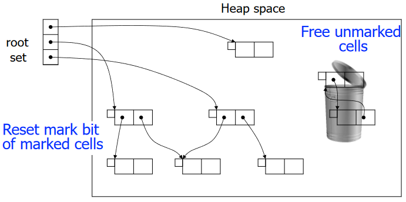
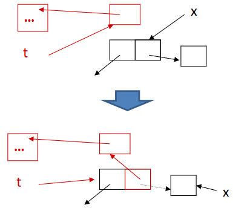

# 垃圾回收

## 简介

### Runtime System

运行时系统（Runtime System）：语言隐式假定且程序中未描述的内容

- POSIX 信号的处理
    - POSIX = Portable Operating System Interface
- 自动核心管理（例如，工作窃取（work stealing））
- 虚拟机执行（即时编译（just-in-time compilation））
- 类加载
- 自动内存管理（例如，垃圾处理（garbage collection））
- ...

也被称为 language runtime 或 runtime

### 内存的主要区域

- 静态区域（Static area）
    - 在编译时分配
- 运行时栈（Run-time stack）
    - 活动记录
    - 用于管理函数调用和返回
- **堆（Heap）**
    - 动态分配的对象和数据结构
    - 如 C 中的 malloc，Java 中的 new

### 什么是垃圾回收

垃圾（Garbage）：已分配但不再使用的堆存储


垃圾回收（Garbage collection）：自动释放程序不再使用的存储空间

- 是运行时系统的一部分
- LISP 中的首次应用（McCarthy 1960）

垃圾回收有两个阶段

- 垃圾检测（Garbage detection）：查找哪些对象还活着，哪些对象死了
- 垃圾回收（Garbage reclamation）：释放死对象

完美的垃圾回收应具有如下属性

- 安全（Safe）：只回收垃圾
- 完整（Complete）：几乎所有垃圾都被收集
- 时间和速度开销（Low overhead）低
- 暂停时间（pause time，程序等待垃圾回收的时间）短
- 并行（Parallel）：能够利用额外的核心
- 简单（Simple）
- 易于使用收集的可用空间
- ...

!!! warning "这些都是困难且常常相互冲突的要求！"

### 如何垃圾回收

!!! question "存储单元 M 什么时候不再使用"
    令 P 为任何不使用 M 的程序，构建新程序 `Execute P; Use M;`，则

    M 使用 $\Leftrightarrow$ P 终止

    这就变成了一个停机问题，即“最后使用/不再使用”是无法确定的

一般来说，一个对象是否是垃圾是无法判定的，所以需要依赖保守的近似，这样 GC 才是安全的（只回收垃圾）。想法是使用可达性信息作为“近似值”

垃圾回收的技术有

- 引用计数（Reference counting）
    - 直接跟踪活动单元
    - 每当分配堆块时就会进行 GC
    - 不检测所有垃圾
- 追踪（Tracing）
    - 当内存申请失败时，GC 接管并识别存活的对象（live cells）
    - Mark-sweep
    - Copy collection
- 现代技术：generational GC 等

### 基础数据结构

有向图

- 结点：程序变量和堆分配记录
- 边：指针
    - p 指向记录 y（令 y 为记录的名称/标识符），一般意味着 p 的值是 y 的地址
    - 在虎书中，p 可以指代**指针**或其**指向的记录**，要根据上下文来判断


## Mark-and-Sweep

### 算法

Mark-and-Sweep 算法的基本思想是

- Mark
    - 从根结点（程序变量）开始搜索图表
    - 标记所有搜索到的结点
- Sweep
    - 通过线性扫描扫描整个堆，将未标记的结点放入空闲列表（freelist）
    - 取消标记已标记的结点

其中空闲列表（freelist）是

- 内存管理器必须知道堆的哪些部分是空闲的和已分配的
- 空闲块存储在空闲列表（堆块的链表）中
- 被多种 GC 算法使用（例如标记和清除）


<i id="Mark-and-Sweep-Mark"></i>
<pre class="pseudocode">
\begin{algorithm}
\caption{Mark-and-Sweep Mark}
\begin{algorithmic}
\For{each root $v$}
    \State DFS($v$)
\EndFor
\Function{DFS}{$x$}
    \If{$x$ is a pointer into the heap}
        \If{record $x$ (the record pointed to) is not marked}
            \State mark $x$
            \For{each field $f_i$ of record $x$}
                \State DFS($x.f_i$)
            \EndFor
        \EndIf
    \EndIf
\EndFunction
\end{algorithmic}
\end{algorithm}
</pre>

<i id="Mark-and-Sweep-Sweep"></i>
<pre class="pseudocode">
\begin{algorithm}
\caption{Mark-and-Sweep Sweep}
\begin{algorithmic}
\State $p \gets$ first address in heap
\While{$p < $ last address in heap}
    \If{record $p$ is marked}
        \State unmark $p$
    \Else
        \State let $f_1$ be the first field in $p$
        \State $p.f_1 \gets$ freelist
        \State freelist $\gets p$
        \State $p \gets p +$ (size of record $p$)
    \EndIf
\EndWhile
\end{algorithmic}
\end{algorithm}
</pre>

垃圾回收后，程序恢复执行，每当它想要堆分配新记录时，它都会从空闲列表中获取一条记录，并当 **freelist 为空**时**再次进行垃圾回收**

??? example "Mark-and-Sweep"
    

    

#### 成本

假设

- $H$：堆大小
- $R$：可达数据大小

那么 GC 的时间

- 标记：与可达数据量成正比
- 扫描：与堆大小成正比
- 总时间：$c_1R + c_2H$

GC 用 $H - R$ words 补充空闲列表，那么均摊开销（Amortized cost）为 $\frac{c_1R + c_2H}{H - R}$，如果 $R$ 很接近 $H$，那么均摊开销会很大

### 优化

#### Explicit Stack

因为 DFS 算法是递归的

- 极端情况：N stack frames for an N-elem linked list
- 活动记录栈的长度会很长，可能会比整个堆还大
- 很容易导致栈溢出

解决方法是使用显式栈（Explicit stack）而不使用递归

<i id="Mark-and-Sweep-Mark-Explicit-Stack"></i>
<pre class="pseudocode">
\begin{algorithm}
\caption{Mark-and-Sweep Mark with Explicit Stack}
\begin{algorithmic}
\Function{DFS}{$x$}
    \If{$x$ is a pointer into the heap and record $x$ is not marked}
        \State mark $x$
        \State $t \gets 1$
        \State stack[$t$] $\gets x$
        \While{$t > 0$}
            \State $x \gets$ stack[$t$]; $t \gets t - 1$
            \For{each field $f_i$ of record $x$}
                \If{$x.f_i$ is a pointer and record $x.f_i$ is not marked}
                    \State mark $x.f_i$
                    \State $t \gets t + 1$; stack[$t$] $\gets x.f_i$
                \EndIf
            \EndFor
        \EndWhile
    \EndIf
\EndFunction
\end{algorithmic}
\end{algorithm}
</pre>

算法中

- t 是栈顶指针
- stack 是显式栈（worklist）

这样可以用 H words 的空间代替 H 个活动记录，节省空间

#### Pointer Reversa

虽然 [Explicit Stack](#Mark-and-Sweep-Mark-Explicit-Stack) 优化了空间，但辅助栈内存与正在收集的堆成正比，还是可能会导致栈溢出。因此，可以使用 **Deutsch-Schorr-Waite (DSW)** 指针反转

- 不要使用显式栈进行 DFS
- 重用图组件来协助回溯

其基本思想是将 DFS 栈存储在图本身，即当搜索过程中遇到新记录时

- 标记该记录
- 更改记录中的指针以指向 DFS 父记录
- 当我们无法再深入时，沿着反向链接返回，并恢复原指针

观察 [Mark-and-Sweep Mark](#Mark-and-Sweep-Mark) 中的 DFS 函数，我们可以指导将字段 x.fi 的内容压入栈后，算法将不再使用 x.fi。因此 x.fi 可用于存储栈的一个元素，当栈出栈时，恢复 x.fi 的原始值

<i id="Mark-and-Sweep-Mark-Pointer-Reversal"></i>
<pre class="pseudocode">
\begin{algorithm}
\caption{Mark-and-Sweep Mark with Pointer Reversal}
\begin{algorithmic}
\Function{DFS}{$x$}
    \If{$x$ is a pointer into the heap and record $x$ is not marked}
        \State $t \gets$ nil
        \State mark $x$; done[$x$] $\gets 0$
        \While{true}
            \State $i \gets$ done[$x$]
            \If{$i < \#$ of fields in record $x$}
                \State $y \gets x.f_i$
                \If{$y$ is a pointer into the heap and record $y$ is not marked}
                    \State $x.f_i \gets t$; $t \gets x$; $x \gets y$
                    \State mark $x$; done[$x$] $\gets 0$
                \Else
                    \State done[$x$] $\gets i + 1$
                \EndIf
            \Else
                \State $y \gets x$; $x \gets t$
                \If{$x = $ nil} \Return
                \EndIf
                \State $i \gets$ done[$x$]
                \State $t \gets x.f_i$; $x.f_i \gets y$
                \State done[$x$] $\gets i + 1$
            \EndIf
        \EndWhile
    \EndIf
\EndFunction
\end{algorithmic}
\end{algorithm}
</pre>



### 总结

Mark-and-Sweep 算法的优缺点

- 优点
    - 垃圾（数目）少则效率高
    - 能够收集循环引用
    - GC 期间不会移动对象/记录
- 缺点
    - 垃圾（数目）多时效率低
    - 正常执行流必须暂停
    - 导致堆碎片（fragmentation）
        - 缓存未命中、页面抖动、更复杂的分配等问题

??? note "关于碎片"

    - 外部碎片（External fragmentation）
        - 程序想要分配大小为 n 的记录，并且有许多小于 n 的空闲记录，但没有一个大小合适  
        
    - 内部碎片（Internal fragmentation）
        - 程序使用了太大的记录而没有对其进行分割，因此未使用的内存位于记录内部而不是外部  
        

## Reference Counting

### 算法

引用计数（Reference Counting）：与其等待内存耗尽，不如尝试在没有指针指向该对象（无法再访问该对象）时收集该对象

- 跟踪每个对象的指针数量（引用计数）
    - 每个赋值操作都会操纵引用计数
- 每当有新引用时数据结构建立后，增加引用计数
    - 每当 p 存储到 x.fi 中时（即 x.fi = p）
    - p 的引用计数增加，并且 x.fi 先前指向的引用计数减少
- 当引用计数为 0 时，该对象是不可达的垃圾，进行回收
    - r 被放入空闲列表中
    - r 指向的所有其他记录的引用计数都会递减

??? example "Reference Counting"
    

    

    

### 总结

引用计数的优缺点

- 优点
    - 开销是增量的
        - 单元管理（Cell management）与程序执行交错，因此没有“停止并收集（stop-and-collection）”的现象
    - 相对容易实现
    - 可以与手动内存管理共存
    - 空间局部性良好
        - 虚拟内存页面的访问模式不比程序差，因此不会出现过多的分页
    - 可以立即重新使用释放的空间
        - 如果 RC == 0，则放回空闲列表
- 缺点
    - 垃圾间存在引用循环时，不能被回收
        - 引用循环是一组循环相互引用的对象
        - 引用计数跟踪**引用**的数量，而不是**可到达引用**的数量  
        
    - 增加引用计数的代价非常昂贵，效率相对较低
        - 为了实现 x.fi <- p，程序必须执行
            ```
            z <- x.fi
            c <- z.count
            c <- c - 1
            z.count <- c
            if c = 0 call putOnFreeList(z)
            x.fi <- p
            c <- p.count
            c <- c + 1
            p.count <- c
            ```
        - 尽管数据流分析可以消除一些增减，但这个问题仍然存在

## Copying Collection

### 大体算法

复制收集（Copying Collection）：基本思想是使用 2 个堆

- from-space：程序使用的空间
- to-space：在 GC 之前未使用的空间

垃圾回收的过程为

- 当 from-space 耗尽时，遍历 from-space，将所有**可达结点**复制到 to-space
    - 这样就抛开了垃圾
    - 在 to-space 中分配新记录很容易（开始时 next 在 to-space 开头）：p = next, next = next + n
    - 所有可达结点都在to-space的开头附近，因此不存在碎片问题
- 当下一次到达 limit 时，调换两个空间的角色，重新进行垃圾回收


### 过程细化 - Pointer Forwarding

在复制过程中，我们还需要解决指针指向问题（因为复制之后指针还是指向 from-space 的旧的记录）

因此，当我们复制记录时，我们在 from-space 中旧副本中存储指向 to-space 新副本的转发指针，当我们稍后使用转发指针到达记录时，我们知道它已经被复制，并可以从中得到新的地址


<i id="Copying-Collection-Forward"></i>
<pre class="pseudocode">
\begin{algorithm}
\caption{Copying-Collection Forward}
\begin{algorithmic}
\Function{Forward}{$p$}
    \If{$p$ points to from-space}
        \If{$p.f_1$ points to to-space}
            \Return $p.f_1$
        \Else
            \For{each field $f_i$ of $p$}
                \State next.$f_i \gets p.f_i$
            \EndFor
            \State $p.f_1 \gets$ next
            \State next $\gets$ next + size of record $p$
            \Return $p.f_1$
        \EndIf
    \Else
        \Return $p$
    \EndIf
\EndFunction
\end{algorithmic}
\end{algorithm}
</pre>

### Cheney's Algorithm

将 to-space 划分为三个连续区域

- 已复制（Copied）：记录已复制，但我们尚未查看记录里的指针
- 复制和扫描（Copied and scanned）：记录被复制并且我们 Forward 了记录中的所有指针
- 空闲（Empty）：未使用的空间


由此可以引出 Cheney's Algorithm (Breadth-first copying garbage collection)：使用广度优先搜索遍历可达数据，从 from-space 复制到 to-space

- BFS 队列：scan 和 next 之间的区域
- 当 scan 赶上 next 时，算法完成

<i id="Cheney-Algorithm"></i>
<pre class="pseudocode">
\begin{algorithm}
\caption{Cheney's Algorithm}
\begin{algorithmic}
\State scan $\gets$ next (beginning of to-space)
\For{each root $r$}
    \State $r \gets$ Forward($r$)
\EndFor
\While{scan < next}
    \For{each field $f_i$ of record at scan}
        \State scan.$f_i \gets$ Forward(scan.$f_i$)
    \EndFor
    \State scan $\gets$ scan + size of record at scan
\EndWhile
\end{algorithmic}
\end{algorithm}
</pre>

??? example "Cheney's Algorithm"
    

#### 局限性

在具有虚拟内存或内存高速缓存的计算机系统中，良好的引用局部性非常重要，因为在程序获取地址 a 后，内存子系统预计很快会获取 a 附近的地址，因此对附近的地址进行缓存，但是通过广度优先复制的指针数据结构的引用局部性较差：如果地址 a 处的记录指向地址b处的另一条记录，则 a 和 b 很可能相距很远

与之相反，深度优先复制提供了更好的局部性，但深度优先复制需要指针反转，这不方便且缓慢

### 混合算法

混合的、部分深度优先和部分广度优先的算法可以提供可接受的局部性，基本思想是使用广度优先复制，但每当复制一个对象时，看看是否可以在它附近复制一些子对象

<i id="Copying-Collection-Forward-Hybrid"></i>
<pre class="pseudocode">
\begin{algorithm}
\caption{Copying-Collection Forward Hybrid}
\begin{algorithmic}
\Function{Forward}{$p$}
    \If{$p$ points to from-space}
        \If{$p.f_1$ points to to-space}
            \Return $p.f_1$
        \Else
            \State Chase($p$); \Return $p.f_1$
        \EndIf
    \Else
        \Return $p$
    \EndIf
\EndFunction
\Function{Chase}{$p$}
    \Repeat
        \State $q \gets$ next
        \State next $\gets$ next + size of record $p$
        \State $r \gets$ nil
        \For{each field $f_i$ of record $p$}
            \State $q.f_i \gets p.f_i$
            \If{$q.f_i$ points to from-space and $q.f_i.f_1$ does not point to to-space}
                \State $r \gets q.f_i$
            \EndIf
        \EndFor
        \State $p.f_1 \gets q$
        \State $p \gets r$
    \Until{$p = $ nil}
\EndFunction
\end{algorithmic}
\end{algorithm}
</pre>

### 总结

复制收集的优缺点

- 优点
    - 简单
        - 不需要栈或指针反转
    - 运行时间与 # 个活动对象成正比
    - 空闲空间是连续的
        - 自动压缩以消除碎片
    - 成为许多后来算法的基础
- 缺点
    - 一半的内存被浪费了
    - 局部性较差（至少对于 Cheney's Alg.）
    - 需要精确的类型信息（指针或非指针）

## Interface to the Compiler

虽然垃圾收集器是“运行时”的一部分，但垃圾收集语言的编译器需要通过以下方式与垃圾收集器交互：

- 生成分配记录的代码
- 描述每个垃圾收集周期的根位置
- 描述堆上数据记录的布局
- 生成指令以实现读或写屏障（对于某些版本的增量收集）
- ...

特别适用于：

- 函数式语言（updating is discouraged）
- 内存密集型应用程序（access once for each）

Empirical measurements: one in seven instructions is a store! We have at most 1/7 word of allocation per instruction

### Fast Allocation

创建堆记录需要相当大的成本，所以应使用复制集合（因为它很快）

- 分配空间是连续的空闲区域
- 下一个空闲位置是 next 并且
- 区域的末尾是有限的

不优化时，分配大小为 N 的记录的步骤如下

1. 调用分配函数
2. 检查 next + N < limit 是否满足，如果不满足，调用 GC
3. 将 next 移动到 result
4. 清除 M[next, next + N - 1] 的内容
5. next <- next + N
6. 返从分配函数返回

A. 将 result 移动到一些计算上有用的位置（computationally useful place）  
B. 将有用的值存储到记录中

其中 A 和 B 不是分配开销

我们可以使用如下的优化

-  应通过内联扩展分配函数来消除步骤 1 和 6
-  将步骤 3 与步骤 A 结合起来，通常可以消除步骤 3
-  步骤 4 可以通过步骤 B 的储存来消除
-  第 2 步和第 5 步无法消除，但它们可以在多个分配之间共享

那么就变成了

2\. 检查 next + N < limit 是否满足，如果不满足，调用 GC  
A. 将 result 移动到一些计算上有用的位置（computationally useful place）  
5\. next <- next + N  
B. 将有用的值存储到记录中

通过将 next 和 limit 保存在寄存器中，步骤 2 和 5 总共可以用三个指令完成。通过这种技术组合，分配记录以及最终对其进行垃圾收集的成本可以降低到大约四个指令

### Describing Data Layouts

收集器需要处理不同类型的记录

- 例如 [Cheney's Algorithm](#Cheney-Algorithm) 中对 scan 增加时，需要知道记录的大小
- 例如 [Copying-Collection Forward](#Copying-Collection-Forward) 中，需要知道传入对象是不是指针（只需要对指针进行 Forward）

因此对于静态类型语言，例如 Tiger 或 Pascal，或者对于面向对象语言，例如 Java，可以让每个对象的第一个 word 指向特殊的类型或类描述符（type- or class-descriptor）记录

类型或类描述符（type- or class-descriptor）

- 包含对象的总大小
- 包含每个指针字段的位置
- 由编译器在语义分析阶段生成


### Describing Roots (Pointer Map)

GC 从根（root）开始追踪，但是根的位置是不确定的

一个简单的实现是基于猜测的解决方案（近似 GC）：，扫描堆栈/寄存器，查找所有看起来像指针的内容，但是某些整数也可能被视为指针

为了实现精确 GC，Tiger 的解决方案是构建指针映射

- 所有映射均由编译器生成
- 编译器在编译期间知道哪个 temp 是指针

其中，指针映射包括

- 堆栈上的指针
- callee-save 寄存器中的指针

GC 线程将使用这些指针进行遍历

在哪里插入指针映射取决于 GC 何时触发

- 分配时：插入到 alloc_record 之前
- 对于递归调用：为所有函数调用插入


为了找到所有根，收集器从堆栈顶部开始向下扫描

- 每个返回地址都是描述下一帧的指针映射条目的键
- 在每个帧中，收集器 mark（或 forward，如果是 copying collection 的话）来自该框架中的指针

此外，callee-save 寄存器需要特殊处理

- 假设函数 f 调用 g，g 又调用 h
- g 的指针映射必须描述其哪些 callee-save 寄存器包含调用 h 时的指针以及哪些是从 f 继承的。

### Derived Pointers

有时，编译后的程序有一个指针指向堆记录的中间，或者指向记录之前或之后

例如，对于 a[i-2000]（或者表示为 M[a-2000+i]）

```
t1 <- a - 2000
t2 <- t1 + i
t3 <- M[t2]
```

如果 a[i-2000] 出现在循环内部，编译器可能会选择将 t1 <- a – 2000 提升到循环外部，以避免在每次迭代中重新计算。此时，如果循环还包含分配，并且在 t1 处于活动状态时发生垃圾收集，那么由于 t1 不指向对象的开头或更糟糕地指向不相关的对象，可能导致 a 被错误地回收或其他错误

为了让 GC 能够认识到 t1 是从基指针（base pointer）a 派生（derived）出来的，指针映射必须识别每个派生指针并记录其基指针，并且当收集器将 a 重定位到地址 a' 时，它必须调整 t1 指向地址为 t1 + a' - a

也就是说，只要 t1 处于活动状态，a 就必须保持活动状态，且二者保持对应关系，例如

```
let
    var a := int array[100] of 0
in
    for i := 1930 to 1990
        do f(a[i-2000])
end
```

```
r1 <- 100
r2 <- 0
call alloc
a <- r1
t1 <- a – 2000
i <- 1930
L1 : r1 <- M[t1 + i]
call f
L2 : if i ≤ 1990 goto L1
```

临时 a 在赋值给 t1 后看起来不再活跃，但是与返回地址 L2 关联的指针映射将无法充分解释 t1，因此，派生指针隐式地使其基指针保持活动状态

## 总结

垃圾收集器是任何现代语言实现中复杂而迷人的一部分，不同的收集算法各有利弊

- 显式 MM、引用计数、复制、标记扫描
- 所有方法，包括显式 MM 都有成本
- 优化使分配更快，GC 时间、空间和延迟要求可接受
- 阅读 Appel 第 13 章并能够分析、比较和对比不同的 GC 机制

另外 Allocation 有

- Linear allocation  
    
- Freelist allocation  
    