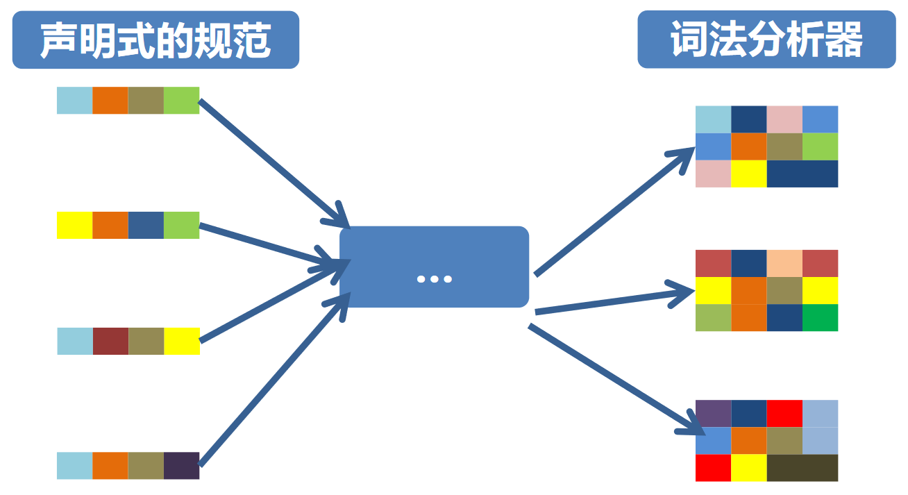

# 词法分析

## 概述

程序是以**字符串**的形式传递给编译器的，词法分析的作用在于：

- 将输入的字符串识别为**有意义的字串**
- 过滤注释、空格
- ...

基于此，有两个基本概念：

- Token
  - 类似于英语中的 noun, verb, adjective, ...
  - 在编程语言中 keyword, identifier, operator, ...
- Lexeme
  - 是 Token 集合中的一个元素，类似于 `if` `else`
  - 可以称为 Token 的一个实例

??? example "示例：Token 与 Lexeme"
    对于如下的程序：
    ```c
    if (i == j) {
        printf("i equals j");
    } else {
        num = 5;
    }
    ```
    我们从中看出
    
    |Token|Lexeme|Token 的非形式化定义|
    |:-:|:-:|:-:|
    |if|if|字符 i, f|
    |else|else|字符 e, l, s, e|
    |relation|<, <=, =, ...|< 或 <= 或 = 或 ...|
    |id|sum, count, D5|由字母开头的字母数字串|
    |number|5, 3.1, 2.8e12|任何数值常熟|

??? example "示例：字符流 -> Token 流"
    对于如下的程序：
    ```c
    float match0(char *s) /* find a zero */
    {
        if (!strncmp(s, "0.0", 3))
        return 0.;
    }
    ```
    其中的 Token 流为：
    ```
    FLOAT       ID(match0) LPAREN CHAR   STAR ID(s)
    RPAREN      LBRACE     IF     LPAREN BANG
    ID(strncmp) LPAREN     ID(s)  COMMA  STRING(0.0)
    COMMA       NUM(3)     RPAREN RPAREN RETURN
    REAL(0.0)   SEMI       RBRACE EOF
    ```

对于词法分析器的构造，可以通过定义声明式的规范，然后使用工具自动生成。



可以看作：
```
Program = Specification + Implementation
              "What"          "How"
```

## 正则表达式

??? question "如何形式化地描述词法分析器的规范？"
    这就引入了正则表达式的概念。

### 前置知识

#### 字母表和串

字母表（alphabet）是**符号**的**有限集合**

- 包括字母、数字、标点符号等

串（string, word）是字母表中**符号**的**有限序列**

- 串 $s$ 的**长度**，通常记作 $|s|$，指代 $s$ 中符号的个数
- **空串**是长度为 0 的串，通常记作 $\epsilon$

有如下的运算定义：

- 连接（concatenation）
    - $y$ 附加到 $x$ 后形成的串 $xy$
    - 例如，$x = abc$, $y = def$，则 $xy = abcdef$
    - 空串是连接运算的单位元，即对于任何串 $s$ 都有 $εs = sε = s$
- 幂（power）
    - $s^n$ 是 $n$ 个 $s$ 的连接
    - $s^n=\left\{\begin{matrix} &ε &, n=0 \\ &s^{n-1}s &, n \ge 1 \end{matrix}\right.$
    - 例如，$s = abc$，则 $s^3 = abcabcabc$

#### 语言

语言（language）：字母表 $\Sigma$ 上的一个串集

- 例如，$\{\epsilon,0,00,000,...\}$, $\{s\}$, $\emptyset$
- 属于语言的串，可以称为句子（sentence）

语言的运算：

- 并（union）
    - $L_1 \cup L_2 = \{s | s \in L_1 \text{ or } s \in L_2\}$
- 连接（concatenation）
    - $L_1L_2 = \{xy | x \in L_1 \text{ and } y \in L_2\}$
- 幂（power）
    - $L^n = \left\{\begin{matrix} &\{ε\} &, n=0 \\ &L^{n-1}L &, n \ge 1 \end{matrix}\right.$
- Kleene 闭包（Kleene closure）
    - $L^* = \bigcup_{i=0}^{\infty}L^i$
- 正闭包（positive closure）
    - $L^+ = \bigcup_{i=1}^{\infty}L^i$

### 正则表达式的定义

正则表达式（Regular Expression, RE）是用来描述、匹配文中全部匹配指定格式串的表达式，如 $a$ 匹配 $a$，$a|b$ 匹配 $a$ 或 $b$

正则表达式 $r$ 定义正则语言，记为 $L(r)$，有如下性质：

- $\epsilon$ 是一个 RE，$L(\epsilon) = \{\epsilon\}$
- 如果 $a \in \Sigma$，则 $a$ 是一个 RE，$L(a) = \{a\}$
- 假设 $x$ 和 $y$ 都是 RE，分别表示语言 $L(x)$ 和 $L(y)$
    - $x|y$ 是一个 RE，$L(x|y) = L(x) \cup L(y)$
    - $xy$ 是一个 RE，$L(xy) = L(x)L(y)$
    - $x^*$ 是一个 RE，$L(x^*) = (L(x))^*$
    - $(x)$ 是一个 RE，$L((x)) = L(x)$
- 优先级：$() > * > xy > |$

### 正则表达式的定律

一些正则表达式的定律如下：

|定律|描述|
|:-:|:-:|
|$r\text{\textbar}s = s\text{\textbar}r$|$\text{\textbar}$ 是可交换的|
|$(r\text{\textbar}s)\text{\textbar}t = r\text{\textbar}(s\text{\textbar}t)$|$\text{\textbar}$ 是可结合的|
|$r(st) = (rs)t$|连接是可结合的|
|$r(s\text{\textbar}t) = rs\text{\textbar}rt$<br>$(s\text{\textbar}t)r = sr\text{\textbar}tr$|连接对 $\text{\textbar}$ 是可分配的|
|$\epsilon r = r\epsilon = r$|$\epsilon$ 是连接的单位元|
|$r^* = (r \text{\textbar} \epsilon)^*$|闭包中一定包含 $\epsilon$|
|$(r^*)^* = r^*$|闭包的闭包等于闭包|

### 正则定义

!!! warning "区分于正则表达式的定义"

对于比较复杂的语言，为了构造简洁的正则式，可先构造简单的正则式，再将这些正则式组合起来，形成一个与该语言匹配的正则序列

正则定义是具有如下形式的定义序列：

$$
\begin{gather*}
d_1 \rightarrow r_1 \\
d_2 \rightarrow r_2 \\
\vdots \\
d_n \rightarrow r_n
\end{gather*}
$$

其中：

- 每个 $d_i$ 的名字都不相同
- 每个 $r_i$ 都是 $\Sigma = \cup \{d_1, d_2, ..., d_{i-1}\}$ 上的正则式

??? exmaple "示例：C 语言的标识符"
    对于如下的正则定义：

    $$
    \begin{align*}
    &digit &\rightarrow \quad &0|1|2|\ldots|9 \\
    &letter\_ &\rightarrow \quad &a|b|c|\ldots|z|A|B|C|\ldots|Z|\_ \\
    &id &\rightarrow \quad &letter\_(letter\_|digit)^*
    \end{align*}
    $$
    
    其中，$digit$ 表示数字，$letter\_$ 表示字母和下划线，$id$ 表示标识符。也可以简写为：

    $$
    \begin{align*}
    &digit &\rightarrow \quad &[0\text{-}9] \\
    &letter\_ &\rightarrow \quad &[a\text{-}zA\text{-}Z\_] \\
    &id &\rightarrow \quad &letter\_(letter\_|digit)^*
    \end{align*}
    $$

### 词法分析的规约

正则表达式是词法分析的规约（Specification），是字符流到 Token-lexeme 对的过程，大体上可以分为

1. 选择一系列 Tokens

   - 如 Number, Identifier, Keyword, ...

2. 为每个 Token 的 Lexemes 定义一个正则表达式

   - Number: $digit^+$
   - Keyword: $'if'|'else'|\ldots$
   - Identifier: $letter\_(letter\_|digit)^*$
   - LeftPar: $'('$

### 正则规则的二义性

!!! question "给定 if8，这是单个 Indentifier 还是两个 Token：if 和 8？"

对于这种情况，可以通过如下的规则解决：

- 最长匹配（Longest match）
    - 输入可以匹配任何正则表达式的中，最长初始子字符串将被视为下一个标记
- 规则优先（Rule priority）
    - 对于特定的最长初始子串，第一个可以匹配的正则表达式确定其标记类型
    - 这意味着书写正则表达式的顺序很重要

## 有穷自动机

!!! tips "计算理论"
    很多内容和计算理论很像，但是因为~~懒~~不想整理了，可以参考 Tony 老师的[相关笔记](https://note.tonycrane.cc/cs/tcs/toc/topic1/#_4)

### 定义

!!! quote "Wikipedia"
    A finite-state machine (FSM) or finite-state automaton (FSA, plural: automata), finite automaton, or simply a state machine, is a mathematical model of computation. It is an abstract machine that can be in exactly one of a finite number of states at any given time.

对于一个有穷自动机：$M = (S, \Sigma, move, s_0, F)$

- $S$：有穷状态集
- $\Sigma$：输入字母表（符号集合）
- $move(s, a)$：状态转移函数，$s \in S, a \in \Sigma$，表示从状态 $s$ 读入输入 $a$ 后的下一个状态
- $s_0$：初始状态（开始状态），$s_0 \in S$
- $F$：接受状态（终止状态）集合，$F \subseteq S$

此外，还有一种特殊的状态转换方式 $\epsilon$-moves，指 FA 不读入任何输入，而从一个状态转移到另一个状态

### 表示方式

#### 转换图

在转换图中，有如下的基本元素：

<table>
<tr>
<th>元素</th>
<th>示例</th>
</tr>
<tr>
<td>状态</td>
<td>
\tikzpicture-automata
    \node[state] (s) {s};
</td>
</tr>
<tr>
<td>初始状态（开始状态）</td>
<td>
\tikzpicture-automata
    \node[state, initial] (s) {s};
</td>
</tr>
<tr>
<td>接受状态（终止状态）</td>
<td>
\tikzpicture-automata
    \node[state, accepting] (s) {s};
</td>
</tr>
<tr>
<td>状态转移</td>
<td>
\tikzpicture-automata
    \node[state] (s0) {$s_0$};
    \node[state, right of=s0] (s1) {$s_1$};
    \draw (s0) edge[above] node{a} (s1);
</td>
</tr>
</table>


对于 $\epsilon$-moves，可以用如下的方式表示：

\tikzpicture-automata
    \node[state] (0) {0};
    \node[state, right of=0] (1) {1};
    \draw (0) edge[above] node{$\epsilon$} (1);

#### 转换表

以如下的 FA 为例：

\tikzpicture-automata
    \node[state, initial] (0) {0};
    \node[state, right of=0] (1) {1};
    \node[state, right of=1] (2) {2};
    \node[state, accepting, right of=2] (3) {3};
    \draw (0) edge[loop above] node{a} (0)
          (0) edge[loop below] node{b} (0)
          (0) edge[above] node{a} (1)
          (1) edge[above] node{b} (2)
          (2) edge[above] node{b} (3);

对应的转换表为：

|状态\输入|$a$|$b$|
|:-:|:-:|:-:|
|$0$|$\{0, 1\}$|$\{0\}$|
|$1$|$\emptyset$|$\{2\}$|
|$2$|$\emptyset$|$\{3\}$|
|$3$|$\emptyset$|$\emptyset$|

### 接收

#### 有穷自动机接收的串

给定输入串 $x$，如果存在一个对应于串 $x$ 的从**初始状态**到**某个接受状态**的转换序列，则称**串 $x$ 被该 FA 接收**

例如对于上面的 FA，串 $ababb$ 被接收，因为存在如下的转换序列：

$$
0 \xrightarrow{a} 0 \xrightarrow{b} 0 \xrightarrow{a} 1 \xrightarrow{b} 2 \xrightarrow{b} 3
$$

#### 有穷自动机接收的语言

由一个有穷自动机 $M$ 接收的所有串构成的集合，称为**该 FA 接收（或定义）的语言**，记为 $L(M)$

同样以上面的 FA 为例，其接收的语言为：

$$
L(M) = \text{所有以 } abb \text{ 结尾的字母表 } {a, b} \text{ 上的串}
$$

### 分类

根据状态转换方式的不同，可以分为：

- 非确定性有穷自动机（Nondeterministic finite automata, NFA）
    - $move: S \times (\Sigma \cup \{\epsilon\}) \rightarrow P(S)$
    - $move(s, a)$ 表示从状态 $s$ 出发，沿着标记为 $a$ 的边所能到达的**状态集合**
    - 在状态 $s$ 时读入 $a$，可能迁移到多个不同的状态
    - 可能有 $\epsilon$-moves（不读入任何输入而迁移到其他状态）
- 确定性有穷自动机（Deterministic finite automata, DFA）
    - $move: S \times \Sigma \rightarrow S$
    - $\delta(s, a)$ 表示从状态 $s$ 出发，沿着标记为 $a$ 的边所能到达的**唯一状态**
    - 在状态 $s$ 时读入 $a$，可迁移到的状态是确定的
    - 没有 $\epsilon$-moves

### 等价性

对于两个 FA，如果它们接收的语言相同，则称它们是**等价的**

由计算理论的知识

- 对于任何 NFA $N$，存在定义同一语言的 DFA $D$
- 对于任何 DFA $D$，存在定义同一语言的 NFA $N$
- 对于任何正则表达式 RE $r$，存在一个定义同一语言的 NFA $N$

故我们可以得到：

$$
\text{RE} \Leftrightarrow \text{NFA} \Leftrightarrow \text{DFA}
$$

??? example "例子"
    NFA:
    \tikzpicture-automata
        \node[state, initial] (0) {0};
        \node[state, right of=0] (1) {1};
        \node[state, right of=1] (2) {2};
        \node[state, accepting, right of=2] (3) {3};
        \draw (0) edge[loop above] node{a} (0)
              (0) edge[loop below] node{b} (0)
              (0) edge[above] node{a} (1)
              (1) edge[above] node{b} (2)
              (2) edge[above] node{b} (3);

    DFA:
    \tikzpicture-automata
        \node[state, initial] (0) {0};
        \node[state, right of=0] (1) {1};
        \node[state, right of=1] (2) {2};
        \node[state, accepting, right of=2] (3) {3};
        \draw (0) edge[loop above] node{b} (0)
              (0) edge[above] node{a} (1)
              (1) edge[loop below] node{a} (1)
              (1) edge[above] node{b} (2)
              (2) edge[above, bend left] node{a} (1)
              (2) edge[above] node{b} (3)
              (3) edge[below, bend left] node{a} (1)
              (3) edge[above, bend right] node{b} (0);

    RE:
    <center>$r = (a|b)^*abb$</center>


### 识别字符串

??? question "如何构造 FA，来识别用 RE 刻画的 Token？"
    若使用 NFA，需要对多种路径进行试探和回溯，类似树的遍历，效率较低，故使用 DFA

基于以下的输入、输出以及辅助函数：

- 输入
    - 以 EOF 结尾的字符串 $x$
    - DFA $D$: 开始状态 $s_0$，接受状态 $F$，状态转移函数 $move$
- 输出
    - 如果 $D$ 接受 $x$，则输出 "yes"，否则输出 "no"
- 辅助函数
    - $move(s, x)$：从状态 $s$ 出发，读入 $x$ 后的下一个状态
    - $nextChar()$：返回 $x$ 的下一个字符

我们可以得到如下的伪代码：

<pre id="Identify-String" class="pseudocode">
\begin{algorithm}
\caption{Identify String}
\begin{algorithmic}
\Function{IdentifyString}{$D, s_0, F, x$}
    \State $s \gets s_0$
    \State $c \gets nextChar()$
    \While{$c \neq \text{EOF}$}
        \State $s \gets move(s, c)$
        \State $c \gets nextChar()$
    \EndWhile
    \If{$s \in F$}
        \State \Return "yes"
    \Else
        \State \Return "no"
    \EndIf
\EndFunction
\end{algorithmic}
\end{algorithm}
</pre>

??? example "识别语言 $(a|b)^*abb$ 的DFA"
    以[等价性](#_21)示例中的 DFA 为例，若输入为 $ababb$，可以通过如下的路径识别：  
    $$
    0 \xrightarrow{a} 1 \xrightarrow{b} 2 \xrightarrow{a} 1 \xrightarrow{b} 2 \xrightarrow{b} 3
    $$

## 词法分析器自动生成

??? question "给定 RE，如何自动构造其 DFA？"
    从 RE 直接构造 DFA 有时比较困难，故可以通过 NFA 作为中间步骤

### RE -> NFA

!!! info "问题描述"
    输入：正则表达式 $r$  
    输出：定义 $r$ 的 NFA $N(r)$

Thompson 算法：基于 RE 的结构做归纳

- 对基本的 RE 进行直接构造：$\epsilon, a$
- 对于复合的 RE 进行递归构造：$st, s|t, s^*$
- 重要特点：$N(r)$ 仅有**一个接受状态**，且**没有出边**

#### Thompson 直接构造

- 识别正则表达式 $\epsilon$ 的 NFA
\tikzpicture-automata
    \node[state, initial] (0) {0};
    \node[state, accepting, right of=0] (1) {1};
    \draw (0) edge[above] node{$\epsilon$} (1);
- 识别正则表达式 $a$ 的 NFA
\tikzpicture-automata
    \node[state, initial] (0) {0};
    \node[state, accepting, right of=0] (1) {1};
    \draw (0) edge[above] node{a} (1);

#### Thompson 递归构造

- 选择 $s|t$ 的 NFA
\tikzpicture-automata
    \node[state, initial] at(0, 1.5) (i) {i};
    \node[state] at(2, 0) (q1) {$q_1$};
    \node[state] at(4.5, 0) (f1) {$f_1$};
    \node[state] at(2, 3) (q2) {$q_2$};
    \node[state] at(4.5, 3) (f2) {$f_2$};
    \node[state, accepting] at(6.5, 1.5) (f) {f};
    \draw (i) edge[above] node{$\epsilon$} (q1)
          (i) edge[below] node{$\epsilon$} (q2)
          (f1) edge[above] node{$\epsilon$} (f)
          (f2) edge[below] node{$\epsilon$} (f);
    \draw[dashed] (3.25, 0) ellipse (2.25 and 1)
                  (3.25, 0) node{N(s)}
                  (3.25, 3) ellipse (2.25 and 1)
                  (3.25, 3) node{N(t)};
- 连接 $st$ 的 NFA
\tikzpicture-automata
    \node[state, initial] at(0, 0) (i) {i};
    \node[state] at(3, 0) (f1) {$f_1$};
    \node[state] at(5, 0) (q2) {$q_2$};
    \node[state, accepting] at(8, 0) (f) {f};
    \draw (f1) edge[above] node{$\epsilon$} (q2);
    \draw[dashed] (1.5, 0) ellipse (2.25 and 1.1)
                  (6.5, 0) ellipse (2.25 and 1.1)
                  (1.5, 0) node{N(s)}
                  (6.5, 0) node{N(t)};
- 闭包 $s^*$ 的 NFA
\tikzpicture-automata
    \node[state, initial] at(0, 0) (i) {i};
    \node[state] at(2, 0) (q1) {$q_1$};
    \node[state] at(5, 0) (f1) {$f_1$};
    \node[state, accepting] at(7, 0) (f) {f};
    \draw (i) edge[above] node{$\epsilon$} (q1)
          (i) edge[below, bend right] node{$\epsilon$} (f)
          (f1) edge[above] node{$\epsilon$} (f)
          (f1) edge[above, bend right] node{$\epsilon$} (q1);
    \draw[dashed] (3.5, 0) ellipse (2.25 and 0.75)
                  (3.5, 0) node{N(s)};

??? example "RE -> NFA"
    以 RE $r = a(b|c)^*$ 为例，逐步进行构造：

    - $a, b, c$
    \tikzpicture-automata
        \node[state, initial] at(0, 0) (s00) {$s_0$};
        \node[state, accepting] at(3, 0) (s10) {$s_1$};
        \node[state, initial] at(0, 1.5) (s01) {$s_0$};
        \node[state, accepting] at(3, 1.5) (s11) {$s_1$};
        \node[state, initial] at(0, 3) (s02) {$s_0$};
        \node[state, accepting] at(3, 3) (s12) {$s_1$};
        \draw (s00) edge[above] node{a} (s10)
              (s01) edge[above] node{b} (s11)
              (s02) edge[above] node{c} (s12);
    - $b|c$
    \tikzpicture-automata
        \node[state, initial] at(0, 0) (s0) {$s_0$};
        \node[state] at(1.5, 1.5) (s1) {$s_1$};
        \node[state] at(3.5, 1.5) (s2) {$s_2$};
        \node[state] at(1.5, -1.5) (s3) {$s_3$};
        \node[state] at(3.5, -1.5) (s4) {$s_4$};
        \node[state, accepting] at(5, 0) (s5) {$s_5$};
        \draw (s0) edge[above left] node{$\epsilon$} (s1)
              (s0) edge[below left] node{$\epsilon$} (s3)
              (s1) edge[below] node{b} (s2)
              (s3) edge[above] node{c} (s4)
              (s2) edge[above right] node{$\epsilon$} (s5)
              (s4) edge[below right] node{$\epsilon$} (s5);
    - $(b|c)^*$
    \tikzpicture-automata
        \node[state] at(3, 0) (s0) {$s_0$};
        \node[state] at(4.5, 0) (s1) {$s_1$};
        \node[state] at(5.5, 0.8) (s2) {$s_2$};
        \node[state] at(7, 0.8) (s3) {$s_3$};
        \node[state] at(5.5, -1) (s4) {$s_4$};
        \node[state] at(7, -1) (s5) {$s_5$};
        \node[state] at(8, 0) (s6) {$s_6$};
        \node[state, accepting] at(9.5, 0) (s7) {$s_7$};
        \draw (s0) edge[above] node{$\epsilon$} (s1)
              (s1) edge[above left] node{$\epsilon$} (s2)
              (s1) edge[below left] node{$\epsilon$} (s4)
              (s2) edge[below] node{b} (s3)
              (s4) edge[above] node{c} (s5)
              (s3) edge[above right] node{$\epsilon$} (s6)
              (s5) edge[below right] node{$\epsilon$} (s6)
              (s6) edge[above] node{$\epsilon$} (s7)
              (s0) edge[below, bend right] node{$\epsilon$} (s7)
              (s6) edge[above, bend right=90] node{$\epsilon$} (s1);
    - $a(b|c)^*$
    \tikzpicture-automata
        \node[state, initial] at(0, 0) (s0) {$s_0$};
        \node[state] at(1.5, 0) (s1) {$s_1$};
        \node[state] at(3, 0) (s2) {$s_2$};
        \node[state] at(4.5, 0) (s3) {$s_3$};
        \node[state] at(5.5, 0.8) (s4) {$s_4$};
        \node[state] at(7, 0.8) (s5) {$s_5$};
        \node[state] at(5.5, -1) (s6) {$s_6$};
        \node[state] at(7, -1) (s7) {$s_7$};
        \node[state] at(8, 0) (s8) {$s_8$};
        \node[state, accepting] at(9.5, 0) (s9) {$s_9$};
        \draw (s0) edge[above] node{a} (s1)
              (s1) edge[above] node{$\epsilon$} (s2)
              (s2) edge[above] node{$\epsilon$} (s3)
              (s3) edge[above left] node{$\epsilon$} (s4)
              (s3) edge[below left] node{$\epsilon$} (s6)
              (s4) edge[below] node{b} (s5)
              (s6) edge[above] node{c} (s7)
              (s5) edge[above right] node{$\epsilon$} (s8)
              (s7) edge[below right] node{$\epsilon$} (s8)
              (s8) edge[above] node{$\epsilon$} (s9)
              (s2) edge[below, bend right] node{$\epsilon$} (s9)
              (s8) edge[above, bend right=90] node{$\epsilon$} (s3);

### NFA -> DFA

!!! info "问题描述"
    输入：NFA $N$  
    输出：等价的 DFA $D$

采用的方法为子集构造法（Subset Construction）：

- DFA 的每个状态都对应 NFA 的状态子集 $A$
- DFA 的初始状态是 NFA 的初始状态的 $\epsilon$-闭包
- DFA 的一个状态对应的 NFA 状态子集中，只要有一个 NFA 的接受状态，则该 DFA 状态是接受状态
- 对于 DFA 的每个状态都对应 NFA 的状态子集 $A$ 以及 DFA 的每个输入符号 $a$，计算能到达的 NFA 状态的 $\epsilon$-闭包 $S = \epsilon-closure(move(A, a))$。该 $S$ 需满足以下条件之一
    - 对应于 DFA 的一个已有状态
    - 对应于 DFA 的一个新加状态
- 逐步构造 DFA 的状态转移表，直到**没有新的状态产生**

??? example "NFA -> DFA"
    以 $(a|b)^*ab$ 对应的 NFA 为例
    \tikzpicture-automata
        \node[state, initial] at(0, 0) (0) {0};
        \node[state] at(2, 0) (1) {1};
        \node[state] at(3.5, 1) (2) {2};
        \node[state] at(5.5, 1) (3) {3};
        \node[state] at(3.5, -1) (4) {4};
        \node[state] at(5.5, -1) (5) {5};
        \node[state] at(7, 0) (6) {6};
        \node[state] at(9, 0) (7) {7};
        \node[state] at(11, 0) (8) {8};
        \node[state, accepting] at(13, 0) (9) {9};
        \draw (0) edge[above] node{$\epsilon$} (1)
              (0) edge[below, bend right=45] node{$\epsilon$} (7)
              (1) edge[above left] node{$\epsilon$} (2)
              (1) edge[below left] node{$\epsilon$} (4)
              (2) edge[above] node{a} (3)
              (4) edge[above] node{b} (5)
              (3) edge[above] node{$\epsilon$} (6)
              (5) edge[below] node{$\epsilon$} (6)
              (6) edge[above, bend right=90] node{$\epsilon$} (1)
              (6) edge[above] node{$\epsilon$} (7)
              (7) edge[above] node{a} (8)
              (8) edge[above] node{b} (9);
    逐步构造 DFA 的状态转移表：
    
    - 首先，计算初始状态的 $\epsilon$-闭包 $A = \{0, 1, 2, 4, 7\}$ 在输入 $a$ 和 $b$ 下的转移状态
        <table><thead><tr><th rowspan="2">状态</th><th colspan="2">输入符号</th></tr><tr><th>$a$</th><th>$b$</th></tr></thead><tbody><tr><td>$A$</td><td>$B$</td><td>$C$</td></tr><tr><td>&nbsp;</td><td></td><td></td></tr><tr><td>&nbsp;</td><td></td><td></td></tr><tr><td>&nbsp;</td><td></td><td></td></tr></tbody></table>
        其中
        - $\epsilon-closure(move(A, a)) = \{1,2,3,4,6,7,8\} \coloneqq B$
        - $\epsilon-closure(move(A, b)) = \{1,2,4,5,6,7\} \coloneqq C$
    - 接着，计算 $B$ 和 $C$ 在输入 $a$ 和 $b$ 下的转移状态
        <table><thead><tr><th rowspan="2">状态</th><th colspan="2">输入符号</th></tr><tr><th>$a$</th><th>$b$</th></tr></thead><tbody><tr><td>$A$</td><td>$B$</td><td>$C$</td></tr><tr><td>$B$</td><td>$B$</td><td>$D$</td></tr><tr><td>&nbsp;</td><td></td><td></td></tr><tr><td>&nbsp;</td><td></td><td></td></tr></tbody></table>
        其中
        - $\epsilon-closure(move(B, b)) = \{1,2,4,5,6,7,9\} \coloneqq D$
    - 类似的，完成对 $C$ 和 $D$ 的计算，可以看到不再有新的状态产生，即完成了 DFA 状态转移表的构造
        <table><thead><tr><th rowspan="2">状态</th><th colspan="2">输入符号</th></tr><tr><th>$a$</th><th>$b$</th></tr></thead><tbody><tr><td>$A$</td><td>$B$</td><td>$C$</td></tr><tr><td>$B$</td><td>$B$</td><td>$D$</td></tr><tr><td>$C$</td><td>$B$</td><td>$C$</td></tr><tr><td>$D$</td><td>$B$</td><td>$C$</td></tr></tbody></table>
    
    最终得到的 DFA 的转换图如下：
    \tikzpicture-automata
        \node[state, initial] (A) {A};
        \node[state, right of=A] (B) {B};
        \node[state, above of=B] (C) {C};
        \node[state, accepting, right of=B] (D) {D};
        \draw (A) edge[above] node{a} (B)
              (A) edge[above left] node{b} (C)
              (B) edge[loop below] node{a} (B)
              (B) edge[above] node{b} (D)
              (C) edge[left] node{a} (B)
              (C) edge[loop above] node{b} (C)
              (D) edge[below, bend left] node{a} (B)
              (D) edge[above right] node{b} (C);

### DFA 简化

!!! info "问题描述"
    输入：DFA $D$  
    输出：等价的最小化 DFA $D'$

一个正则语言可以对应于多个识别它的 DFA。在不计同构的情况下，通过 DFA 最小化，可以得到**状态数量最少**的唯一 DFA。

#### 可区分状态

**状态 $s, t$ 是可区分的**，如果存在串 $x$，使得从 $s, t$ 出发，一个到达接受状态，一个到达非接受状态。也称为**串 $x$ 区分了状态 $s, t$**

??? example "可区分状态"
    以 [NFA -> DFA](#nfa-dfa) 例子中的 DFA 为例，因为对于串 $1$，从状态 $B$ 出发可以到达接受状态，而从状态 $A$ 出发不可以，故状态 $A, B$ 是可区分的状态

不可区分的两个状态是**等价**的，可以合并。

由此可以推出 DFA 状态 $s, t$ 等价的条件：

- 一致性：$s, t$ 同为接受状态或同为非接受状态
- 蔓延性：对于任何输入符号，$s, t$ 必须转换到**等价**的**状态集合**中，同时具有传递性

#### DFA 最小化算法

基于上述的等价性条件，可以得到 DFA 最小化的算法的基本步骤：

- 划分：根据等价性条件，迭代地划分等价类
- 构造：从划分的等价类中选取一个代表，构造最小化 DFA

##### 划分

基本的划分算法如下：

<pre id="Partition" class="pseudocode">
\begin{algorithm}
\caption{Partition}
\begin{algorithmic}
\Function{Partition}{$D$}
    \State $\Pi \gets \{F, S-F\}$
    \Repeat
        \State $\Pi' \gets \Pi$
        \ForAll{$A \in \Pi$}
            \State Divide $A$ into smaller sets $A_1, A_2, \ldots, A_k$ such that $s, t \in A$ are in the same set iff for all input $a$, $move(s, a)$ and $move(t, a)$ are in the same set $B$ in $\Pi$
            \If{$A$ is divided}
                \State $\Pi' \gets \Pi' \cup \{A_1, A_2, \ldots, A_k\} - \{A\}$
            \EndIf
        \EndFor
    \Until{$\Pi' = \Pi$}
    \State \Return $\Pi$
\EndFunction
\end{algorithmic}
\end{algorithm}
</pre>

##### 构造

在划分出的每个等价类中，选取一个代表，作为最小化 DFA 中的一个状态，其中

- 开始状态：划分中包含 DFA 的开始状态的等价类的代表
- 接受状态：划分中包含 DFA 的接受状态的等价类的代表
    - 由于初始划分中就将接受状态和非接受状态分开，故这种等价类中一定只有接受状态

状态转移则根据如下的规则进行：

- 假设
    - $s$ 是 DFA 的等价类 $A$ 的代表
    - $t$ 是 DFA 的等价类 $B$ 的代表
    - 输入符号 $a$，等价类 $A$ 中的任意状态 $s'$ 转移到等价类 $B$ 中的状态 $t'$
    - 则新构造 DFA 的状态 $s$ 在输入 $a$ 下转移到状态 $t$

??? example "DFA 最小化"
    同样以 [NFA -> DFA](#nfa-dfa) 例子中的 DFA 为例，进行最小化：

    - 划分部分
        - 根据是否为接受状态初始化等价类划分
            - $\Pi = \{\{A,B,C\}, \{D\}\}$
        - 进行第一次划分迭代
            - 测试 $\{A,B,C\}$ 是否可划分
                - 对于输入 $a$，$move(\{A,B,C\}, a) = \{B\}$
                - 对于输入 $b$，$move(\{A,B,C\}, b) = \{C,D\}$
                - 出现了不同的等价类，故划分为 $\{\{A,C\}, \{B\}\}$
            - $\{D\}$ 只有一个状态，不可划分
            - 得到的新划分为 $\Pi' = \{\{A,C\}, \{B\}, \{D\}\}$
        - 由于 $\Pi' \neq \Pi$，$\Pi = \Pi'$进行第二次划分迭代
            - 步骤类似，得到新划分为 $\Pi' = \{\{A,C\}, \{B\}, \{D\}\}$
        - 由于 $\Pi' = \Pi$，划分完成
    - 构造部分
        - 选取代表
            - $\{A,C\}$ 的代表为 $A$，为开始状态
            - $\{B\}$ 的代表为 $B$
            - $\{D\}$ 的代表为 $D$，为接受状态
        - 采用构造中状态转移的规则，进行构造

    最终得到的最小化 DFA 的转换图如下：
    \tikzpicture-automata
        \node[state, initial] (A) {A};
        \node[state, right of=A] (B) {B};
        \node[state, accepting, right of=B] (D) {D};
        \draw (A) edge[above] node{a} (B)
              (A) edge[loop above] node{b} (A)
              (B) edge[loop below] node{a} (B)
              (B) edge[above] node{b} (D)
              (D) edge[below, bend left] node{a} (B)
              (D) edge[above, bend right] node{b} (A);

## Lex 词法分析工具

### 常用工具组合

通常使用 Lex/Flex 生成词法分析器，与 Yacc/Bison 生成语法分析器配合使用，生成编译器前端

- Lex + Yacc
    - Lex：词法分析器生成工具
    - Yacc：语法分析器生成工具
    - 通过 Lex 生成的词法分析器将输入串分解为 Token，然后通过 Yacc 生成的语法分析器进行语法分析
- Flex + Bison
- ANTLR

??? example "用 Lex 创建一个词法分析器"
    

    以下面 Lex 语法示例中的词法分析器为例：
    ```bash
    $ lex a.lex 
    $ clang lex.yy.c 
    $ ./a.out 
    Hello123World5
    Saw an integer: 123
    Saw an integer: 5
    Total characters except integer: 10
    ```

### Lex 语法

Lex 语法的基本结构如下：

- 声明部分
    - 常量：表示常数的标识符
    - 正则定义
- 转换规则
    - 格式为 `pattern { action }`
    - pattern：正则表达式
    - action：与 pattern 匹配时执行的动作
    - 处理方式通常用 C 语言代码表示
- 辅助函数
    - 各个 action 中使用的函数

??? example "Lex 语法示例"
    以识别整数的词法分析器为例，其 Lex 语法如下：
    ```lex
    /*** Definition section ***/

    %{
    /* C code to be copied verbatim */
    #include <stdio.h>
    int i = 0;
    %}

    %%
        /*** Rules section ***/

        /* [0-9]+ matches a string of one or more digits */
    [0-9]+  {
                /* yytext is a string containing the matched text. */
                printf("Saw an integer: %s\n", yytext);
            }

    .       {
                i++;
            }

    \n      {
                printf("Total characters except integer: %d\n", i);
                i = 0;
            }

    %%
    /*** C Code section ***/


    int yywrap() {return 0;}

    int main(void)
    {
        /* Call the lexer, then quit. */
        yylex();
        return 0;
    }
    ```

### 工作方式与冲突

Lex 生成的词法分析器的工作方式如下：

- Lex 生成的词法分析器作为一个函数被调用
- 在每次调用过程中，不断读入余下的输入符号
- 发现最长的、与某个模式匹配的输入前缀时
    - 调用相应的动作，该动作进行相关处理
    - 之后词法分析器继续寻找其它词素

在这种方式下，可能会出现冲突：多个输入前缀与某个模式相匹配，或者一个前缀与多个模式相匹配。常用的解决方法有：

- 最长匹配（Longest match）：选择最长的匹配前缀
    - 如 `<=` 被当作一个 Token，而不是 `<` 和 `=`
- 优先级（Rule Priority）：最长前缀与多个模式匹配时，选择列在前面的模式
    - 如 `R = Whitespace | 'new' | Integer | Identifier`
    - 对于 `new foo`，`new` 会被识别为写在前面的模式 `'new'`，而不是 `Identifier`