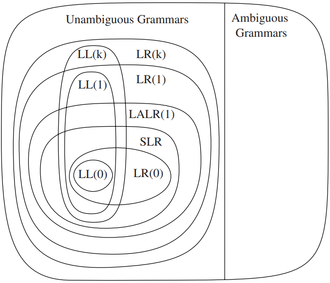
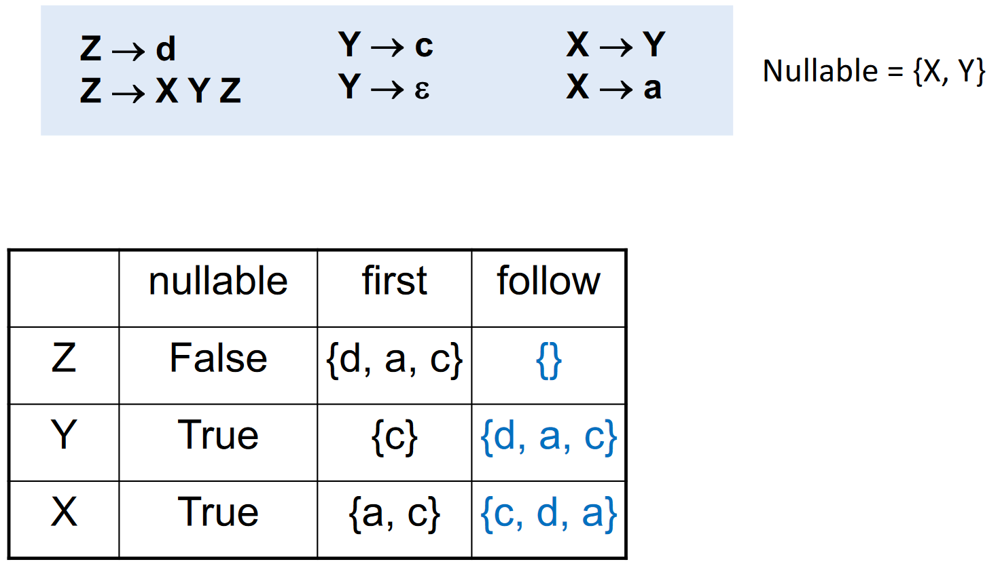
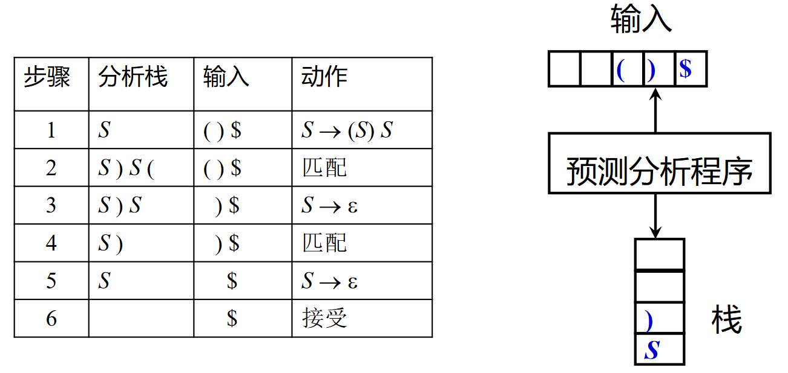
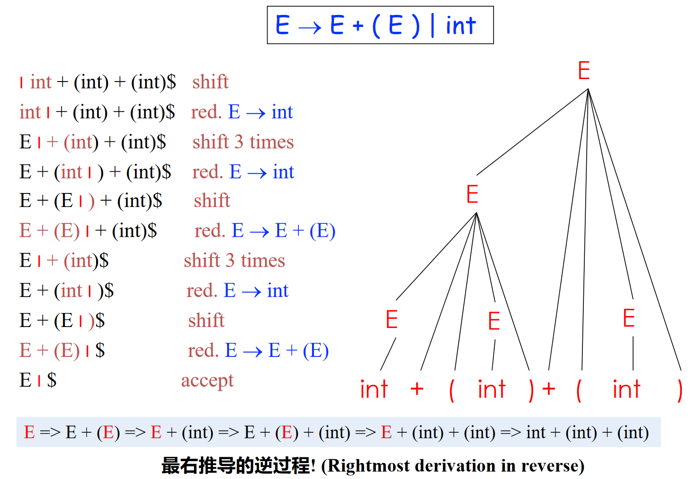
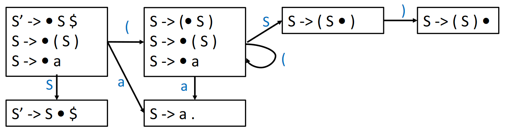
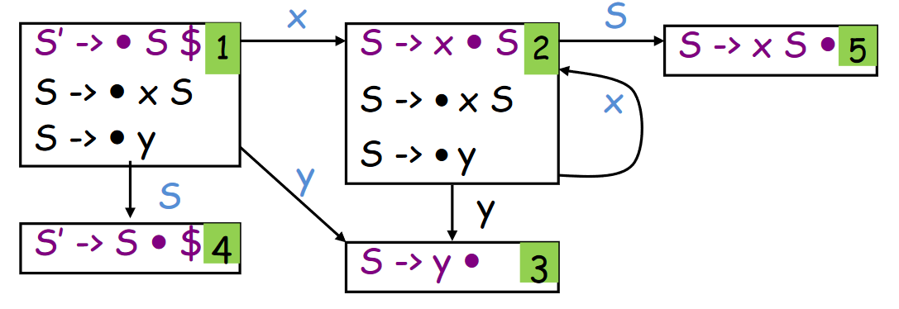
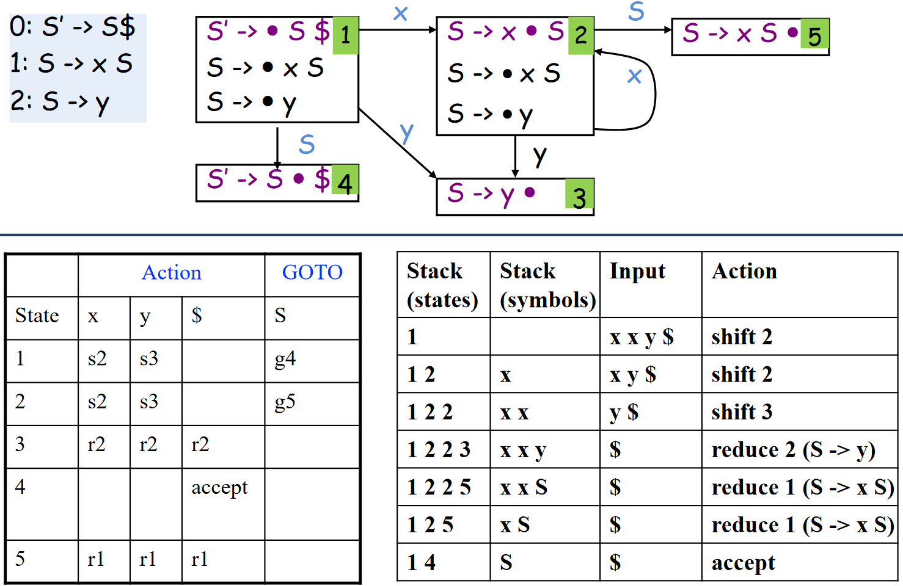
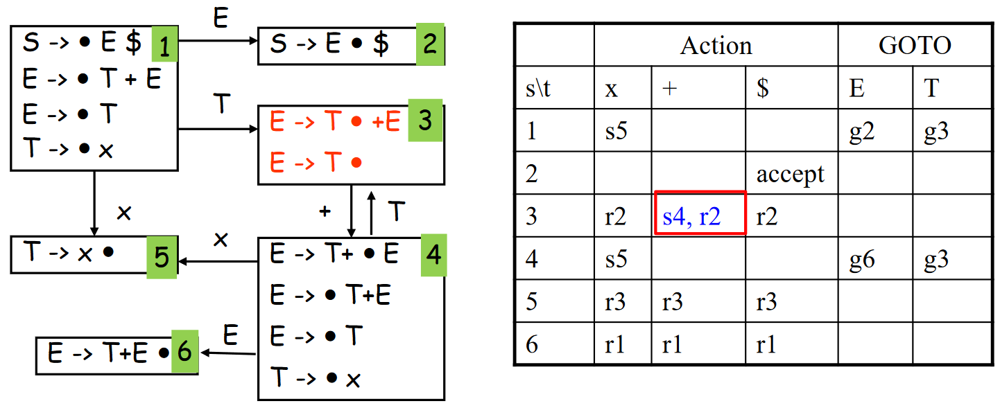

# 语法分析

??? abstract "语法分析器的基本作用"
    从词法分析器获得 Token 序列，确认该序列是否可以由语言的文法生成

    - 对于语法错误的程序，报告错误信息
    - 对于语法正确的程序，生成语法分析树（简称语法树）
        - 通常产生的是抽象语法树 (AST)

    !!! warning "Parse Tree 不是 AST"

    

目前语法分析器的实现有下面两种方法：

- By-hand (recursive descent)
    - Clang, gcc (Since 3.4)
    - Libraries can make this easier (e.g.,parser combinators-parsec)
- Option 2: Use a parser generator
    - Much easier to get right ("Specification is the implementation")
    - Gcc (Before 3.4), Glasgow Haskell Compiler, OCaml
    - Parser generator: Yacc, Bison, ANTLR, menhir

手写的原因可能包括语法太过复杂，手写反而方便一些 (GCC 3.4 later)

## 上下文无关法

### CFG 简介

??? question "上下文无关是什么意思？"
    $\alpha A \beta \Rightarrow \alpha \gamma \beta$
    在文法推导的每一步，符号串 $\gamma$ 仅根据 $A$ 的产生式推导，无需依赖 $A$ 的上下文 $\alpha$ $\beta$

基本作用：指定编程语言的语法结构

!!! info "CFG 定义的方式和计算理论所讲的形式略不同，符号需要注意一下"
    一个上下文无关文法 $G$ 是一个四元组 $G = (T, N, P, S)$

    - $T$ 是终结符号集合 (Terminal)
    - $N$ 是非终结符号集合 (Non-terminal)
    - $P$ 是产生式集合 (Production): e.g., $A \rightarrow \alpha, A \in N, \alpha \in (T \cup N)^*$
    - $S$ 是开始符号 (Start symbol): $S \in N$

    至于性质，可以参考计算理论的内容，这里不再赘述

在这里的 CFG 中，我们使用 EOF Marker $\$$ 来表示输入串的结束，必须位于完整的 $S$ 之后，可以通过添加一个新的开始符号 $S' \rightarrow S \$$ 来实现

此外，对于一组有相同左部的 $\alpha$ 产生式
$$
\alpha \rightarrow \beta_1, \alpha \rightarrow \beta_2, \ldots, \alpha \rightarrow \beta_n
$$
可以简写为
$$
\alpha \rightarrow \beta_1 | \beta_2 | \ldots | \beta_n
$$
读作：$\alpha$ 定义为 $\beta_1$，或者 $\beta_2$ ...，或者 $\beta_n$

$\beta_i$ 称为 $\alpha$ 的候选式 (Candidate)

### 推导和规约

给定文法 $G = (T, N, P, S)$

- 直接推导/规约
    - 直接推导：把产生式看成重写规则，把符号串中的非终结符用其产生式右部的串来代替
        - 如果 $A \rightarrow \gamma \in P$，且 $\alpha, \beta \in (T \cup N)^*$，则称串 $\alpha A \beta$ 直接推导出 $\alpha \gamma \beta$，记作 $\alpha A \beta \Rightarrow \alpha \gamma \beta$
    - 直接规约：如果 $\alpha A \beta \Rightarrow \alpha \gamma \beta$，则称 $\alpha \gamma \beta$ 直接规约为 $\alpha A \beta$
- 多步推导/规约
    - 多步推导：如果 $\alpha_0 \Rightarrow \alpha_1, \alpha_1 \Rightarrow \alpha_2, \ldots, \alpha_{n-1} \Rightarrow \alpha_n$，则可以记作 $\alpha_0 \Rightarrow \alpha_1 \Rightarrow \alpha_2 \Rightarrow \ldots \Rightarrow \alpha_n$，称符号串 $\alpha_0$ 经过 $n$ 步推导出 $\alpha_n$，可简记为 $\alpha_0 \Rightarrow^n \alpha_n$
    - 此外，可以使用
        - $\Rightarrow^*$ 表示若干（可以是 0）步推导
        - 使用 $\Rightarrow^+$ 表示至少一步推导
- 最左推导/规约
    - 最左推导 (Left-most Derivation)：每步代换最左边的非终结符
    - 如果 $S \Rightarrow^*_{lm} \alpha_0$，则称 $\alpha_0$ 是当前文法的最左句型 (left-sentential form)
    - 在自顶向下的语法分析中，总是采用最左推导的方式
    
- 最右推导/规约
    - 最右推导 (Right-most Derivation)：每步代换最右边的非终结符
    - 在自底向上的分析中，总是采用最左归约的方式
    

??? note "产生式和推导的表示"
    龙书区分了 $\rightarrow$ (Production Rule)和 $\Rightarrow$（推导），但是虎书似乎在表达推导时直接用了 $\rightarrow$  
    看起来还是龙书比较符合计算理论的常用符号，这里统一使用龙书的表示

#### 句型、句子和语言

- 句型 (Sentential Form)：对开始符号为 $S$ 的文法 $G$，如果 $S \Rightarrow^* \alpha, \alpha \in (T \cup N)^*$，则称 $\alpha$ 是文法 $G$ 的一个句型
    - 句型中既可以包含**终结符**，又可以包含**非终结符**，可以是**空串**（在虎书中直接用空格代表空串，如 $X \rightarrow \space$，但是龙书会用 $\epsilon$ 来表示空）
- 句子 (Sentence)：如果 $S \Rightarrow^* w, w \in T^*$，则称 $w$ 是文法 $G$ 的一个句子
    - 句子是**不含非终结符的句型**
    - **仅含终结符号的句型**是一个句子
- 语言 (Language): 由文法 $G$ 推导出的所有句子构成的集合称为文法 $G$ 的语言，记作 $L(G)$
    - $L(G) = \{w | S \Rightarrow^* w, w \in T^*\}$

??? example "句型和句子"
    考虑文法 $E \rightarrow E + E | E * E | (E) | -E | \textbf{id}$，其中 $\textbf{id}$ 表示标识符，为终结符号  
    存在如下的推导序列

    $$
    \begin{aligned}
    E &\Rightarrow -E \\
    &\Rightarrow -(E) \\
    &\Rightarrow -(E + E) \\
    &\Rightarrow -(\textbf{id} + E) \\
    &\Rightarrow -(\textbf{id} + \textbf{id})
    \end{aligned}
    $$

    则其中：

    - $-(\textbf{id} + \textbf{id})$ 是文法的一个句子
    - $-(\textbf{id} + E)$ 是文法的一个句型

#### 输入串的判定

!!! question "给定 CFG，如何判定输入串属于文法规定的语言？"

有两个角度可以考虑：

- 从生成语言的角度
    - 句子的推导（派生）
    - 从开始符号能推导出该词串
- 从识别语言的角度
    - 句子的归约
    - 从词串能归约出开始符号


### RE 和 CFG

!!! question "为什么词法和语法分析用不同形式语言？"

#### 语法分析和词法分析的比较


事实上，我们可以推出：

\tikzpicture-automata
    \draw (0, 0) ellipse (5 and 2.5)
          (1.2, -0.7) ellipse (3 and 1.5)
          (-1, 1.2) node{Context-Free Language L(G)}
          (1.2, -0.7) node{Regular Language L(r)};

#### 正则文法 (Regular Grammar)

通过将正则语言进行形式文法刻画，我们可以得到正则文法 (Regular Grammar) 的定义：
$$
G = (T, N, P, S)
$$
其中：

- $T$ 是终结符号集合
- $N$ 是非终结符号集合
- $P$ 是产生式集合，形式如下：
    - 右线性文法：$\alpha \rightarrow \beta$ 形如 $A \rightarrow \alpha B$ 或 $A \rightarrow \alpha$，其中 $A, B \in N, \alpha \in T \cup \{\epsilon\}$
    - 左线性文法：$\alpha \rightarrow \beta$ 形如 $A \rightarrow B \alpha$ 或 $A \rightarrow \alpha$，其中 $A, B \in N, \alpha \in T \cup \{\epsilon\}$
- $S$ 是开始符号，$S \in N$

正则语言是右线性文法/左线性文法产生的所有句子的集合

??? question "为什么词法分析用正则表达式，不用正则文法？"
    正则表达式描述简洁（刻画Token），且易于理解

    

??? note "正则语言 vs 上下文无关语言"
    每个正则语言都是一个上下文无关语言，反之不成立

    - 从文法角度，对产生式 $\alpha \rightarrow \beta$ 形式的限制不同
        - 上下文无关文法：左部 $\alpha$ 是一个非终结符号，右部是一个**符号串**（包括终结符号和非终结符号）
        - 正则文法：右线性文法和左线性文法的限制
    - 从实用角度, 正则语言表达能力有限，难以刻画编程语言的语法
        - 如不能用于描述配对或嵌套的结构，实例包括配对括号串的集合，e.g., $(^n)^n, n \geq 1$
        - 原因在于有穷自动机无法记录访问同一状态的次数

#### 词法分析和语法分析的分离

- 为什么用正则语言定义词法
    - 词法规则非常简单，不必用上下文无关文法
    - 对于 Token，正则表达式描述简洁且易于理解
    - 从正则表达式构造出的词法分析器效率高
- 分离词法分析和语法分析的好处
    - 简化设计、提升性能
    - 编译器的可移植性加强
    - 便于编译器前端的模块划分

??? lab "*形式文法的分类"
    Chomsky 在 1956 创立了形式语言学，并将形式语言的文法分为四类：

    - 0 型文法（短语结构文法）：递归可枚举语言
        - $\alpha \rightarrow \beta$, $\alpha, \beta \in (T \cup N)^*, \left| \alpha \right| > 1$
    - 1 型文法（上下文有关文法）
        - $\left| \alpha \right| \leq \left| \beta \right|$，但 $S \rightarrow \epsilon$ 可以例外
    - 2 型文法（上下文无关文法）
        - $\alpha \rightarrow \beta$, $\alpha \in N, \beta \in (T \cup N)^*$
    - 3 型文法（正则文法）

??? lab "*CFL-Reachability"
    结合 CFG 和图可达性，可以用于分析程序语义，如类型推导、指针分析、数据流分析等

    具体实例如 LLVM 内部的 cfl-aa

## 语法分析概述

### CFG 的 Parse Tree

分析树 (ParseTree) 是推导的图形化表示，具有下面性质：

- **根节点**为文法的**初始符号**
- 每个**叶子节点**是一个**终结符**
- 每个**内部节点**是一个**非终结符**
- 每一个父节点和他的子节点构成一条**产生式**

??? example "Parse Tree 构造"
    - 文法 $E \rightarrow E + E | E * E | (E) | \textbf{id}$
    - 串 $\textbf{id} * \textbf{id} + \textbf{id}$

    

#### 语法分析作为搜索问题

语法分析的核心问题：对于一个终结符号串 $x$

- 设法从 $S$ 推导出 $x$
- 或者反过来，设法将 $x$ 归约为 $S$


根据推导和规约的不同，我们可以分为两种分析方式：

- 自顶向下 (Top-down) 分析
    - 从开始符号 $S$ 出发，尝试根据产生式规则推导 (derive) 出 $x$
    - Parse Tree 的构造方法：从根部开始  
    
- 自底向上 (Bottom-up) 分析
    - 尝试根据产生式规则归约 (reduce) 到文法的开始符号 $S$
    - Parse Tree 的构造方法: 从叶子开始  
    

但是随搜索而来的是比较高的时间复杂度：如果对文法的格式没有限制，那么解析 CFL 需要 $\Omicron(n^3)$ 的时间（如 CYK 算法）

为了解决这个问题，我们可以限制文法的形式，使得解析 CFL 的时间复杂度降低到 $\Omicron(n)$，如

- LL(1) 文法
- LR(1) 文法

\tikzpicture-automata
    \draw (0, 0) ellipse (5 and 2.5)
          (1.2, -0.7) ellipse (3 and 1.5)
          (-1, 1.2) node{Context-Free Language L(G)}
          (1.2, -0.6) node{Programming Language Grammar's}
          (1.2, -1.2) node{Language L(G')};

### 设计编程语言的文法

由上述的时间复杂度问题，为了高效语法分析，需要对文法做处理/限制：

- 消除二义性 (Resolving ambiguities)
    - 二义性：可以为一个句子生成多颗不同的分析树
- 消除左递归 (Elimination of left recursions) - 通常限于自顶向下分析
    - 避免自顶向下分析的无限循环
- 提左公因子 (Left-factoring) - 通常限于自顶向下分析
    - 避免自顶向下分析的回溯

#### 二义性文法与消除二义性

如果文法的某些句子存在**不止一棵**分析树，则该文法是二义的

“给定 CFG 是否无二义性？”是不可判定问题，但是能给出一组**充分条件**，使得满足这组充分条件的文法是无二义性的

??? example "二义性文法的例子"
    考虑文法 $E \rightarrow E + E | E * E | (E) | -E | \textbf{id}$，串 $\textbf{id} * \textbf{id} + \textbf{id}$ 有两种不同的最左推导：

    $$
    \begin{aligned}
    E &\Rightarrow E * E & E &\Rightarrow E + E \\
    &\Rightarrow \textbf{id} * E & &\Rightarrow E * E + E \\
    &\Rightarrow \textbf{id} * E + E & &\Rightarrow \textbf{id} * E + E \\
    &\Rightarrow \textbf{id} * \textbf{id} + E & &\Rightarrow \textbf{id} * \textbf{id} + E \\
    &\Rightarrow \textbf{id} * \textbf{id} + \textbf{id} & &\Rightarrow \textbf{id} * \textbf{id} + \textbf{id}
    \end{aligned}
    $$

    从而对应两颗不同的分析树：

    

编程语言的文法通常是无二义性的，否则就会导致一个程序有多种“正确”的解释，例如在上例中，左边的分析树会先计算加法，而右边的分析树会先计算乘法

以抽象的思维思考二义性的根源，可以这样表述：多种“正确”推导处于文法同一层。因此可以采用**分层**的方式来确保只有一种最左推导，消除二义性：

- 规定符号的**优先级**
    - 根据算符不同的优先级，引入新的非终结符
    - 越接近开始符号 $S$ 的文法符号优先级越低
- 规定符号的**结合性**
    - 递归非终结符在终结符左边，运算就左结合。如 $A \rightarrow A \beta$，$A$ 在终结符（如 $*$）左侧出现（即终结符在 $\beta$ 中）

??? example "消除二义性"
    以下原始文法为例：

    $$
    \begin{aligned}
    E &\rightarrow E + E
    & | E * E
    & | (E) | \textbf{id}
    \end{aligned}
    $$

    通过引入优先级和结合性，可以消除二义性：

    $$
    \begin{aligned}
    E &\rightarrow E + T | T \\
    T &\rightarrow T * F | F \\
    F &\rightarrow (E) | \textbf{id}
    \end{aligned}
    $$

    在修改后的文法中，$+$ 和 $*$ 都是左结合的，且 $*$ 的优先级高于 $+$

??? example "Parser 自动生成器中消除二义性"
    在 Yacc（Parser自动生成器）等工具中，我们可以直接指定优先级、结合性而无需自己重写文法

    ```yacc
    %left '+' '-'
    %left '*' '/'
    %right '-'
    ```

### *通常的符号约定

- 终结符 (Terminals, T)
    - 字母表中**排在前面的小写字母**，如 $a,\ b,\ c$
    - **运算符**，如 $+,\ *$ 等
    - **标点符号**，如括号、逗号等
    - **数字** $0,\ 1,\ \ldots,\ 9$
    - **粗体字符串**，如 $\textbf{id},\ \textbf{if}$ 等
- 非终结符 (Nonterminals， N)
    - 字母表中**排在前面的大写字母**，如 $A,\ B,\ C$
    - 字母 $S$（通常表示开始符号）
    - **小写、斜体的名字**，如 $expr,\ stmt$ 等
    - **代表程序构造的大写字母**，如 $E$（表达式）、$T$（项）
- 其他
    - 字母表中**排在后面的大写字母**（如 $X,\ Y,\ Z$）表示**文法符号**（即终结符或非终结符）
    - 字母表中**排在后面的小写字母**（主要是 $u,\ v,\ \ldots,\ z$）表示**终结符号串**（包括**空串**）
    - **小写希腊字母**，如 $\alpha,\ \beta,\ \gamma$，表示**文法符号串**（包括**空串**）
    - 除非特别说明，**第一个产生式的左部**就是**开始符号**

### 总结

基于无二义文法的 Parsing 有两种主要方法：

- 自顶向下 (Top-down): LL(1), ...
    - LL Parser 的优势在于**代码结构与文法对应**，且**方便手动实现**
- 自底向上 (Bottom-up): LR(1), LALR(1), ...
    - LR Parser 的优势在于**表达能力强**



## 自顶向下分析

自顶向下分析需要从分析树的顶部向底部方向构造分析树，即从文法开始符号 $S$ 推导出串 $w$。在每一步推到中，都需要做两个选择：

- 替换当前句型中的哪个非终结符？
    - 自顶向下分析总是选择每个句型的**最左非终结符**进行替换
- 用该非终结符的哪个产生式进行替换？

接下来将会为第二个问题提供解决方案

### 允许回溯的递归下降分析

递归下降分析 (Recursive-Descent Parsing) 是自顶向下分析的通用形式

- 由一组过程/函数组成，每个过程对应一个非终结符
- 从开始符号 $S$ 对应的**过程**开始，（递归）调用其它**过程**
- 如果 $S$ 对应的过程恰好扫描了整个输入串，则成功完成分析

对于非终结符 $A$ 的文法规则 $A \rightarrow X_1 \ldots X_k$，对应的**过程**为：

- 如果 $X_i$ 是非终结符，则调用相应非终结符对应的过程
- 如果 $X_i$ 是终结符 $a$，则检查输入串是否匹配该终结符，匹配输入串中对应的终结符 $a$
- 在这个过程中，如果选择了不合适的产生式，可能需要回溯（如更换产生式）

??? example "递归下降分析的例子"
    考虑文法
    
    $$
    \begin{aligned}
    S &\rightarrow cAd \\
    A &\rightarrow ab | a
    \end{aligned}
    $$

    为输入串 $w = cad$ 使用递归下降分析建立分析树（假设按顺序选产生式），过程如下：

    

但是在通用递归下降中，存在一个很大的问题：**回溯**

- 复杂的回溯导致**代价太高**
    - 非终结符有可能有多个产生式，由于信息缺失，无法准确预测选择哪一个
    - 考虑到往往需要对多个非终结符进行推导展开，因此尝试的路径可能呈指数级爆炸（如 $a \rightarrow ab | a$，不确定选择哪条产生式）
- 计算过程类似于 NFA

所以需要构造一个类似于 DFA 的分析方式

### LL(1) 和预测分析法

#### LL(1) 文法的定义

预测分析法 (Predictive Parsing) 可以接受 LL(k) 文法，其中：

- 第一个 L 表示 left-to-right，即**从左到右**扫描输入串
- 第二个 L 表示 leftmost derivation，即**最左推导**
- k 表示**向前看 Token** 的个数，即向前看 $k$ 个 Token 来确定产生式（通常 $k = 1$）

为了给文法加以限制来确保没有回溯，我们先来定义 *First* 集和 *Follow* 集。给定文法 $G = (T, N, P, S)$：

- $\text{First}(\alpha) = \{a | \alpha \Rightarrow^* a \ldots, a \in T\}, \alpha \in (T \cup N)^*$
    - 即可从 $\alpha$ 推导得到的串的首个终结符的集合
- $\text{Follow}(A) = \{a | S \Rightarrow^* \ldots Aa \ldots, a \in T\}, A \in N$
    - 即从 $S$ 出发, 可能在推导过程中跟在 $A$ **右边**的终结符号集
    - 例如 $S \rightarrow \alpha A a \beta$，则终结符号 $a \in \text{Follow}(A)$

由此我们可以给出 LL(1) 文法的定义：文法G的任何两个产生式 $A \rightarrow \alpha | \beta$ 都满足下列条件

- $\text{First}(\alpha) \cap \text{First}(\beta) = \emptyset$，即 $\alpha$ 和 $\beta$ 推导不出以同一个单词为首的串
- 若 $\beta \Rightarrow^* \epsilon$，则 $\alpha \nRightarrow^* \epsilon$，且 $\text{First}(\alpha) \cap \text{Follow}(A) = \emptyset$

这样，可以保证产生式选择的唯一性

??? note "为什么这么定义 LL(1) 文法？"
    对于第一个条件而言，存在的意义为：假设下一个输入是 $b$，且 $\text{First}(\alpha)$ 和 $\text{First}(\beta)$ 不相交，那么

    - 若 $b \in \text{First}(\alpha)$，则选择 $\alpha$
    - 若 $b \in \text{First}(\beta)$，则选择 $\beta$

    对于第二个条件而言，存在的意义为：假设下一个输入是 $b$ 且 $\beta \Rightarrow^* \epsilon$，那么

    - 若 $b \in \text{First}(\alpha)$，则选择 $\alpha$（属于第一个条件中的情况）
    - 若 $b \in \text{Follow}(A)$，则选择 $\beta$，因为这样可以使得 $A \Rightarrow^* \epsilon$ 且后面跟着 $b$

#### 实现 LL(1) 预测分析

##### 计算 First 和 Follow 集

由于在 First 和 Follow 集中涉及**空串**，因此我们引入 *Nullable* 的概念：$X$ 是 Nullable 的，即 $X$ 能推导出空串

我们接着给出 Nullable，First 和 Follow 集的归纳定义：

Nullable 的归纳定义：$X$ 是 Nullable 的，当且仅当

- Base case: $X \rightarrow \epsilon$
- Inductive case: 若 $X \rightarrow Y_1 Y_2 \ldots Y_k$，且 $Y_1, Y_2, \ldots, Y_k \in N$ 都是 Nullable 的

First 的归纳定义：$\text{First}(\alpha) = \{a | \alpha \Rightarrow^* a \ldots, a \in T\}$

- Base case: $\text{First}(X) = \{X\}$，如果 $X \in T$
- Inductive case: 若 $X \rightarrow Y_1 Y_2 \ldots Y_k$，则
    - $\text{First}(X) \ \cup= \text{First}(Y_1)$
    - 如果 $Y_1 \in \text{Nullable}$，则 $\text{First}(X) \ \cup= \text{First}(Y_2)$
    - 如果 $Y_1, Y_2 \in \text{Nullable}$，则 $\text{First}(X) \ \cup= \text{First}(Y_3)$
    - ...

> 补充说明：虽然上述规则看起来是关于单个非终结符或终结符的，但是实际中 First 是关于文法符号串 $\alpha$（类似于产生式右部）的，计算规则类似于 Inductive case

Follow 的归纳定义：$\text{Follow}(A) = \{a | S \Rightarrow^* \ldots Aa \ldots, a \in T\}$

- Base case: $\text{Follow}(S) = \{\$\}$
- Inductive case: 若存在产生式 $B \rightarrow s_1 A s_2, s_1, s_2 \in (T \cup N)^*$，则
    - $\text{Follow}(A) \ \cup= \text{First}(s_2)$
    - 如果 $s_2 \in \text{Nullable}$，则 $\text{Follow}(A) \ \cup= \text{Follow}(B)$

> 补充说明：关于 Inductive case 的第 2 种情况, 假设 $S \Rightarrow^* \ldots B b \ldots$，即 $b \in \text{Follow}(B)$
> 
> - 用 $s_1 A s_2$ 替换 $B$，得到 $S \Rightarrow^* \ldots s_1 A s_2 b \ldots$
> - 由于 $s_2 \in \text{Nullable}$，因此 $b \in \text{Follow}(A)$

??? example "计算 Nullable，First 和 Follow 集<i id="Calculate Nullable, First, Follow"></i>"
    

??? lab "优化 Nullable, First, Follow 的计算 - Tiger book algorithm 3.13"
    <pre id="Calculate Nullable, First, Follow" class="pseudocode">
    \begin{algorithm}
    \caption{Calculate Nullable, First, Follow}
    \begin{algorithmic}
    \Function{CalculateNullableFirstFollow}{}
        \State Initialize $\text{First}$ and $\text{Follow}$ to all empty sets, and $\text{Nullable}$ to all false
        \For{each terminal symbol $Z$}
            \State $\text{First}[Z] \gets \{Z\}$
        \EndFor
        \Repeat
            \For{each production $X \rightarrow Y_1 Y_2 \ldots Y_k$}
                \For{each $i$ from $1$ to $k$, each $j$ from $i+1$ to $k$}
                    \If{all the $Y_i$ are nullable}
                        \State $\text{Nullable}[X] \gets \text{true}$
                    \EndIf
                    \If{$Y_1, \ldots, Y_{i-1}$ are all nullable}
                        \State $\text{First}[X] \gets \text{First}[X] \cup \text{First}[Y_i]$
                    \EndIf
                    \If{$Y_{i+1}, \ldots, Y_k$ are all nullable}
                        \State $\text{Follow}[Y_i] \gets \text{Follow}[Y_i] \cup \text{Follow}[X]$
                    \EndIf
                    \If{$Y_{i+1}, \ldots, Y_{j-1}$ are all nullable}
                        \State $\text{Follow}[Y_i] \gets \text{Follow}[Y_i] \cup \text{First}[Y_j]$
                    \EndIf
                \EndFor
            \EndFor
        \Until{$\text{First}$, $\text{Follow}$, and $\text{Nullable}$ no longer change}
    \EndFunction
    \end{algorithmic}
    \end{algorithm}
    </pre>

##### 构造预测分析表

预测分析表是表驱动分析程序需要的二维表（记为 $M$），其中

- 表的每一行 $A$ 对应一个非终结符
- 表的每一列 $a$ 对应某个终结符或输入结束符 $\$$
- 表中的项 $M(A,a)$ 表示: 针对非终结符为 $A$，当下一个输入 Token 为 $a$ 时，可选的产生式集合（若为空，表示语法错误 syntax errors）

构造方法为：对文法 $G$ 的每个产生式 $X \rightarrow \gamma$

- 对每个 $t \in \text{First}(\gamma)$，则将 $X \rightarrow \gamma$ 加入 $M[X, t]$
- 另如果 $\gamma \in \text{Nullable}$，且 $t \in \text{Follow}(X)$，则将 $X \rightarrow \gamma$ 加入 $M[X, t]$

??? example "构造预测分析表"
    以 <a href="#Calculate Nullable, First, Follow">计算 Nullable，First 和 Follow 集</a> 为例，构造预测分析表如下：
    
    可以看到在表中 [$Z$, $d$]、[$Y$, $c$]、[$X$, $a$] 等项处有多个产生式，表明存在二义性，该文法不是 LL(1) 文法

由预测分析表可以给出 LL(1) 文法的另一个定义：如果文法 $G$ 的预测分析表中每个项都至多有一个产生式，则文法 $G$ 是 LL(1) 文法

##### 预测分析

对于 LL(1) 分析，有两种实现方式：

- 递归下降实现
    - 递归下降语法分析程序由一组过程组成
    - 每个非终结符号对应于一个过程
    - 可以通过向前看一个输入符号来唯一地选择产生式
- *非递归实现
    - 可以看作是实现 LL(1) 对应的的 PDA (pushdown automata)
    - 针对输入串 $w$，有两个基本动作
        - 如果栈顶是非终结符 $A$，则利用预测分析表, 选择产生式 $A \rightarrow \alpha$，将栈顶的非终结符 $A$ 替换成串 $\alpha$
        - 如果栈顶是终结符 $\alpha$，则将栈顶记号 $\alpha$ 和输入中的 Token 匹配

对于递归下降实现中，一个过程可以表示为：

``` c
void A() {
    // 根据 Lookahead Token 与预测分析表选择产生式
    // 记该产生式为 A -> X1 X2 ... Xn
    // ...

    for (int i = 0; i < k; i++) {
        if (isNonterminal(Xi)) {
            // 调用对应的过程
            Xi();
        } else if (Xi == inputToken) {
            // 匹配输入 Token
            eat(inputToken);
        } else {
            // 语法错误
            error();
        }
    }
}
```

??? example "LL(1) 的递归下降实现"
    考虑文法

    $$
    \begin{aligned}
    S &\rightarrow \textbf{if}\ E\ \textbf{then}\ S\ \textbf{else}\ S\ |\ \textbf{begin}\ S\ L\ |\ \textbf{print}\ E \\
    L &\rightarrow \textbf{end}\ |\ \textbf{;}\ S\ L \\
    E &\rightarrow \textbf{num} = \textbf{num}
    \end{aligned}
    $$

    Step 1: Represent the token
    ``` c
    enum token {IF, THEN, ELSE, BEGIN, END, PRINT, SEMI, NUM, EQ};
    ```

    Step 2: build infrastructure for reading tokens from lexer
    ``` c
    // call lexer
    extern enum token getToken(void);
    // store the next token
    enum token tok;
    void advance() {
        tok=getToken();
    }
    // consume the next token and get the new one
    void eat(enum token t) {
        if (tok==t) {
            advance(); 
        } else {
            error();
        }
    }
    ```

    Step 3: build a function for each non-terminal
    ``` c
    void S(void) {
        switch(tok) {
            case IF: eat(IF); E(); eat(THEN); S(); eat(ELSE); S(); break;
            case BEGIN: eat(BEGIN); S(); L(); break;
            case PRINT: eat(PRINT); E(); break;
            default: error();
        }
    }
    void L(void) {
        switch(tok) {
            case END: eat(END); break;
            case SEMI: eat(SEMI); S(); L(); break;
            default: error();
        }
    }
    void E(void) {
        eat(NUM); eat(EQ); eat(NUM);
    }
    ```

    当然，这个语法比较特殊：对于每一个非终结符的所有的产生式，右边第一个符号都是不同的终结符，所以可以很轻松的写出 `switch` 语句。如果没有这种“便利”的条件，需要先写出预测分析表，再“硬编码”到switch语句

??? example "*LL(1) 的非递归实现"
    

#### 消除左递归与左公因子

LL(1)文法有一些明显的性质

- LL(1)文法是无二义的
- LL(1)文法是无左递归的
- LL(1)文法是无左公因子的

##### 无左递归

左递归 (left-recursive) 文法

- 如果一个文法中有非终结符号 $A$ 使得 $A \Rightarrow^+ A \alpha$，那么这个文法就是左递归的
- 特别的，称 $S \rightarrow S a | b$ 为直接/立即左递归

左递归带来的问题是：在递归下降分析中，可能会导致无限循环

- 如考虑串 $baaaaa$
- 在最左推导下，若只看下个 Token，可能产生 $S \Rightarrow S a \Rightarrow S a a \Rightarrow S a a a \Rightarrow \ldots$

为了解决这个问题，可以考虑限制文法或者进行文法变换以消除左递归。其中，消除左递归的文法变换的一个例子如下：

- 原先：$A \rightarrow A \alpha | \beta$，其中 $\alpha \neq \epsilon$，$\alpha$ 和 $\beta$ 都不以 $A$ 开头，如图中 a)
- 修改为：$A \rightarrow \beta A'$，$A' \rightarrow \alpha A' | \epsilon$，如图中 b)


##### 无左公因子

有左公因子的 (left-factored) 文法如：$P \rightarrow \alpha \beta | \alpha \gamma$，与之而来的问题是同一非终结符的多个候选式存在共同前缀，可能导致回溯。同样可以考虑限制文法或进行文法变换，其中消除该产生式的左公因子的文法变换为：

$$
\begin{aligned}
P &\rightarrow \alpha Q \\
Q &\rightarrow \beta | \gamma
\end{aligned}
$$

其中 $Q$ 为新添加的未出现过的非终结符

这种方法类似于通过改写产生式来推迟决定，等读入了足够多的输入、获得足够信息后再做选择

#### 错误恢复

上文提及，预测分析表中一个空白的项表示语法错误，对于这种情况，有两种解决方式：

- 抛出异常并停止分析
- 打印错误信息，并从当前错误中恢复，继续分析
    - 常用的方法有 deleting, replacing, inserting

??? example "错误恢复的例子"
    - Through inserting: pretend we have the token and return normally
    ``` c
    void T( ) {
        switch (tok) {
            case ID:
            case NUM:
            case LPAREN: F( ); Tprime( ); break;
            default: print("expected id, num, or left-paren");
        }
    }
    ```
    - Deleting tokens is safer, because the loop must eventually terminate when EOF is reached. Simple recover by deletion works by skipping tokens util a token in the FOLLOW set is reached
    ``` c
    int Tprime_follow[] = {PLUS, RPAREN, EOF};
    void Tprime() {
        switch (tok) {
            case PLUS: break;
            case TIMES: eat(TIMES); F(); Tprime(); break;
            case RPAREN: break;
            case EOF: break;
            default: print("expected +, *, right-paren, or
            end-of-file");
            skipto(Tprime_follow);
        }
    }
    ```

## 自底向上分析

在自顶向下分析中，我们了解了 LL(1) 文法的概念，我们可以看到 LL(1) 文法的特点有

- 优点
    - 运行高效(线性时间)
    - 递归实现符合文法结构、适合手动构造与自动生成
- 局限性
    - 能分析的文法类型受限

由此我们引出基于 LR(k) 的文法。这是一种更强大的文法，每种 LL(k) 文法都是 LR(k) 文法，但反之不然。这类文法被 Parser 自动生成器广泛采用（如 Yacc, Bison 等）

- L 表示 left-to-right scanning，即自左向右扫描
- R 表示 rightmost derivation in reverse，即最右推导的逆
- k 表示向前看的字符的个数（当 k 被省略的时候, 默认为 1）

### 移进-规约 (Shift-Reduce)

> LR 分析并不需要消除左递归或左公因子，例如如下的文法
> 
> $$
> E \rightarrow E + (E) | \textbf{int}
> $$
> 
> 不是 LL(1) 但是是 LR(1) 的

对一个具体的输入串 $\textbf{int} + (\textbf{int}) + (\textbf{int})$，移进-规约的主要思想是将串分成两个子串：

- 右侧子串（由终结符组成）还没有被 Parser 处理
- 左侧子串（由终结符和非终结符组成）已经被 Parser 处理
- 分隔符是一个特殊的符号 $|$
    - 请注意这并不是串的一部分
- 初始时，所有的输入都没有被处理，即左侧子串为空，右侧子串是整个输入串
    - 例如 $| \textbf{int} + (\textbf{int}) + (\textbf{int})$

??? example "移进-规约的例子"
    以上述的输入串为例，移进-规约的过程如下：

    

总结一下

- LR 分析是最右推导的逆过程
    - 类似 LL 中的最左推导，同样限制了规约方式
- LR 分析的每一步都是最右句型（最右推导过程中出现的句型）
    - $\alpha | \beta$ 是最右句型

具体的实现方法如下：

#### 基于栈的移进-归约

基于栈的移进-归约是 LR 实现的一般模式，包括如下的内容：

- 两个组成部分
    - 栈 (Stack)：存储左子串 $\alpha$（已经处理的部分，包括终结符和非终结符）
    - 输入流 (Input steam)：存储右子串 $\beta$（还未处理的部分，只包括终结符）
- 四个基本动作
    - 移进 (Shift)
        - 将输入流下一个输入（终结符）压入栈顶
    - 规约 (Reduce)
        - 栈顶部的符号串匹配某个产生式右部（如 $X \rightarrow ABC$ 中的 $ABC$）
        - 从栈顶部弹出相应的符号串（如依次弹出 $C$ $B$ $A$）
        - 将产生式左部压入栈顶（如压入 $X$）
    - 错误 (Error)：分析失败
    - 接受 (Accept)：移进 $\$$ 并和栈中剩余的所有符号一起规约为开始符号

!!! note "核心问题在于如何选择移进和规约的时机"

#### 表驱动的 LR 分析

表驱动的 LR 分析是最通用的无回溯移入-规约分析

- 所有的分析器都使用相同的驱动程序
    - 虽然复杂语法对应的表很大，但分析表可以自动生成
    - 分析表随 LR 分析文法的不同而不同

示例图如下：


### LR(0) 分析

??? question "如何知道栈顶的内容可以归约了？"
    维护一个状态，记录当前识别的进度

#### LR(0) 语法分析思路

引入如下的概念：

- 项 (Item)：一个产生式加上在其中某处的一个点
    - $A \rightarrow \alpha \cdot \beta$ 意味着已经扫描/规约到了 $\alpha$，并期望在接下来的输入中经过扫描/归约得到 $\beta$，然后把 $\alpha \beta$ 归约到 $A$
    - $A \rightarrow \alpha \beta \cdot$ 意味着已经扫描/规约得到了 $\alpha \beta$，可以将 $\alpha \beta$ 归约到 $A$
    - 以产生式 $A \rightarrow \cdot XYZ$ 为例，项有 $A \rightarrow \cdot XYZ$, $A \rightarrow X \cdot YZ$, $A \rightarrow XY \cdot Z$, $A \rightarrow XYZ \cdot$
    - LR(0) 的 Item 类似有穷自动机的状态
- 状态跳转
    - 一个项读入一个符号后，可变为另一个项
    - $A \rightarrow \cdot xyz$ 可以变为 $A \rightarrow x \cdot yz$，类似状态间的**跳转**

> 文法产生式是有限的，项的数量也是有限的，每个产生式右部的长度也是有限的，结合**状态**和**跳转**的概念，可以看作一台有穷自动机，称为 **LR(0)自动机**


#### LR(0) Parsing NFA

!!! note "此处的NFA不是指直接用来识别 LR(0) 语言的自动机（NFA 只能识别正则语言，然而正则语言 < LR(0)）。该 NFA 是用来*记录当前识别进度*的（帮助判断栈顶内容是否可归约了）"


- 起始和终结状态
    - 文法 $G$ 中增加新开始符号 $S'$，并加入产生式 $S' \rightarrow S\$$
    - 按 $S' \rightarrow S\$$ 进行归约（*将输入符号串归约成为开始符号*）
    - 加入 $S'$ 方便表示起始和终结状态
- 状态迁移
    - LR(0) Item 之间会有转换关系，如
        - $X \rightarrow \cdot \alpha \beta$ 接收 $\alpha$ 后转换为 $X \rightarrow \alpha \cdot \beta$
        - 若存在产生式 $X \rightarrow \alpha Y \beta$ 和 $Y \rightarrow \gamma$，则 $X \rightarrow \alpha \cdot Y \beta$ 可以转换到 $Y \rightarrow \cdot \gamma$ 

??? example "LR(0) Parsing NFA"
    以文法

    $$
    \begin{aligned}
    S' &\rightarrow S \$ \\
    S &\rightarrow ( S ) \\
    S &\rightarrow \epsilon
    \end{aligned}
    $$

    为例，LR(0) Parsing NFA 如下：

    

    回想子集构造法，可以将一组 LR(0) Items（称为项集）看作一个 DFA 的状态，得到如下的 LR(0) Parsing DFA

    

#### LR(0) Parsing DFA

!!! note "类似 LR(0) Parsing NFA，此处的 DFA 不是指直接用来识别 LR(0) 语言的自动机（DFA只能识别正则语言，然而正则语言 < LR(0)）。该DFA是用来*记录当前识别进度*的（帮助判断栈顶内容是否可归约了）"

在上面的例子中，我们构造了 LR(0) Parsing NFA 并将其转换为 DFA，不过在实际过程中，我们可以跳过 NFA 直接构造 DFA

假定

- $I$ 是一个项集
- $X$ 是一个符号（终结符或非终结符）

我们定义两个过程：

- Closure($I$)
    - 类似 NFA 转 DFA 过程中的 $\epsilon$-closure
- Goto($I$, $X$)
    - 类似 NFA 转 DFA 过程中计算新的 DFA 状态

<pre class="pseudocode">
\begin{algorithm}
\caption{LR(0) Parsing DFA - Closure}
\begin{algorithmic}
\Function{Closure}{$I$}
    \Repeat
        \For{any item $A \rightarrow \alpha \cdot X \beta$ in $I$}
            \For{any production $X \rightarrow \gamma$}
                \State $I \gets I \cup \{X \rightarrow \cdot \gamma\}$
            \EndFor
        \EndFor
    \Until{no new items can be added to $I$}
    \State \Return $I$
\EndFunction
\end{algorithmic}
\end{algorithm}
</pre>

<pre class="pseudocode">
\begin{algorithm}
\caption{LR(0) Parsing DFA - Goto}
\begin{algorithmic}
\Function{Goto}{$I$, $X$}
    \State set $J$ to the empty set
    \For{any item $A \rightarrow \alpha \cdot X \beta$ in $I$}
        \State $J \gets J \cup \{A \rightarrow \alpha X \cdot \beta\}$
    \EndFor
    \State \Return \Call{Closure}{$J$}
\EndFunction
\end{algorithmic}
\end{algorithm}
</pre>

结合 Closure 和 Goto 过程，可以整理出 LR(0) Parsing DFA 构造的算法

<pre class="pseudocode">
\begin{algorithm}
\caption{LR(0) Parsing DFA}
\begin{algorithmic}
\Function{LR0DFA}{}
    \State Initialize $T$ to $\{$\Call{Closure}{$\{S' \rightarrow \cdot S\$$}$\}$
    \State Initialize $E$ to empty set (set of edges)
    \Repeat
        \For{each state $I$ in $T$}
            \For{each item $A \rightarrow \alpha \cdot X \beta$ in $I$}
                \State $J \gets$ \Call{Goto}{$I$, $X$}
                \State $T \gets T \cup \{J\}$
                \State $E \gets E \cup \{I \xrightarrow{X} J\}$
            \EndFor
        \EndFor
    \Until{no new members are added to $T$ or $E$}
    \State \Return $T$, $E$
\EndFunction
\end{algorithmic}
\end{algorithm}
</pre>

??? example "LR(0) Parsing DFA<i id="LR(0) Parsing DFA example"></i>"
    以文法

    $$
    \begin{aligned}
    0: S' &\rightarrow S \$ \\
    1: S &\rightarrow x S \\
    2: S &\rightarrow y
    \end{aligned}
    $$

    为例，LR(0) Parsing DFA 如下：

    

#### LR(0) 语法分析表

以上例 [LR(0) Parsing DFA](#LR(0) Parsing DFA example) 为例，构造出的 LR(0) 语法分析表如下：


表由两个部分组成：**动作 (Action)** 与 **转换 (GOTO)**

- Action 表项的参数：状态 $i$，终结符号 $t$
    - 移入 (Shift)：若从状态 $i$ 到状态 $j$ 有一条边标记为 $t$，则在 Action 表中 $[i, t] = sj$ (shift j)；涉及栈分析时，向前移动一个 Token，把新状态 $j$ 压入栈
    - 规约 (Reduce)：在状态 $i$ 中有一个项 $A \rightarrow \beta \cdot$，则在且 $A \rightarrow \beta涉及栈分析时，$ 是第 $k$ 条产生式，则在 Action 表中 $[i, \text{each terminal symbol}] = rk$ (reduce k)；涉及栈分析时，弹出 $|\beta|$ 个状态，然后根据 GOTO 表将其中 $\text{GOTO}[\text{top(stack)}, A]$ 压入栈
    - 接受 (Accept)：对于每个包含 $S' \rightarrow S \cdot \$$ 的状态 $i$，在 Action 表中 $[i, \$] = \text{accept}$；涉及栈分析时，结束分析，接受输入返回成功
    - 报错：在输入中发现语法错误，停止分析并报错
- GOTO 表项的参数：状态 $i$，非终结符 $A$
    - 若从状态 $i$ 到状态 $j$ 有一条边标记为 $A$（即函数 $\text{Goto}[I_i, A] = I_j$），则在 GOTO 表中 $\text{GOTO}[i, A] = j$

> 上述提及的涉及栈分析是一套可以被其他 LR 分析器使用的通用算法

输入文法的 LR 语法分析表与输入串 $w$，分析算法的一个简略表述为：

``` c
// 令 s 是栈顶状态, a 是 w$ 的第一个符号;
while (1) { // 一开始 s 为 Parsing DFA 的状态 1
    if (Action[s, a] = "shift s'") {
        // 将 s' 压入栈内；
        // 将下一个输入符号赋值给 a；
    } else if (Action[s, a] = "reduce A → β") {
        // 从栈顶弹出 |β| 个状态；
        // 令 s' 是当前栈顶状态, 把 GOTO[s', A] 入栈；
    } else if (Action[s, a] = “Accept”) break;
    else error( ); // 调用后面会提及的错误恢复程序;
}
```

!!! warning "LR **实际实现只有状态栈**，符号信息可从相应状态中获取。下面例子中的文法符号栈是为了方便理解"

??? example "完整的 LR(0) 语法分析"
    示例一
    

    示例二
    

#### LR(0) 的问题/局限性

??? question "为什么说 LR(0) 没有 Lookahead？"
    LR(0) Item 中没有 lookahead terminal 等信息，使得*是否归约*、*选择哪个产生式规约*仅由栈顶状态决定

对于 LR(0) 文法而言，一旦存在状态 $X \rightarrow \alpha \cdot$，就会盲目的将 $\alpha$ 规约为 $X$，可能导致冲突，如从文法

$$
\begin{aligned}
0:\ &S \rightarrow E \$ \\
1:\ &E \rightarrow T + E \\
2:\ &E \rightarrow T \\
3:\ &T \rightarrow x
\end{aligned}
$$

出发，构造的 LR(0) Parsing DFA 与 LR(0) 语法分析表如下：



标红的地方存在移入-规约冲突 (shift-reduce conflict)，即状态 3 中无法确定是移入 $+$ 还是规约到 $E$

### SLR(1) 分析

为了一定程度上改善 LR(1) 存在的问题，SLR(1) 利用更多信息来指导规约操作，即每步归约都应该满足 $t \in \text{Follow}(E)$，其中

- $E$ 是用来归约的产生式的左部
- $t$ 是 Next Token

因此

- SLR(1) Parsing DFA 和 LR(0) 的相同
- 构造分析表时的**归约动作**不同，每步归约都应该满足 $t \in \text{Follow}(E)$

例如上述涉及 LR(0) 局限性的例子，SLR(1) 语法分析表如下：


解决了 LR(0) 中存在的 shift-Reduce conflict

#### SLR(1) 的问题/局限性

考虑文法

$$
\begin{aligned}
S' &\rightarrow S \$ \\
S &\rightarrow L = R | R \\
L &\rightarrow * R | id \\
R &\rightarrow L
\end{aligned}
$$

我们可以知道 $\text{Follow}(R) = \text{Follow}(L) = \{=, \$\}$，因此，在如下的 DFA 中，状态 3 存在 shift-reduce conflict


