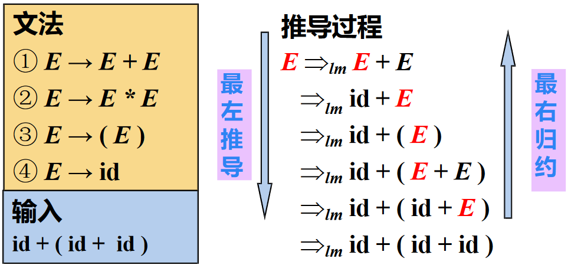
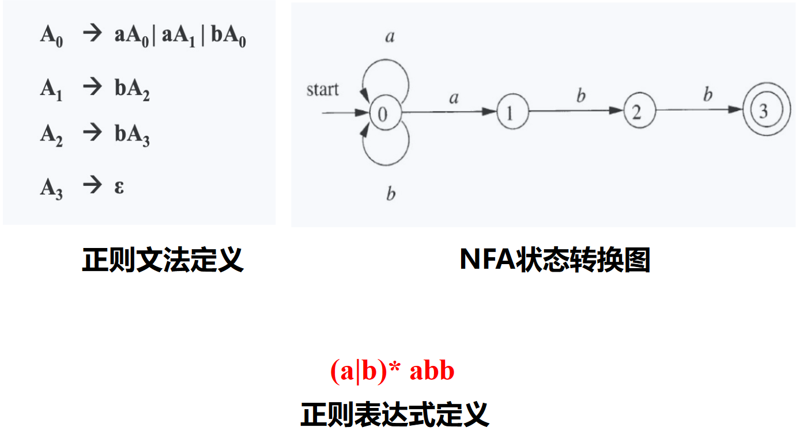
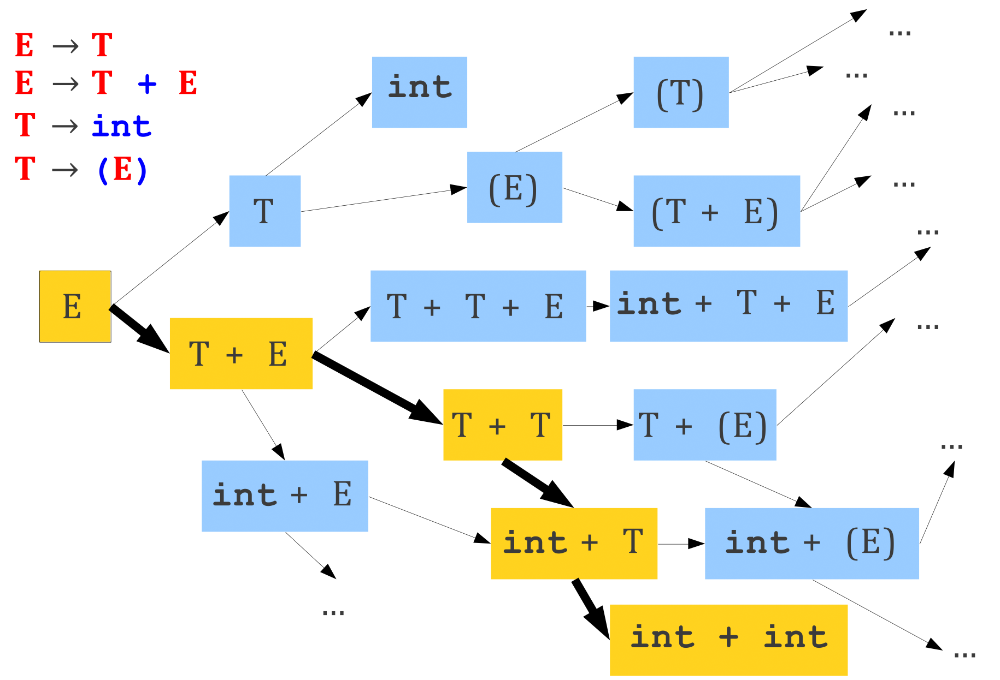
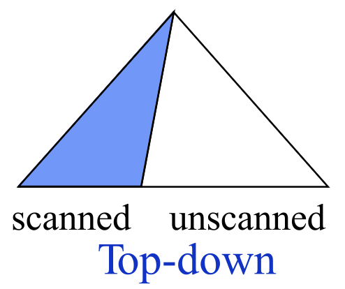

# CFG 及语法分析概述

## 上下文无关文法

### CFG 简介

??? question "上下文无关是什么意思？"
    $\alpha A \beta \Rightarrow \alpha \gamma \beta$
    在文法推导的每一步，符号串 $\gamma$ 仅根据 $A$ 的产生式推导，无需依赖 $A$ 的上下文 $\alpha$ $\beta$

基本作用：指定编程语言的语法结构

!!! info "CFG 定义的方式和计算理论所讲的形式略不同，符号需要注意一下"
    一个上下文无关文法 $G$ 是一个四元组 $G = (T, N, P, S)$

    - $T$ 是终结符号集合 (Terminal)
    - $N$ 是非终结符号集合 (Non-terminal)
    - $P$ 是产生式集合 (Production): e.g., $A \rightarrow \alpha, A \in N, \alpha \in (T \cup N)^*$
    - $S$ 是开始符号 (Start symbol): $S \in N$

    至于性质，可以参考计算理论的内容，这里不再赘述

在这里的 CFG 中，我们使用 EOF Marker $\$$ 来表示输入串的结束，必须位于完整的 $S$ 之后，可以通过添加一个新的开始符号 $S' \rightarrow S \$$ 来实现

此外，对于一组有相同左部的 $\alpha$ 产生式
$$
\alpha \rightarrow \beta_1, \alpha \rightarrow \beta_2, \ldots, \alpha \rightarrow \beta_n
$$
可以简写为
$$
\alpha \rightarrow \beta_1 | \beta_2 | \ldots | \beta_n
$$
读作：$\alpha$ 定义为 $\beta_1$，或者 $\beta_2$ ...，或者 $\beta_n$

$\beta_i$ 称为 $\alpha$ 的候选式 (Candidate)

### 推导和规约

给定文法 $G = (T, N, P, S)$

- 直接推导/规约
    - 直接推导：把产生式看成重写规则，把符号串中的非终结符用其产生式右部的串来代替
        - 如果 $A \rightarrow \gamma \in P$，且 $\alpha, \beta \in (T \cup N)^*$，则称串 $\alpha A \beta$ 直接推导出 $\alpha \gamma \beta$，记作 $\alpha A \beta \Rightarrow \alpha \gamma \beta$
    - 直接规约：如果 $\alpha A \beta \Rightarrow \alpha \gamma \beta$，则称 $\alpha \gamma \beta$ 直接规约为 $\alpha A \beta$
- 多步推导/规约
    - 多步推导：如果 $\alpha_0 \Rightarrow \alpha_1, \alpha_1 \Rightarrow \alpha_2, \ldots, \alpha_{n-1} \Rightarrow \alpha_n$，则可以记作 $\alpha_0 \Rightarrow \alpha_1 \Rightarrow \alpha_2 \Rightarrow \ldots \Rightarrow \alpha_n$，称符号串 $\alpha_0$ 经过 $n$ 步推导出 $\alpha_n$，可简记为 $\alpha_0 \Rightarrow^n \alpha_n$
    - 此外，可以使用
        - $\Rightarrow^*$ 表示若干（可以是 0）步推导
        - 使用 $\Rightarrow^+$ 表示至少一步推导
- 最左推导/规约
    - 最左推导 (Left-most Derivation)：每步代换最左边的非终结符
    - 如果 $S \Rightarrow^*_{lm} \alpha_0$，则称 $\alpha_0$ 是当前文法的最左句型 (left-sentential form)
    - 在自顶向下的语法分析中，总是采用最左推导的方式
    
- 最右推导/规约
    - 最右推导 (Right-most Derivation)：每步代换最右边的非终结符
    - 在自底向上的分析中，总是采用最左归约的方式
    

??? note "产生式和推导的表示"
    龙书区分了 $\rightarrow$ (Production Rule)和 $\Rightarrow$（推导），但是虎书似乎在表达推导时直接用了 $\rightarrow$  
    看起来还是龙书比较符合计算理论的常用符号，这里统一使用龙书的表示

#### 句型、句子和语言

- 句型 (Sentential Form)：对开始符号为 $S$ 的文法 $G$，如果 $S \Rightarrow^* \alpha, \alpha \in (T \cup N)^*$，则称 $\alpha$ 是文法 $G$ 的一个句型
    - 句型中既可以包含**终结符**，又可以包含**非终结符**，可以是**空串**（在虎书中直接用空格代表空串，如 $X \rightarrow \space$，但是龙书会用 $\epsilon$ 来表示空）
- 句子 (Sentence)：如果 $S \Rightarrow^* w, w \in T^*$，则称 $w$ 是文法 $G$ 的一个句子
    - 句子是**不含非终结符的句型**
    - **仅含终结符号的句型**是一个句子
- 语言 (Language): 由文法 $G$ 推导出的所有句子构成的集合称为文法 $G$ 的语言，记作 $L(G)$
    - $L(G) = \{w | S \Rightarrow^* w, w \in T^*\}$

??? example "句型和句子"
    考虑文法 $E \rightarrow E + E | E * E | (E) | -E | \textbf{id}$，其中 $\textbf{id}$ 表示标识符，为终结符号  
    存在如下的推导序列

    $$
    \begin{aligned}
    E &\Rightarrow -E \\
    &\Rightarrow -(E) \\
    &\Rightarrow -(E + E) \\
    &\Rightarrow -(\textbf{id} + E) \\
    &\Rightarrow -(\textbf{id} + \textbf{id})
    \end{aligned}
    $$

    则其中：

    - $-(\textbf{id} + \textbf{id})$ 是文法的一个句子
    - $-(\textbf{id} + E)$ 是文法的一个句型

#### 输入串的判定

!!! question "给定 CFG，如何判定输入串属于文法规定的语言？"

有两个角度可以考虑：

- 从生成语言的角度
    - 句子的推导（派生）
    - 从开始符号能推导出该词串
- 从识别语言的角度
    - 句子的归约
    - 从词串能归约出开始符号


### RE 和 CFG

!!! question "为什么词法和语法分析用不同形式语言？"

#### 语法分析和词法分析的比较


事实上，我们可以推出：

\tikzpicture-automata
    \draw (0, 0) ellipse (5 and 2.5)
          (1.2, -0.7) ellipse (3 and 1.5)
          (-1, 1.2) node{Context-Free Language L(G)}
          (1.2, -0.7) node{Regular Language L(r)};

#### 正则文法 (Regular Grammar)

通过将正则语言进行形式文法刻画，我们可以得到正则文法 (Regular Grammar) 的定义：
$$
G = (T, N, P, S)
$$
其中：

- $T$ 是终结符号集合
- $N$ 是非终结符号集合
- $P$ 是产生式集合，形式如下：
    - 右线性文法：$\alpha \rightarrow \beta$ 形如 $A \rightarrow \alpha B$ 或 $A \rightarrow \alpha$，其中 $A, B \in N, \alpha \in T \cup \{\epsilon\}$
    - 左线性文法：$\alpha \rightarrow \beta$ 形如 $A \rightarrow B \alpha$ 或 $A \rightarrow \alpha$，其中 $A, B \in N, \alpha \in T \cup \{\epsilon\}$
- $S$ 是开始符号，$S \in N$

正则语言是右线性文法/左线性文法产生的所有句子的集合

??? question "为什么词法分析用正则表达式，不用正则文法？"
    正则表达式描述简洁（刻画Token），且易于理解

    

??? note "正则语言 vs 上下文无关语言"
    每个正则语言都是一个上下文无关语言，反之不成立

    - 从文法角度，对产生式 $\alpha \rightarrow \beta$ 形式的限制不同
        - 上下文无关文法：左部 $\alpha$ 是一个非终结符号，右部是一个**符号串**（包括终结符号和非终结符号）
        - 正则文法：右线性文法和左线性文法的限制
    - 从实用角度, 正则语言表达能力有限，难以刻画编程语言的语法
        - 如不能用于描述配对或嵌套的结构，实例包括配对括号串的集合，e.g., $(^n)^n, n \geq 1$
        - 原因在于有穷自动机无法记录访问同一状态的次数

#### 词法分析和语法分析的分离

- 为什么用正则语言定义词法
    - 词法规则非常简单，不必用上下文无关文法
    - 对于 Token，正则表达式描述简洁且易于理解
    - 从正则表达式构造出的词法分析器效率高
- 分离词法分析和语法分析的好处
    - 简化设计、提升性能
    - 编译器的可移植性加强
    - 便于编译器前端的模块划分

??? lab "*形式文法的分类"
    Chomsky 在 1956 创立了形式语言学，并将形式语言的文法分为四类：

    - 0 型文法（短语结构文法）：递归可枚举语言
        - $\alpha \rightarrow \beta$, $\alpha, \beta \in (T \cup N)^*, \left| \alpha \right| > 1$
    - 1 型文法（上下文有关文法）
        - $\left| \alpha \right| \leq \left| \beta \right|$，但 $S \rightarrow \epsilon$ 可以例外
    - 2 型文法（上下文无关文法）
        - $\alpha \rightarrow \beta$, $\alpha \in N, \beta \in (T \cup N)^*$
    - 3 型文法（正则文法）

??? lab "*CFL-Reachability"
    结合 CFG 和图可达性，可以用于分析程序语义，如类型推导、指针分析、数据流分析等

    具体实例如 LLVM 内部的 cfl-aa

## 语法分析概述

### CFG 的 Parse Tree

分析树 (Parse Tree) 是推导的图形化表示，具有下面性质：

- **根结点**为文法的**初始符号**
- 每个**叶子结点**是一个**终结符**
- 每个**内部结点**是一个**非终结符**
- 每一个父结点和他的子结点构成一条**产生式**

??? example "Parse Tree 构造"
    - 文法 $E \rightarrow E + E | E * E | (E) | \textbf{id}$
    - 串 $\textbf{id} * \textbf{id} + \textbf{id}$

    

#### 语法分析作为搜索问题

语法分析的核心问题：对于一个终结符号串 $x$

- 设法从 $S$ 推导出 $x$
- 或者反过来，设法将 $x$ 归约为 $S$



根据推导和规约的不同，我们可以分为两种分析方式：

- 自顶向下 (Top-down) 分析
    - 从开始符号 $S$ 出发，尝试根据产生式规则推导 (derive) 出 $x$
    - Parse Tree 的构造方法：从根部开始  
    
- 自底向上 (Bottom-up) 分析
    - 尝试根据产生式规则归约 (reduce) 到文法的开始符号 $S$
    - Parse Tree 的构造方法: 从叶子开始  
    

但是随搜索而来的是比较高的时间复杂度：如果对文法的格式没有限制，那么解析 CFL 需要 $\Omicron(n^3)$ 的时间（如 CYK 算法）

为了解决这个问题，我们可以限制文法的形式，使得解析 CFL 的时间复杂度降低到 $\Omicron(n)$，如

- LL(1) 文法
- LR(1) 文法

\tikzpicture-automata
    \draw (0, 0) ellipse (5 and 2.5)
          (1.2, -0.7) ellipse (3 and 1.5)
          (-1, 1.2) node{Context-Free Language L(G)}
          (1.2, -0.6) node{Programming Language Grammar's}
          (1.2, -1.2) node{Language L(G')};

### 设计编程语言的文法

由上述的时间复杂度问题，为了高效语法分析，需要对文法做处理/限制：

- 消除二义性 (Resolving ambiguities)
    - 二义性：可以为一个句子生成多颗不同的分析树
- 消除左递归 (Elimination of left recursions)
    - 通常限于自顶向下分析
    - 避免自顶向下分析的无限循环
- 提左公因子 (Left-factoring)
    - 通常限于自顶向下分析
    - 避免自顶向下分析的回溯

#### 二义性文法与消除二义性

如果文法的某些句子存在**不止一棵**分析树，则该文法是二义的

“给定 CFG 是否无二义性？”是不可判定问题，但是能给出一组**充分条件**，使得满足这组充分条件的文法是无二义性的

??? example "二义性文法的例子"
    考虑文法 $E \rightarrow E + E | E * E | (E) | -E | \textbf{id}$，串 $\textbf{id} * \textbf{id} + \textbf{id}$ 有两种不同的最左推导：

    $$
    \begin{aligned}
    E &\Rightarrow E * E & E &\Rightarrow E + E \\
    &\Rightarrow \textbf{id} * E & &\Rightarrow E * E + E \\
    &\Rightarrow \textbf{id} * E + E & &\Rightarrow \textbf{id} * E + E \\
    &\Rightarrow \textbf{id} * \textbf{id} + E & &\Rightarrow \textbf{id} * \textbf{id} + E \\
    &\Rightarrow \textbf{id} * \textbf{id} + \textbf{id} & &\Rightarrow \textbf{id} * \textbf{id} + \textbf{id}
    \end{aligned}
    $$

    从而对应两颗不同的分析树：

    

编程语言的文法通常是无二义性的，否则就会导致一个程序有多种“正确”的解释，例如在上例中，左边的分析树会先计算加法，而右边的分析树会先计算乘法

以抽象的思维思考二义性的根源，可以这样表述：多种“正确”推导处于文法同一层。因此可以采用**分层**的方式来确保只有一种最左推导，消除二义性：

- 规定符号的**优先级**
    - 根据算符不同的优先级，引入新的非终结符
    - 越接近开始符号 $S$ 的文法符号优先级越低
- 规定符号的**结合性**
    - 递归非终结符在终结符左边，运算就左结合。如 $A \rightarrow A \beta$，$A$ 在终结符（如 $*$）左侧出现（即终结符在 $\beta$ 中）

??? example "消除二义性"
    以下原始文法为例：

    $$
    \begin{aligned}
    E &\rightarrow &E + E \\
    & | &E * E \\
    & | &(E) | \textbf{id}
    \end{aligned}
    $$

    通过引入优先级和结合性，可以消除二义性：

    $$
    \begin{aligned}
    E &\rightarrow E + T | T \\
    T &\rightarrow T * F | F \\
    F &\rightarrow (E) | \textbf{id}
    \end{aligned}
    $$

    在修改后的文法中，$+$ 和 $*$ 都是左结合的，且 $*$ 的优先级高于 $+$

??? example "Parser 自动生成器中消除二义性"
    在 Yacc（Parser自动生成器）等工具中，我们可以直接指定优先级、结合性而无需自己重写文法

    ```yacc
    %left '+' '-'
    %left '*' '/'
    %right '-'
    ```

### *通常的符号约定

- 终结符 (Terminals, T)
    - 字母表中**排在前面的小写字母**，如 $a,\ b,\ c$
    - **运算符**，如 $+,\ *$ 等
    - **标点符号**，如括号、逗号等
    - **数字** $0,\ 1,\ \ldots,\ 9$
    - **粗体字符串**，如 $\textbf{id},\ \textbf{if}$ 等
- 非终结符 (Nonterminals， N)
    - 字母表中**排在前面的大写字母**，如 $A,\ B,\ C$
    - 字母 $S$（通常表示开始符号）
    - **小写、斜体的名字**，如 $expr,\ stmt$ 等
    - **代表程序构造的大写字母**，如 $E$（表达式）、$T$（项）
- 其他
    - 字母表中**排在后面的大写字母**（如 $X,\ Y,\ Z$）表示**文法符号**（即终结符或非终结符）
    - 字母表中**排在后面的小写字母**（主要是 $u,\ v,\ \ldots,\ z$）表示**终结符号串**（包括**空串**）
    - **小写希腊字母**，如 $\alpha,\ \beta,\ \gamma$，表示**文法符号串**（包括**空串**）
    - 除非特别说明，**第一个产生式的左部**就是**开始符号**

### 总结

基于无二义文法的 Parsing 有两种主要方法：

- 自顶向下 (Top-down): LL(1), ...
    - LL Parser 的优势在于**代码结构与文法对应**，且**方便手动实现**
- 自底向上 (Bottom-up): LR(1), LALR(1), ...
    - LR Parser 的优势在于**表达能力强**

