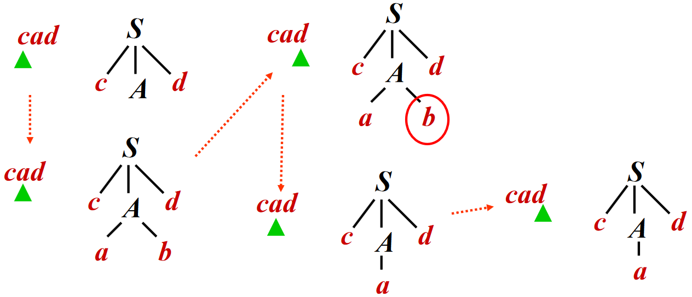

# 自顶向下分析

自顶向下分析需要从分析树的顶部向底部方向构造分析树，即从文法开始符号 $S$ 推导出串 $w$。在每一步推到中，都需要做两个选择：

- 替换当前句型中的哪个非终结符？
    - 自顶向下分析总是选择每个句型的**最左非终结符**进行替换
- 用该非终结符的哪个产生式进行替换？

接下来将会为第二个问题提供解决方案

## 允许回溯的递归下降分析

递归下降分析 (Recursive-Descent Parsing) 是自顶向下分析的通用形式

- 由一组过程/函数组成，每个过程对应一个非终结符
- 从开始符号 $S$ 对应的**过程**开始，（递归）调用其它**过程**
- 如果 $S$ 对应的过程恰好扫描了整个输入串，则成功完成分析

对于非终结符 $A$ 的文法规则 $A \rightarrow X_1 \ldots X_k$，对应的**过程**为：

- 如果 $X_i$ 是非终结符，则调用相应非终结符对应的过程
- 如果 $X_i$ 是终结符 $a$，则检查输入串是否匹配该终结符，匹配输入串中对应的终结符 $a$
- 在这个过程中，如果选择了不合适的产生式，可能需要回溯（如更换产生式）

??? example "递归下降分析的例子"
    考虑文法
    
    $$
    \begin{aligned}
    S &\rightarrow cAd \\
    A &\rightarrow ab | a
    \end{aligned}
    $$

    为输入串 $w = cad$ 使用递归下降分析建立分析树（假设按顺序选产生式），过程如下：

    

但是在通用递归下降中，存在一个很大的问题：**回溯**

- 复杂的回溯导致**代价太高**
    - 非终结符有可能有多个产生式，由于信息缺失，无法准确预测选择哪一个
    - 考虑到往往需要对多个非终结符进行推导展开，因此尝试的路径可能呈指数级爆炸（如 $a \rightarrow ab | a$，不确定选择哪条产生式）
- 计算过程类似于 NFA

所以需要构造一个类似于 DFA 的分析方式

## LL(1) 和预测分析法

### LL(1) 文法的定义

预测分析法 (Predictive Parsing) 可以接受 LL(k) 文法，其中：

- 第一个 L 表示 left-to-right，即**从左到右**扫描输入串
- 第二个 L 表示 leftmost derivation，即**最左推导**
- k 表示**向前看 Token** 的个数，即向前看 $k$ 个 Token 来确定产生式（通常 $k = 1$）

为了给文法加以限制来确保没有回溯，我们先来定义 *First* 集和 *Follow* 集。给定文法 $G = (T, N, P, S)$：

- $\text{First}(\alpha) = \{a | \alpha \Rightarrow^* a \ldots, a \in T\}, \alpha \in (T \cup N)^*$
    - 即可从 $\alpha$ 推导得到的串的首个终结符的集合
- $\text{Follow}(A) = \{a | S \Rightarrow^* \ldots Aa \ldots, a \in T\}, A \in N$
    - 即从 $S$ 出发, 可能在推导过程中跟在 $A$ **右边**的终结符号集
    - 例如 $S \rightarrow \alpha A a \beta$，则终结符号 $a \in \text{Follow}(A)$

由此我们可以给出 LL(1) 文法的定义：文法G的任何两个产生式 $A \rightarrow \alpha | \beta$ 都满足下列条件

- $\text{First}(\alpha) \cap \text{First}(\beta) = \emptyset$，即 $\alpha$ 和 $\beta$ 推导不出以同一个单词为首的串
- 若 $\beta \Rightarrow^* \epsilon$，则 $\alpha \nRightarrow^* \epsilon$，且 $\text{First}(\alpha) \cap \text{Follow}(A) = \emptyset$

这样，可以保证产生式选择的唯一性

??? note "为什么这么定义 LL(1) 文法？"
    对于第一个条件而言，存在的意义为：假设下一个输入是 $b$，且 $\text{First}(\alpha)$ 和 $\text{First}(\beta)$ 不相交，那么

    - 若 $b \in \text{First}(\alpha)$，则选择 $\alpha$
    - 若 $b \in \text{First}(\beta)$，则选择 $\beta$

    对于第二个条件而言，存在的意义为：假设下一个输入是 $b$ 且 $\beta \Rightarrow^* \epsilon$，那么

    - 若 $b \in \text{First}(\alpha)$，则选择 $\alpha$（属于第一个条件中的情况）
    - 若 $b \in \text{Follow}(A)$，则选择 $\beta$，因为这样可以使得 $A \Rightarrow^* \epsilon$ 且后面跟着 $b$

### 实现 LL(1) 预测分析

#### 计算 First 和 Follow 集

由于在 First 和 Follow 集中涉及**空串**，因此我们引入 *Nullable* 的概念：$X$ 是 Nullable 的，即 $X$ 能推导出空串

我们接着给出 Nullable，First 和 Follow 集的归纳定义：

Nullable 的归纳定义：$X$ 是 Nullable 的，当且仅当

- Base case: $X \rightarrow \epsilon$
- Inductive case: 若 $X \rightarrow Y_1 Y_2 \ldots Y_k$，且 $Y_1, Y_2, \ldots, Y_k \in N$ 都是 Nullable 的

First 的归纳定义：$\text{First}(\alpha) = \{a | \alpha \Rightarrow^* a \ldots, a \in T\}$

- Base case: $\text{First}(X) = \{X\}$，如果 $X \in T$
- Inductive case: 若 $X \rightarrow Y_1 Y_2 \ldots Y_k$，则
    - $\text{First}(X) \ \cup= \text{First}(Y_1)$
    - 如果 $Y_1 \in \text{Nullable}$，则 $\text{First}(X) \ \cup= \text{First}(Y_2)$
    - 如果 $Y_1, Y_2 \in \text{Nullable}$，则 $\text{First}(X) \ \cup= \text{First}(Y_3)$
    - ...

> 补充说明：虽然上述规则看起来是关于单个非终结符或终结符的，但是实际中 First 是关于文法符号串 $\alpha$（类似于产生式右部）的，计算规则类似于 Inductive case

Follow 的归纳定义：$\text{Follow}(A) = \{a | S \Rightarrow^* \ldots Aa \ldots, a \in T\}$

- Base case: $\text{Follow}(S) = \{\$\}$
- Inductive case: 若存在产生式 $B \rightarrow s_1 A s_2, s_1, s_2 \in (T \cup N)^*$，则
    - $\text{Follow}(A) \ \cup= \text{First}(s_2)$
    - 如果 $s_2 \in \text{Nullable}$，则 $\text{Follow}(A) \ \cup= \text{Follow}(B)$

> 补充说明：关于 Inductive case 的第 2 种情况, 假设 $S \Rightarrow^* \ldots B b \ldots$，即 $b \in \text{Follow}(B)$
> 
> - 用 $s_1 A s_2$ 替换 $B$，得到 $S \Rightarrow^* \ldots s_1 A s_2 b \ldots$
> - 由于 $s_2 \in \text{Nullable}$，因此 $b \in \text{Follow}(A)$

??? example "计算 Nullable，First 和 Follow 集<i id="Calculate Nullable, First, Follow"></i>"
    

??? lab "优化 Nullable, First, Follow 的计算 - Tiger book algorithm 3.13"
    <pre id="Calculat-Nullable-First-Follow" class="pseudocode">
    \begin{algorithm}
    \caption{Calculate Nullable, First, Follow}
    \begin{algorithmic}
    \Function{CalculateNullableFirstFollow}{}
        \State Initialize $\text{First}$ and $\text{Follow}$ to all empty sets, and $\text{Nullable}$ to all false
        \For{each terminal symbol $Z$}
            \State $\text{First}[Z] \gets \{Z\}$
        \EndFor
        \Repeat
            \For{each production $X \rightarrow Y_1 Y_2 \ldots Y_k$}
                \For{each $i$ from $1$ to $k$, each $j$ from $i+1$ to $k$}
                    \If{all the $Y_i$ are nullable}
                        \State $\text{Nullable}[X] \gets \text{true}$
                    \EndIf
                    \If{$Y_1, \ldots, Y_{i-1}$ are all nullable}
                        \State $\text{First}[X] \gets \text{First}[X] \cup \text{First}[Y_i]$
                    \EndIf
                    \If{$Y_{i+1}, \ldots, Y_k$ are all nullable}
                        \State $\text{Follow}[Y_i] \gets \text{Follow}[Y_i] \cup \text{Follow}[X]$
                    \EndIf
                    \If{$Y_{i+1}, \ldots, Y_{j-1}$ are all nullable}
                        \State $\text{Follow}[Y_i] \gets \text{Follow}[Y_i] \cup \text{First}[Y_j]$
                    \EndIf
                \EndFor
            \EndFor
        \Until{$\text{First}$, $\text{Follow}$, and $\text{Nullable}$ no longer change}
    \EndFunction
    \end{algorithmic}
    \end{algorithm}
    </pre>

#### 构造预测分析表

预测分析表是表驱动分析程序需要的二维表（记为 $M$），其中

- 表的每一行 $A$ 对应一个非终结符
- 表的每一列 $a$ 对应某个终结符或输入结束符 $\$$
- 表中的项 $M(A,a)$ 表示: 针对非终结符为 $A$，当下一个输入 Token 为 $a$ 时，可选的产生式集合（若为空，表示语法错误 syntax errors）

构造方法为：对文法 $G$ 的每个产生式 $X \rightarrow \gamma$

- 对每个 $t \in \text{First}(\gamma)$，则将 $X \rightarrow \gamma$ 加入 $M[X, t]$
- 另如果 $\gamma \in \text{Nullable}$，且 $t \in \text{Follow}(X)$，则将 $X \rightarrow \gamma$ 加入 $M[X, t]$

??? example "构造预测分析表"
    以 <a href="#Calculate Nullable, First, Follow">计算 Nullable，First 和 Follow 集</a> 为例，构造预测分析表如下：

    

    可以看到在表中 [$Z$, $d$]、[$Y$, $c$]、[$X$, $a$] 等项处有多个产生式，表明存在二义性，该文法不是 LL(1) 文法

由预测分析表可以给出 LL(1) 文法的另一个定义：如果文法 $G$ 的预测分析表中每个项都至多有一个产生式，则文法 $G$ 是 LL(1) 文法

#### 预测分析

对于 LL(1) 分析，有两种实现方式：

- 递归下降实现
    - 递归下降语法分析程序由一组过程组成
    - 每个非终结符号对应于一个过程
    - 可以通过向前看一个输入符号来唯一地选择产生式
- *非递归实现
    - 可以看作是实现 LL(1) 对应的的 PDA (pushdown automata)
    - 针对输入串 $w$，有两个基本动作
        - 如果栈顶是非终结符 $A$，则利用预测分析表, 选择产生式 $A \rightarrow \alpha$，将栈顶的非终结符 $A$ 替换成串 $\alpha$
        - 如果栈顶是终结符 $\alpha$，则将栈顶记号 $\alpha$ 和输入中的 Token 匹配

对于递归下降实现中，一个过程可以表示为：

``` c
void A() {
    // 根据 Lookahead Token 与预测分析表选择产生式
    // 记该产生式为 A -> X1 X2 ... Xn
    // ...

    for (int i = 0; i < k; i++) {
        if (isNonterminal(Xi)) {
            // 调用对应的过程
            Xi();
        } else if (Xi == inputToken) {
            // 匹配输入 Token
            eat(inputToken);
        } else {
            // 语法错误
            error();
        }
    }
}
```

??? example "LL(1) 的递归下降实现"
    考虑文法

    $$
    \begin{aligned}
    S &\rightarrow \textbf{if}\ E\ \textbf{then}\ S\ \textbf{else}\ S\ |\ \textbf{begin}\ S\ L\ |\ \textbf{print}\ E \\
    L &\rightarrow \textbf{end}\ |\ \textbf{;}\ S\ L \\
    E &\rightarrow \textbf{num} = \textbf{num}
    \end{aligned}
    $$

    Step 1: Represent the token
    ``` c
    enum token {IF, THEN, ELSE, BEGIN, END, PRINT, SEMI, NUM, EQ};
    ```

    Step 2: build infrastructure for reading tokens from lexer
    ``` c
    // call lexer
    extern enum token getToken(void);
    // store the next token
    enum token tok;
    void advance() {
        tok=getToken();
    }
    // consume the next token and get the new one
    void eat(enum token t) {
        if (tok==t) {
            advance(); 
        } else {
            error();
        }
    }
    ```

    Step 3: build a function for each non-terminal
    ``` c
    void S(void) {
        switch(tok) {
            case IF: eat(IF); E(); eat(THEN); S(); eat(ELSE); S(); break;
            case BEGIN: eat(BEGIN); S(); L(); break;
            case PRINT: eat(PRINT); E(); break;
            default: error();
        }
    }
    void L(void) {
        switch(tok) {
            case END: eat(END); break;
            case SEMI: eat(SEMI); S(); L(); break;
            default: error();
        }
    }
    void E(void) {
        eat(NUM); eat(EQ); eat(NUM);
    }
    ```

    当然，这个语法比较特殊：对于每一个非终结符的所有的产生式，右边第一个符号都是不同的终结符，所以可以很轻松的写出 `switch` 语句。如果没有这种“便利”的条件，需要先写出预测分析表，再“硬编码”到switch语句

??? example "*LL(1) 的非递归实现"
    

### 消除左递归与左公因子

LL(1)文法有一些明显的性质

- LL(1)文法是无二义的
- LL(1)文法是无左递归的
- LL(1)文法是无左公因子的

#### 无左递归

左递归 (left-recursive) 文法

- 如果一个文法中有非终结符号 $A$ 使得 $A \Rightarrow^+ A \alpha$，那么这个文法就是左递归的
- 特别的，称 $S \rightarrow S a | b$ 为直接/立即左递归

左递归带来的问题是：在递归下降分析中，可能会导致无限循环

- 如考虑串 $baaaaa$
- 在最左推导下，若只看下个 Token，可能产生 $S \Rightarrow S a \Rightarrow S a a \Rightarrow S a a a \Rightarrow \ldots$

为了解决这个问题，可以考虑限制文法或者进行文法变换以消除左递归。其中，消除左递归的文法变换的一个例子如下：

- 原先：$A \rightarrow A \alpha | \beta$，其中 $\alpha \neq \epsilon$，$\alpha$ 和 $\beta$ 都不以 $A$ 开头，如图中 a)
- 修改为：$A \rightarrow \beta A'$，$A' \rightarrow \alpha A' | \epsilon$，如图中 b)


#### 无左公因子

有左公因子的 (left-factored) 文法如：$P \rightarrow \alpha \beta | \alpha \gamma$，与之而来的问题是同一非终结符的多个候选式存在共同前缀，可能导致回溯。同样可以考虑限制文法或进行文法变换，其中消除该产生式的左公因子的文法变换为：

$$
\begin{aligned}
P &\rightarrow \alpha Q \\
Q &\rightarrow \beta | \gamma
\end{aligned}
$$

其中 $Q$ 为新添加的未出现过的非终结符

这种方法类似于通过改写产生式来推迟决定，等读入了足够多的输入、获得足够信息后再做选择

### 错误恢复

上文提及，预测分析表中一个空白的项表示语法错误，对于这种情况，有两种解决方式：

- 抛出异常并停止分析
- 打印错误信息，并从当前错误中恢复，继续分析
    - 常用的方法有 deleting, replacing, inserting

??? example "错误恢复的例子"
    - Through inserting: pretend we have the token and return normally
    ``` c
    void T( ) {
        switch (tok) {
            case ID:
            case NUM:
            case LPAREN: F( ); Tprime( ); break;
            default: print("expected id, num, or left-paren");
        }
    }
    ```
    - Deleting tokens is safer, because the loop must eventually terminate when EOF is reached. Simple recover by deletion works by skipping tokens util a token in the FOLLOW set is reached
    ``` c
    int Tprime_follow[] = {PLUS, RPAREN, EOF};
    void Tprime() {
        switch (tok) {
            case PLUS: break;
            case TIMES: eat(TIMES); F(); Tprime(); break;
            case RPAREN: break;
            case EOF: break;
            default: print("expected +, *, right-paren, or
            end-of-file");
            skipto(Tprime_follow);
        }
    }
    ```