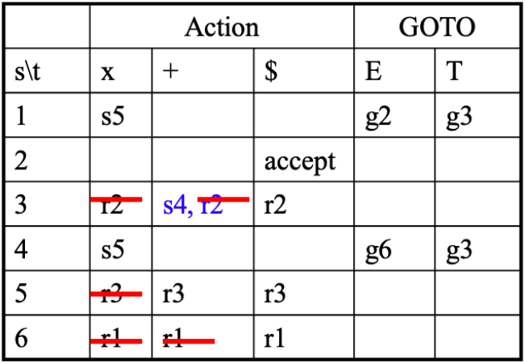
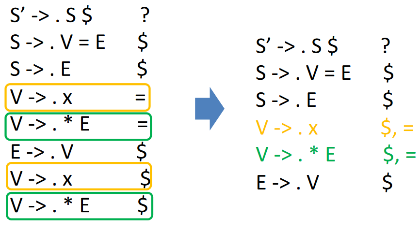
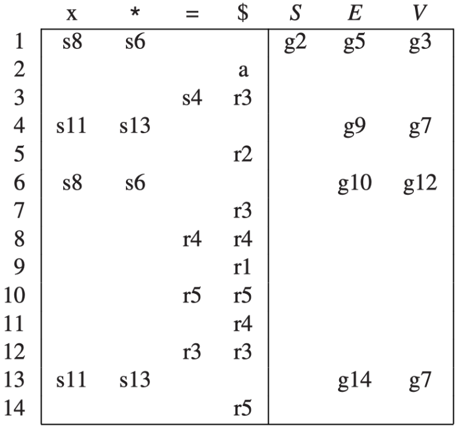
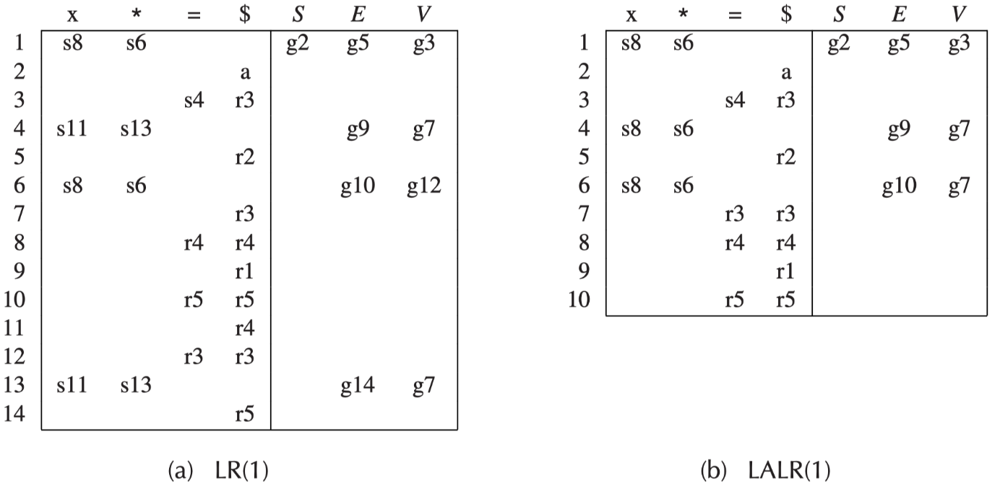
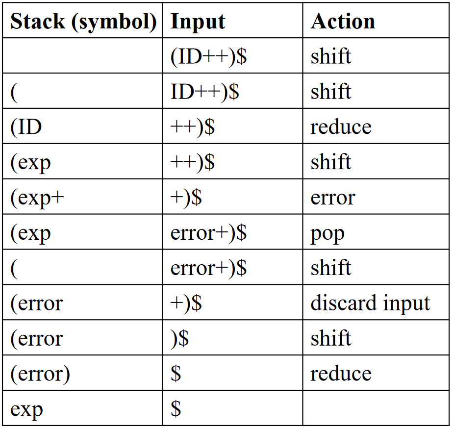

# 自底向上分析

在自顶向下分析中，我们了解了 LL(1) 文法的概念，我们可以看到 LL(1) 文法的特点有

- 优点
    - 运行高效(线性时间)
    - 递归实现符合文法结构、适合手动构造与自动生成
- 局限性
    - 能分析的文法类型受限

由此我们引出基于 LR(k) 的文法。这是一种更强大的文法，每种 LL(k) 文法都是 LR(k) 文法，但反之不然。这类文法被 Parser 自动生成器广泛采用（如 Yacc, Bison 等）

- L 表示 left-to-right scanning，即自左向右扫描
- R 表示 rightmost derivation in reverse，即最右推导的逆
- k 表示向前看的字符的个数（当 k 被省略的时候, 默认为 1）

## 移进-规约 (Shift-Reduce)

> LR 分析并不需要消除左递归或左公因子，例如如下的文法
> 
> $$
> E \rightarrow E + (E) | \textbf{int}
> $$
> 
> 不是 LL(1) 但是是 LR(1) 的

对一个具体的输入串 $\textbf{int} + (\textbf{int}) + (\textbf{int})$，移进-规约的主要思想是将串分成两个子串：

- 右侧子串（由终结符组成）还没有被 Parser 处理
- 左侧子串（由终结符和非终结符组成）已经被 Parser 处理
- 分隔符是一个特殊的符号 $|$
    - 请注意这并不是串的一部分
- 初始时，所有的输入都没有被处理，即左侧子串为空，右侧子串是整个输入串
    - 例如 $| \textbf{int} + (\textbf{int}) + (\textbf{int})$

??? example "移进-规约的例子"
    以上述的输入串为例，移进-规约的过程如下：

    

总结一下

- LR 分析是最右推导的逆过程
    - 类似 LL 中的最左推导，同样限制了规约方式
- LR 分析的每一步都是最右句型（最右推导过程中出现的句型）
    - $\alpha | \beta$ 是最右句型

具体的实现方法如下：

### 基于栈的移进-归约

基于栈的移进-归约是 LR 实现的一般模式，包括如下的内容：

- 两个组成部分
    - 栈 (Stack)：存储左子串 $\alpha$（已经处理的部分，包括终结符和非终结符）
    - 输入流 (Input steam)：存储右子串 $\beta$（还未处理的部分，只包括终结符）
- 四个基本动作
    - 移进 (Shift)
        - 将输入流下一个输入（终结符）压入栈顶
    - 规约 (Reduce)
        - 栈顶部的符号串匹配某个产生式右部（如 $X \rightarrow ABC$ 中的 $ABC$）
        - 从栈顶部弹出相应的符号串（如依次弹出 $C$ $B$ $A$）
        - 将产生式左部压入栈顶（如压入 $X$）
    - 错误 (Error)：分析失败
    - 接受 (Accept)：移进 $\$$ 并和栈中剩余的所有符号一起规约为开始符号

!!! note "核心问题在于如何选择移进和规约的时机"

### 表驱动的 LR 分析

表驱动的 LR 分析是最通用的无回溯移入-规约分析

- 所有的分析器都使用相同的驱动程序
    - 虽然复杂语法对应的表很大，但分析表可以自动生成
    - 分析表随 LR 分析文法的不同而不同

示例图如下：


## LR(0) 分析

??? question "如何知道栈顶的内容可以归约了？"
    维护一个状态，记录当前识别的进度

### LR(0) 语法分析思路

引入如下的概念：

- 项 (Item)：一个产生式加上在其中某处的一个点
    - $A \rightarrow \alpha \cdot \beta$ 意味着已经扫描/规约到了 $\alpha$，并期望在接下来的输入中经过扫描/归约得到 $\beta$，然后把 $\alpha \beta$ 归约到 $A$
    - $A \rightarrow \alpha \beta \cdot$ 意味着已经扫描/规约得到了 $\alpha \beta$，可以将 $\alpha \beta$ 归约到 $A$
    - 以产生式 $A \rightarrow \cdot XYZ$ 为例，项有 $A \rightarrow \cdot XYZ$, $A \rightarrow X \cdot YZ$, $A \rightarrow XY \cdot Z$, $A \rightarrow XYZ \cdot$
    - LR(0) 的 Item 类似有穷自动机的状态
- 状态跳转
    - 一个项读入一个符号后，可变为另一个项
    - $A \rightarrow \cdot xyz$ 可以变为 $A \rightarrow x \cdot yz$，类似状态间的**跳转**

> 文法产生式是有限的，项的数量也是有限的，每个产生式右部的长度也是有限的，结合**状态**和**跳转**的概念，可以看作一台有穷自动机，称为 **LR(0)自动机**


### LR(0) Parsing NFA

!!! note "此处的NFA不是指直接用来识别 LR(0) 语言的自动机（NFA 只能识别正则语言，然而正则语言 < LR(0)）。该 NFA 是用来*记录当前识别进度*的（帮助判断栈顶内容是否可归约了）"


- 起始和终结状态
    - 文法 $G$ 中增加新开始符号 $S'$，并加入产生式 $S' \rightarrow S\$$
    - 按 $S' \rightarrow S\$$ 进行归约（*将输入符号串归约成为开始符号*）
    - 加入 $S'$ 方便表示起始和终结状态
- 状态迁移
    - LR(0) Item 之间会有转换关系，如
        - $X \rightarrow \cdot \alpha \beta$ 接收 $\alpha$ 后转换为 $X \rightarrow \alpha \cdot \beta$
        - 若存在产生式 $X \rightarrow \alpha Y \beta$ 和 $Y \rightarrow \gamma$，则 $X \rightarrow \alpha \cdot Y \beta$ 可以转换到 $Y \rightarrow \cdot \gamma$ 

??? example "LR(0) Parsing NFA"
    以文法

    $$
    \begin{aligned}
    S' &\rightarrow S \$ \\
    S &\rightarrow ( S ) \\
    S &\rightarrow a
    \end{aligned}
    $$

    为例，LR(0) Parsing NFA 如下：

    

    回想子集构造法，可以将一组 LR(0) Items（称为项集）看作一个 DFA 的状态，得到如下的 LR(0) Parsing DFA

    

### LR(0) Parsing DFA

!!! note "类似 LR(0) Parsing NFA，此处的 DFA 不是指直接用来识别 LR(0) 语言的自动机（DFA只能识别正则语言，然而正则语言 < LR(0)）。该DFA是用来*记录当前识别进度*的（帮助判断栈顶内容是否可归约了）"

在上面的例子中，我们构造了 LR(0) Parsing NFA 并将其转换为 DFA，不过在实际过程中，我们可以跳过 NFA 直接构造 DFA

假定

- $I$ 是一个项集
- $X$ 是一个符号（终结符或非终结符）
- $T$ 是一个项集的集合
- $E$ 是一个边的集合

我们定义两个过程：

- Closure($I$)
    - 类似 NFA 转 DFA 过程中的 $\epsilon$-closure
- Goto($I$, $X$)
    - 类似 NFA 转 DFA 过程中计算新的 DFA 状态

<pre class="pseudocode">
\begin{algorithm}
\caption{LR(0) Parsing DFA - Closure}
\begin{algorithmic}
\Function{Closure}{$I$}
    \Repeat
        \For{any item $A \rightarrow \alpha \cdot X \beta$ in $I$}
            \For{any production $X \rightarrow \gamma$}
                \State $I \gets I \cup \{X \rightarrow \cdot \gamma\}$
            \EndFor
        \EndFor
    \Until{no new items can be added to $I$}
    \State \Return $I$
\EndFunction
\end{algorithmic}
\end{algorithm}
</pre>

<pre class="pseudocode">
\begin{algorithm}
\caption{LR(0) Parsing DFA - Goto}
\begin{algorithmic}
\Function{Goto}{$I$, $X$}
    \State set $J$ to the empty set
    \For{any item $A \rightarrow \alpha \cdot X \beta$ in $I$}
        \State $J \gets J \cup \{A \rightarrow \alpha X \cdot \beta\}$
    \EndFor
    \State \Return \Call{Closure}{$J$}
\EndFunction
\end{algorithmic}
\end{algorithm}
</pre>

结合 Closure 和 Goto 过程，可以整理出 LR(0) Parsing DFA 构造的算法

<pre class="pseudocode">
\begin{algorithm}
\caption{LR(0) Parsing DFA}
\begin{algorithmic}
\Function{LR0DFA}{}
    \State Initialize $T$ to $\{$\Call{Closure}{$\{S' \rightarrow \cdot S\$\}$}$\}$
    \State Initialize $E$ to empty set (set of edges)
    \Repeat
        \For{each state $I$ in $T$}
            \For{each item $A \rightarrow \alpha \cdot X \beta$ in $I$}
                \State $J \gets$ \Call{Goto}{$I$, $X$}
                \State $T \gets T \cup \{J\}$
                \State $E \gets E \cup \{I \xrightarrow{X} J\}$
            \EndFor
        \EndFor
    \Until{no new members are added to $T$ or $E$}
    \State \Return $T$, $E$
\EndFunction
\end{algorithmic}
\end{algorithm}
</pre>

??? example "LR(0) Parsing DFA<i id="LR(0) Parsing DFA example"></i>"
    以文法

    $$
    \begin{aligned}
    0: S' &\rightarrow S \$ \\
    1: S &\rightarrow x S \\
    2: S &\rightarrow y
    \end{aligned}
    $$

    为例，LR(0) Parsing DFA 如下：

    

### LR(0) 语法分析表

以上例 [LR(0) Parsing DFA](#LR(0) Parsing DFA example) 为例，构造出的 LR(0) 语法分析表如下：


表由两个部分组成：**动作 (Action)** 与 **转换 (GOTO)**

- Action 表项的参数：状态 $i$，终结符号 $t$
    - 移入 (Shift)：若从状态 $i$ 到状态 $j$ 有一条边标记为 $t$，则在 Action 表中 $[i, t] = sj$ (shift j)；涉及栈分析时，向前移动一个 Token，把新状态 $j$ 压入栈
    - 规约 (Reduce)：在状态 $i$ 中有一个项 $A \rightarrow \beta \cdot$，且 $A \rightarrow \beta$ 是第 $k$ 条产生式，则在 Action 表中 $[i, \text{each terminal symbol}] = rk$ (reduce k)；涉及栈分析时，弹出 $|\beta|$ 个状态，然后根据 GOTO 表将其中 $\text{GOTO}[\text{top(stack)}, A]$ 压入栈
    - 接受 (Accept)：对于每个包含 $S' \rightarrow S \cdot \$$ 的状态 $i$，在 Action 表中 $[i, \$] = \text{accept}$；涉及栈分析时，结束分析，接受输入返回成功
    - 报错：在输入中发现语法错误，停止分析并报错
- GOTO 表项的参数：状态 $i$，非终结符 $A$
    - 若从状态 $i$ 到状态 $j$ 有一条边标记为 $A$（即函数 $\text{Goto}[I_i, A] = I_j$），则在 GOTO 表中 $\text{GOTO}[i, A] = j$

> 上述提及的涉及栈分析是一套可以被其他 LR 分析器使用的通用算法

输入文法的 LR 语法分析表与输入串 $w$，分析算法的一个简略表述为：

``` c
// 令 s 是栈顶状态, a 是 w$ 的第一个符号;
while (1) { // 一开始 s 为 Parsing DFA 的状态 1
    if (Action[s, a] = "shift s'") {
        // 将 s' 压入栈内；
        // 将下一个输入符号赋值给 a；
    } else if (Action[s, a] = "reduce A → β") {
        // 从栈顶弹出 |β| 个状态；
        // 令 s' 是当前栈顶状态, 把 GOTO[s', A] 入栈；
    } else if (Action[s, a] = “Accept”) break;
    else error( ); // 调用后面会提及的错误恢复程序;
}
```

!!! warning "LR **实际实现只有状态栈**，符号信息可从相应状态中获取。下面例子中的文法符号栈是为了方便理解"

??? example "完整的 LR(0) 语法分析"
    示例一
    

    示例二
    

### LR(0) 的问题/局限性

??? question "为什么说 LR(0) 没有 Lookahead？"
    LR(0) Item 中没有 lookahead terminal 等信息，使得*是否归约*、*选择哪个产生式规约*仅由栈顶状态决定

对于 LR(0) 文法而言，一旦存在状态 $X \rightarrow \alpha \cdot$，就会盲目的将 $\alpha$ 规约为 $X$，可能导致冲突，如从文法

$$
\begin{aligned}
0:\ &S \rightarrow E \$ \\
1:\ &E \rightarrow T + E \\
2:\ &E \rightarrow T \\
3:\ &T \rightarrow x
\end{aligned}
$$

出发，构造的 LR(0) Parsing DFA 与 LR(0) 语法分析表如下：


标红的地方存在移入-规约冲突 (shift-reduce conflict)，即状态 3 中无法确定是移入 $+$ 还是规约到 $E$

## SLR(1) 分析

为了一定程度上改善 LR(1) 存在的问题，SLR(1) 利用更多信息来指导规约操作，即每步归约都应该满足 $t \in \text{Follow}(E)$，其中

- $E$ 是用来归约的产生式的左部
- $t$ 是 Next Token

因此

- SLR(1) Parsing DFA 和 LR(0) 的相同
- 构造分析表时的**归约动作**不同，每步归约都应该满足 $t \in \text{Follow}(E)$

<pre class="pseudocode">
\begin{algorithm}
\caption{SLR(1) - Reduce}
\begin{algorithmic}
\Function{Reduce}{$T$}
    \State set $R$ to the empty set
    \For{each state $I$ in $T$}
        \For{each item $A \rightarrow \alpha \cdot$ in $I$}
            \For{each token $X$ in $\text{Follow}(A)$}
                \State $R \gets R \cup \{(I, X, A \rightarrow \alpha)\}$
            \EndFor
        \EndFor
    \EndFor
    \State \Return $R$
\EndFunction
\end{algorithmic}
\end{algorithm}
</pre>

例如上述涉及 LR(0) 局限性的例子，SLR(1) 语法分析表如下：



解决了 LR(0) 中存在的 shift-Reduce conflict

### SLR(1) 的问题/局限性

考虑文法

$$
\begin{aligned}
S' &\rightarrow S \$ \\
S &\rightarrow L = R | R \\
L &\rightarrow * R | id \\
R &\rightarrow L
\end{aligned}
$$

我们可以知道 $\text{Follow}(R) = \text{Follow}(L) = \{=, \$\}$，因此，在如下的 DFA 中，状态 3 存在 shift-reduce conflict


## LR(1) 分析

LR(1)

- 项中包含更多信息来消除一些归约动作，实际的做法相当于“分裂”一些 LR(0) 状态，精确指明何时应该归约
- 形式为 $A \rightarrow \alpha \cdot \beta, a$
    - $a$ 称为向前看符号，可以是终结符号或者 $\$$
    - $A \rightarrow \alpha \cdot \beta, a$ 表示序列 $\alpha$ 在“符号栈”的栈顶，接下来的输入串的头部是一个可以由 $\beta a$ 推导出的串

### LR(1) 的 Closure, Goto 和 Reduce Action

!!! note "一些提示"
    - 对于 Closure，处理 $\epsilon$-transations（添加 $X \rightarrow \cdot \gamma$）时，需要记录 $w \in \text{First}(\beta z)$，把 $A \rightarrow \alpha \cdot X \beta, z$ 的信息“传递”到 $X \rightarrow \cdot \gamma, w$ 中
    - 起始状态是 LR(1) 项 $S' \rightarrow • S \$, ?$ 的闭包，其中 $?$ 是什么无关紧要，因为 $\$$ 不会被移进
    - 在 Reduce 中，action $(I, z, A \rightarrow \alpha)$ 表示在状态 $I$ 中，遇到了一个向前看符号 (lookahead symbol) $z$，可以按 $A \rightarrow \alpha$ 规则规约
        - 这样的话，LR(1) 的向前看符号要比 SLR(1) 更加精确（因为一些在 $\text{Follow}(A)$ 中的符号可能不会触发规约）
        - 如果要根据 $A \rightarrow \alpha \cdot, z$ 规约，下一个输入符号必须是 $z$

<pre class="pseudocode">
\begin{algorithm}
\caption{LR(1) Parsing DFA - Closure}
\begin{algorithmic}
\Function{Closure}{$I$}
    \Repeat
        \For{any item $A \rightarrow \alpha \cdot X \beta, z$ in $I$}
            \For{any production $X \rightarrow \gamma$}
                \For{any $w \in \text{First}(\beta z)$}
                    \State $I \gets I \cup \{(X \rightarrow \cdot \gamma, w)\}$
                \EndFor
            \EndFor
        \EndFor
    \Until{no new items can be added to $I$}
    \State \Return $I$
\EndFunction
\end{algorithmic}
\end{algorithm}
</pre>

<pre class="pseudocode">
\begin{algorithm}
\caption{LR(1) Parsing DFA - Goto}
\begin{algorithmic}
\Function{Goto}{$I$, $X$}
    \State set $J$ to the empty set
    \For{any item $(A \rightarrow \alpha \cdot X \beta, z)$ in $I$}
        \State $J \gets J \cup \{(A \rightarrow \alpha X \cdot \beta, z)\}$
    \EndFor
    \State \Return \Call{Closure}{$J$}
\EndFunction
\end{algorithmic}
\end{algorithm}
</pre>

<pre class="pseudocode">
\begin{algorithm}
\caption{LR(1) - Reduce}
\begin{algorithmic}
\Function{Reduce}{$T$}
    \State set $R$ to the empty set
    \For{each state $I$ in $T$}
        \For{each item $(A \rightarrow \alpha \cdot, z)$ in $I$}
            \State $R \gets R \cup \{(I, z, A \rightarrow \alpha)\}$
        \EndFor
    \EndFor
    \State \Return $R$
\EndFunction
\end{algorithmic}
\end{algorithm}
</pre>

??? example "LR(1) Parsing<i id="LR(1) Parsing"></i>"
    以文法

    $$
    \begin{aligned}
        0:\ &S' \rightarrow S \$ \\
        1:\ &S \rightarrow V = E \\
        2:\ &S \rightarrow E \\
        3:\ &E \rightarrow V \\
        4:\ &V \rightarrow x \\
        5:\ &V \rightarrow * E
    \end{aligned}
    $$

    为例，计算 $S' \rightarrow S \$$ 的闭包，结果为：

    

    中间过程过于复杂，省略，最终的 LR(1) Parsing Table 如下：

    

### LR(1) 的问题/局限性

正如上例 [LR(1) Parsing](#LR(1) Parsing) 所示，LR(1) 语法分析表的大小可能会非常大，因为每个项都有一个向前看符号，这可能导致表的大小超过实际需要

## LALR(1) 分析

以上例 [LR(1) Parsing](#LR(1) Parsing) 为基础，画出 LR(1) Parsing DFA


被相同颜色框选出的状态只有在向前看符号不同，可以尝试将其合并

### LR(1) 项集中的 Core

LR 项集的 core 是指项集中的项去掉向前看符号后的部分（即前半部分）

例如 $\{(X \rightarrow \alpha \cdot \beta, b), (Y \rightarrow \gamma \cdot \delta, d)\}$ 的 core 是 $\{ X \rightarrow \alpha \cdot \beta, Y \rightarrow \gamma \cdot \delta \}$

### LALR(1) 的构造

由此引出 LALR(1)：将 LR(1) Parsing DFA/Table 中 core 相同的项集（除了向前看符号不同之外，其他部分是相同的状态）合并

具体的构造方法如下：

- 重复以下的步骤直到所有状态都有不同的核心
    - 选择具有相同核心的两个不同状态
    - 通过将这两个状态的项集合并在一起，创建一个新的状态
    - 将指向原先两个状态的边重定向到新状态，将原先两个状态指向其他状态的边重新由新状态指出，如下图  
    

??? example "从 LR(1) 到 LALR(1)"
    在例子 [LR(1) Parsing](#LR(1) Parsing) 的基础上，构造 LALR(1) Parsing Table 如下：

    

    可以看到 LALR(1) Parsing Table 比 LR(1) Parsing Table 小很多，实际应用中占用的空间更小

### LALR(1) vs. LR(1)

- LR(1)
    - 把期望的向前看符号也加入项中成为 LR(1) 项
    - 向前看符号（串）的长度即为 LR(k) 中的 k
    - 充分利用向前看符号，但是状态很多
- LALR(1)
    - 介于 SLR(1) 和 LR(1) 之间，且分析表和 SLR 一样大
    - LALR 已经可以处理大部分的程序设计语言

## 错误恢复

错误恢复的动机在于：分析时，应当能够报告出尽可能多的错误，而不是在遇到一个错误后就停止分析

一般有如下两种错误恢复的方式：

- Local error recovery
    - 在检测到错误的地方，调整栈和输入流，使得分析可以恢复
- Global error repair
    - 找到使得原始输入串变得语法正确的最小的插入和删除操作集合，即使操作并不在 LL 或 LR Parser 首先报告错误的位置

### Local Error Recovery

Yacc 中使用的一种 local error recovery 机制是：使用一个特殊的 `error` 符号来控制错误恢复

例如，对于如下文法

$$
\begin{aligned}
exp &\rightarrow \textbf{ID} \\
exp &\rightarrow exp + exp \\
exp &\rightarrow ( exps ) \\
exps &\rightarrow exp \\
exps &\rightarrow exps ; exp
\end{aligned}
$$

添加额外的*错误产生式*（如 $A \rightarrow \textbf{error} \alpha$）来完成语法错误恢复

$$
\begin{aligned}
exp &\rightarrow \textbf{error} \\
exps &\rightarrow \textbf{error} ; exp
\end{aligned}
$$

这样，如果遇到在表达式的中间遇到语法错误，解析器可以有某种方法跳到下一个分号或者右括号处继续解析

!!! note "一些提示"
    - 这样的分号或者右括号被称为同步记号 (synchronizing tokens)
    - $\textbf{error}$ 被当作一个特殊的终结符号，用来表示错误

当 LR Parser 遇到错误时，它会采取如下的步骤：

- 不断弹出栈中状态，直到栈顶状态包含项 $A \rightarrow \alpha \cdot \textbf{error} \beta$
- 分析器将 $\textbf{error}$ 移入
- 如果 $\beta$ 为空，分析器直接执行归约，并调用相关的语义动作；否则跳过一些符号，找到可以归约为 $\beta$ 的串为止
- 分析器继续分析输入

??? example "Local Error Recovery 的例子"
    以上述给出的文法

    $$
    \begin{aligned}
    exp &\rightarrow \textbf{ID} \\
    exp &\rightarrow exp + exp \\
    exp &\rightarrow ( exps ) \\
    exps &\rightarrow exp \\
    exps &\rightarrow exps ; exp \\
    exp &\rightarrow \textbf{error} \\
    exps &\rightarrow \textbf{error} ; exp
    \end{aligned}
    $$

    为例，对于输入串 $(\textbf{ID}++)$，分析过程如下（注意，这里没有刻画状态栈，仅仅使用“符号栈”来示意）：
    

总结一下 Local Error Recovery：

- 使用**错误产生式**来完成语法错误恢复
    - 如 $A \rightarrow \textbf{error} \alpha$, $stmt \rightarrow \textbf{error};$
- 定义哪些非终结符号有错误恢复动作
    - 如表达式、语句、块、函数定义等非终结符号
- 当语法分析器遇到错误时
    - 执行上述的错误恢复动作

### Global Error Repair

!!! warning "TODO: Add more about Burke-Fisher error repair"

一种全局错误修复的方法是 Burke-Fisher error repair，思路是在 Parser 报告错误的地方之前不多于 K 个 Token 的每个点上进行单 Token 插入、删除或替换

- LL(k) 或 LR(k)（或 LALR 等）语法根本没有修改（没有错误产生式）
- 解析表也没有修改

## 小结：LR(0) SLR(1) LR(1) LALR(1)

\tikzpicture-automata
    \draw [rounded corners=8] (0, 0) rectangle (2, 1)
                            (-0.3, -0.3) rectangle (4, 1.3)
                            (-0.6, -0.6) rectangle (6, 1.6)
                            (-0.9, -0.9) rectangle (8, 1.9)
                            (1, 0.5) node {LR(0)}
                            (3, 0.5) node {SLR(1)}
                            (5, 0.5) node {LALR(1)}
                            (7, 0.5) node {LR(1)};