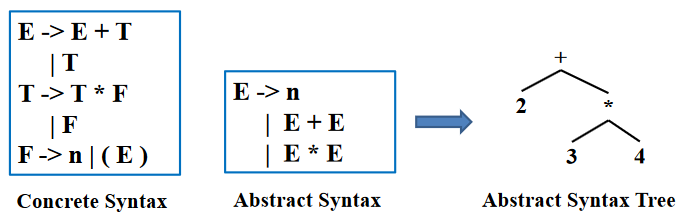
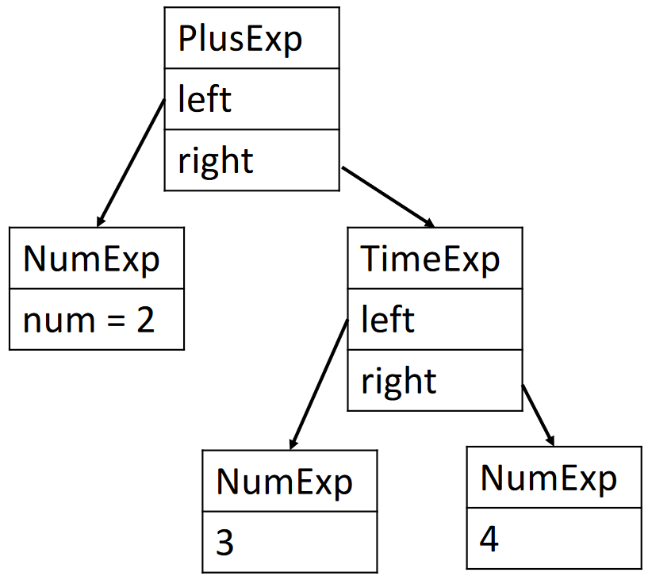

# 抽象语法

## 属性文法

在本章之前，先介绍一下属性文法 (AttributeGrammar)

### 定义

其用**属性**描述语义信息，用**语义规则**描述属性之间的关系，将**语义规则与语法规则相结合**，可以看作是 **上下文无关文法** + **属性** + **属性计算规则**：

- 属性:描述文法符号的语义特征，如变量的类型、值等
    - 例: 非终结符 $E$ 的属性 $E.val$（表达式的值）
- 属性计算规则（语义规则）：与产生式相关联、反映文法符号属性之间关系的规则
    - 比如”如何计算 $E.val$“
    - 仅表明属性间“抽象”关系，不涉及具体实现细节，如计算次序等

### 潜在应用

!!! warning "由于各种局限性，属性文法并未在所有潜在应用上得到普及"

属性文法有两类应用：“推导类”应用 和 “生成类”应用

“推导类”应用类似于程序分析，记录或使用表达式的类型、值、执行代价

<i id="tab:attr-grammer-example"></i>

|产生式|“语法制导”的属性计算规则|
|:-:|:-:|
|$E \rightarrow E_1 '+' E_2$|$E.val := E_1.val + E_2.val$|
|$E \rightarrow E_1 '*' E_2$|$E.val := E_1.val * E_2.val$|
|$E \rightarrow '(' E ')' $|$E.val := E.val$|
|$E \rightarrow number$|$E.val := number.lex_val$|

“生成类”应用类似于程序合成，可以用于

- 抽象语法树生成
- 中间代码甚至汇编生成

### 实现

可以通过 Parser 生成器支持的“语义动作”(Semantic Action) 来实现属性文法，并应用于抽象语法树生成等场景

## 语义动作

### 定义

语义动作是解析函数返回的值，或这些函数的副作用，亦或两者兼而有之

- 对于每个终结符和非终结符，我们可以关联一种语义值的类别，用以表示从该符号派生的语法结构的语义信息
- 每个终结符和非终结符都可能和自己的语义值 (semantic value) 的类别相关联

例如对于一个 $A$ 的产生式 $A \rightarrow B C D$

- 语义动作必须返回一个与非终结符 $A$ 关联的值
- 它可以根据与匹配的终结符和非终结符 $B$、$C$、$D$ 关联的值构建该值

??? example "CFG 和其 Semantic Actions"
    可见上述 [表格](#tab:attr-grammer-example)

### Yacc/Bison 中的语义动作

在 Yacc/Bison 中：

- `{...}` 中的代码块为语义动作
- `$i` 表示第 $i$ 个 RHS 符号的语义值
- `$$` 表示 LHS 符号的语义值
- `%union` 储存了语义值可以携带的不同可能的类型
- `<variant>` 用于声明语义值的类型

一个实例如下

```yacc
%{ ... %}

%union {
    int num;
    string id;
}

%token <num> INT
%token <id> ID
%type <num> exp

...

%left UMINUS

%%

exp : INT { $$ = $1; }
    | exp PLUS exp { $$ = $1 + $3; }
    | exp MINUS exp { $$ = $1 - $3; }
    | exp TIMES exp { $$ = $1 * $3; }
    | MINUS exp %prec UMINUS { $$ = -$2; }
```

??? lab "Yacc 的实现方式"

    - Yacc 生成的解析器会保留一个与状态栈并行的语义值栈
    - 当解析器执行归约时，它必须执行相应的 C 语言语义动作
    - 如何知道规则 $A \rightarrow Y_1 \cdots Y_k$ 的 `$i`
        - 从栈顶部的 k 个元素中
        - 当解析器从符号栈中弹出 $Y_k \cdots Y_1$ 并压入 $A$ 时，它还会从语义值栈中弹出 k 个值并压入通过执行 C 语义动作代码获得的值

## 抽象语法树

### 动机与定义

实际上，我们可以在 Yacc/Bison 的语义动作里直接构建一整个编译器，但是

- 可读性和可维护性差
- 必须按照解析的顺序分析程序

因此，可以选择将语法（解析）问题与语义（类型检查和机器代码翻译）问题分开。为了实现这个目的，需要让解析器生成后续阶段可以遍历的解析树（Parse Tree）：

- 具体解析树（Concrete Parse Tree）：代表源语言的具体语法
    - 对于输入的每个 token 恰好有一个叶子，对于在解析过程中规约（reduce）的每个语法规则有一个内部结点
    - 但是并不方便直接使用：
        - 产生很多后续阶段多余且无用的 token，比如 memory usage
        - 过于依赖具体的语法规则，当语法规则变化时，解析树也需要变化
- 抽象语法树（Abstract Syntax Tree）：代表源语言的抽象语法
    - 解析器使用具体语法（Concrete Syntax）为抽象语法（Abstract Syntax）构建解析树——抽象语法树
    - 仅包含程序的结构信息，不包含具体的细节，在解析器和编译器的后续阶段之间建立一个干净的接口



### 示例与构造

例如，可以使用如下的数据结构：

```c
typedef struct A_exp_ *A_exp;
struct A_exp_ {
    enum {A_numExp, A_plusExp, A_timesExp} kind;
    union {
        int num;
        struct {A_exp left; A_exp right;} plus;
        struct {A_exp left; A_exp right;} times;
    } u;
};

A_exp A_NumExp(int num);
A_exp A_PlusExp(A_exp left, A_exp right);
A_exp A_TimesExp(A_exp left, A_exp right);
```

与对应的添加方法：

```c
A_exp A_PlusExp(A_exp left, A_exp right) {
    A_exp e = checked_malloc(sizeof(*e));
    e->kind = A_plusExp;
    e->u.plus.left = left;
    e->u.plus.right = right;
    return e;
}

A_exp A_TimesExp(A_exp left, A_exp right) {
    A_exp e = checked_malloc(sizeof(*e));
    e->kind = A_timesExp;
    e->u.times.left = left;
    e->u.times.right = right;
    return e;
}
```

那么对于 `2 + 3 * 4`，可以构造如下的抽象语法树：

```c
e1 = A_NumExp(2);
e2 = A_NumExp(3);
e3 = A_NumExp(4);
e4 = A_TimesExp(e2, e3);
e5 = A_PlusExp(e1, e4);
```



此外，也可以使用 Yacc/Bison 的语义动作来构造抽象语法树：

```yacc
%left PLUS
%left TIMES

%%
exp : NUM { $$ = A_NumExp($1); }
    | exp PLUS exp { $$ = A_PlusExp($1, $3); }
    | exp TIMES exp { $$ = A_TimesExp($1, $3); }
```

### 用途

抽象语法树是编译器的重要数据结构，可以用于：

- Pretty print
- Desugaring
- Inlining
- High-level optimizations (e.g., 删除公共子表达式)
- Symbolic execution! (e.g., Clang Static Analyzer)
- Semantic analysis, e.g., type checking
- Translation to intermediate representations
- ...

!!! note "AST 与中间表示"
    编译相关书籍/课程中通常会说“基于 AST 翻译到中间语言/表示”。但是在很多其他场合，我们可以认为 AST 本身也是一种“中间表示”。

### 位置信息

在一次性编译器中，词法分析、语法分析和语义分析都是同时完成的，如果存在必须向用户报告的类型错误，则词法分析器的当前位置是错误源位置的合理近似值。因此，在单遍编译器中，词法分析器保留一个“当前位置”全局变量。

而对于使用抽象语法树数据结构的编译器，它不需要一次性完成所有解析和语义分析，词法分析器甚至在语义分析开始之前就到达了文件末尾，所以必须记住抽象语法树的每个结点的源文件位置：

- 抽象语法数据结构必须有 pos 字段，这些字段指示派生这些抽象语法结构的字符在原始源文件中的位置
- 词法分析器必须将每个标记的开头和结尾的位置传递给解析器
- 解析器应该维护一个位置栈以及语义值栈，使每个符号的位置可供语义操作使用

Bison 无法实现，但是 Yacc 可以，具体实现而言是定义一个非终结符号 pos，其语义值为源位置（行号，或行号和行内位置）。

```yacc
%{ extern A_OpExp (A_exp,A_binop,A_exp,position); %}
%union { int num; string id; position pos; /* ... */ }
%type <pos> pos

pos: { $$ = EM_tokpos; }
exp: exp PLUS pos exp { $$ = A_OpExp($1, A_plus, $4, $3); }
```