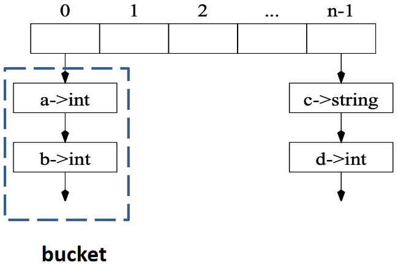
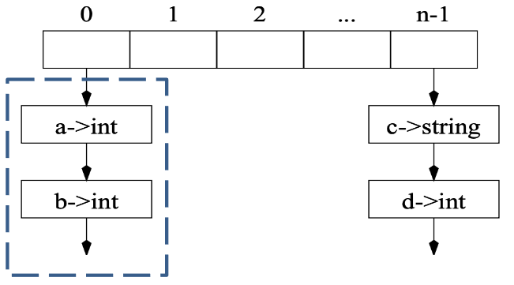

# 语义分析

## 问题提出与定义

很多事情不能通过语法分析来决定，例如：

- 引用的维度是否与声明相匹配？
- 数组访问是否越界？
- 变量应该存储在哪里（堆、栈 ...）？
- ...

限制的原因是，回答这些问题取决于具体的值而不是语法，这就是语义分析的任务

广义上，通常我们分析程序的语义，通过遍历/分析各种程序**表示**来完成：AST, Control Flow Graph (CFG), Program Dependence Graph (PDG), Value Flow Graph (VFG), SSA (single static assignment)。具体的语法分析的**流程**如语义分析示例：类型检查（Type Checking）、代码生成（Code Generation）、死代码消除（Dead Code Elimination）、寄存器分配（Register Allocation）等

狭义上，也就是我们课程中的定义，是

- <i id="type-checking"></i>通过 AST 确定程序的一些静态属性，例如：
    - 名称（name）的范围（scope）和可见性
        - 确保每个变量在使用前都被声明
    - 变量、函数和表达式的类型
        - 每个表达式都有一个正确的类型
        - 函数调用符合定义
    - ...
- 将 AST 翻译成一些中间代码
    - 虎书第七节

??? example "一些语义分析报错的示例"
    ```bash
    ex.c:4:5: warning: assignment makes integer from pointer without a cast
    ex.c:3:11: error: ‘i’ undeclared (first use in this function)
    ```

## 符号表

### 定义

**绑定（Binding）**：赋予符号含义，用 $\mapsto$ 表示，例如：

|Name/Symbol|Meaning/Attribute|
|:-:|:-:|
|type identifier|type (e.g., int, string)|
|variable identifier|type, value, access info, ...|
|function identifier|args.&result type, ...|

**环境（Environment）**：一组绑定，例如：$\left\{ \text{g} \mapsto \text{string}, \text{a} \mapsto \text{int} \right\}$

**符号表（Symbol Table）**：环境的具体实现，如可以保存历史版本的可持久哈希表

??? example "符号表的示例"
    假设一开始的环境是 $\sigma_0$，每个局部变量都有一个可见的 scope
    

    - 在第 2 行中，可以在 $\sigma_1$ 中查找标识符 $a$，$c$
    - 在第 3 行中，环境被更新
    - 在第 4 行中，$\sigma_3$ 中的 $\left\{ a \mapsto \text{string} \right\}$ 覆盖了 $\sigma_2$ 中 $a$ 的 binding
    - 在第 6 行中，$\sigma_3$ 和 $\sigma_2$ 均被丢弃并且 $\sigma_1$ 被返回

??? example "多个符号表"
    在某些语言中，可以同时存在多个活动环境：程序中的每个 module、class 或 record 都有自己的符号表，例如如下的 Java 代码：
    ```java
    package M;
    class E {
        static int a = 5;
    }
    class N {
        static int b = 10;
        static int a = E.a + b;
    }
    class D {
        static int d = E.a + N.a;
    }
    ```
    及其对应的符号表示例：

    $$
    \begin{align*}
    \sigma_1 & = \left\{ a \mapsto \text{int} \right\} \\
    \sigma_2 & = \left\{ E \mapsto \sigma_1 \right\} \\
    \sigma_3 & = \left\{ b \mapsto \text{int}, a \mapsto \text{int} \right\} \\
    \sigma_4 & = \left\{ N \mapsto \sigma_3 \right\} \\
    \sigma_5 & = \left\{ d \mapsto \text{int} \right\} \\
    \sigma_6 & = \left\{ D \mapsto \sigma_5 \right\} \\
    \sigma_7 & = \sigma_2 + \sigma_4 + \sigma_6 \\
    \end{align*}
    $$

    在 Java 中，允许前向引用，所以 E、N、D 都是在环境 $\sigma_7$ 下编译的，分析结果为 $\left\{ M \mapsto \sigma_7 \right\}$

### 符号表的实现

从上述描述中，可以看出符号表的实现需要支持以下操作：

- insert: 将名称绑定到相关信息（如类型），如果名称已在符号表中定义，则新的绑定优先于旧的绑定
- lookup: 在符号表中查找名称，以找到名称绑定的信息
- beginScope: 进入一个新的作用域
- endScope: 退出作用域，将符号表恢复到进入之前的状态

为了实现这些功能，有两种风格的实现方式：

- Imperative Style
    - 有了新的就看不到老的，但是退出 scope 时还能回得去，过程如：
        - 修改 $\sigma_1$ 使其变为 $\sigma_2$
        - 当 $\sigma_2$ 存在时，我们不能看到 $\sigma_1$ 的内容
        - 退出 scope 时，将 $\sigma_2$ 恢复为 $\sigma_1$
- Functional Style
    - 每次发生变化的时候旧的都保留着，过程如：
        - 在创建 $\sigma_2$ 和 $\sigma_3$ 的同时保持 $\sigma_1$ 处于原始状态
        - 退出 scope 时，将 $\sigma_2$ 和 $\sigma_3$ 丢弃，可以轻松获得 $\sigma_1$

#### Efficient Imperative Symbol Tables

!!! question "两个简单的问题"
    - 如何支持高效查找？
        - 使用哈希表，如 $\sigma ' = \left\{ a \mapsto \text{int} \right\}$，即在哈希表插入 `<a, int>`
    - 如何支持删除并恢复到之前的环境？
        - 具有外部链接的哈希表，如使用链表连接 `hash(a) -> <a, int> -> <a, string> -> ...`

##### 数据结构



由上可知，需要两种基本的结构：

- Hash Table：用于存储一系列 buckets
- Bucket：用于存储一系列 entries（每个 entry 是一个 binding）

数据结构如下：

```c
struct bucket {
    string key;
    void *binding;
    struct bucket *next;
};
#define SIZE 109

struct bucket *table[SIZE];

unsigned int hash(char *s0) {
    unsigned int h=0; char *s;
    for(s=s0; *s; s++) {
        h = h * 65599 + *s;
        // h = (a^(n-1)c_1 + a^(n-2)c_2 + ... + ac_{n-1} + c_n)
    }
    return h;
}

struct bucket *Bucket (string key, void *binding, struct bucket *next) {
    struct bucket *b = checked_malloc(sizeof(*b));
    b->key = key;
    b->binding = binding;
    b->next = next;
    return b;
}
```

##### 查找

查找（Lookup）：根据 identifier key 在符号表 `table` 中查找条目

考虑使用 key 来查找 binding 的过程：

- 对 key 使用哈希函数来获得数组索引 `index`
- 遍历 `table[index]` 中的 bucket 链表，直到找到或者链表结束（`table[x]` 包含所有 key 映射到 `x` 的 entries）

```c
void *lookup(string key) {
    int index = hash(key) % SIZE
    struct bucket *b;
    for (b = table[index]; b; b=b->next) {
        if (0==strcmp(b->key,key)) {
            return b->binding;
        }
    }
    return NULL;
}
```

??? example "查询示例"
    

    假设想要查找标识符 `a` 的类型，假定 `hash(a) = 0`，则可以通过 `table[0]` 的第一个元素开始逐一比较

##### 插入

插入（Insert）：在 bucket 前面插入新元素

考虑 $\sigma + \left\{ a \mapsto \tau_2 \right\}$ 的插入过程，其中 $\sigma$ 包含 $a \mapsto \tau_1$：

- 插入函数将 $a \mapsto \tau_1$ 留在原地，将 $a \mapsto \tau_2$ 插入到链表的头部
- 也就是变成 `hash(a) -> <a, τ2> -> <a, τ1> -> ...`

```c
void insert(string key, void *binding) {
    int index = hash(key) % SIZE;
    table[index] = Bucket(key, binding, table[index]);
}
```

??? example "插入示例"
    

##### 恢复

恢复（Restore）：将符号表恢复到之前的状态，即从 bucket 头部删除元素

在上述插入场景下，考虑到达 `a` 的 scope 末尾：

- 从 `table[0]` 的头部使用 `pop(a)` 删除 `<a, τ2>`（插入和弹出以类似堆栈的方式工作）
- 也就是变成 `hash(a) -> <a, τ1> -> ...`

```c
void pop(string key) {
    int index = hash(key) % SIZE
    table[index] = table[index].next;
}
```

??? example "恢复示例"
    

!!! info "处理 scope 的方式"
    为了处理不同 scope，还需其他辅助信息，比如指导“需要 pop 几次”，例如可以使用一个栈，每次进入 scope 时 push 一个特定的值，退出 scope 时一直 pop 直到遇到这个值

#### Efficient Functional Symbol Tables

基于函数式编程中的“不可变数据结构”思想，可以使用二叉查找树（binary search tree, BST）来实现：

- 每个节点包含从 identifier (key) 到 binding 的映射
- 使用字符串间的比较做 less than 排序
    - 对于某一中间节点 $l$，其左子树为 $L$，右子树为 $R$
    - 对于 $\forall x \in L, key(x) < key(l)$
    - 对于 $\forall x \in R, key(x) > key(l)$

##### 查找

使用二叉查找树的查找过程，对于 $n$ 个节点的树，最坏情况下的时间复杂度为 $O(\log n)$

??? example "查找示例"
    

##### 插入

将从根节点到插入节点的父节点路劲间的所有节点复制一份，然后插入新节点，以避免完整复制所有旧版本

??? example "插入示例"
    

### 符号表实现的总结

两种方法对于 `lookup`, `insert`, `beginScope`, `endScope` 等接口的支持，复杂度上各有优势

- Imperative Symbol Tables（具有副作用）
    - 当进入 scope 之后，entries 被添加到表中，因副作用旧表被摧毁
    - 当退出 scope 之后，使用辅助信息来移除之前的插入。旧表被恢复
- Functional Symbol Tables（无副作用）
    - 当进入 scope 之后，通过添加到旧环境来创建新环境，旧表保持不变
    - 当退出 scope 之后，丢弃新环境，旧表保持不变

??? lab "另一种 Efficient Functional Symbol Tables"
    使用哈希表，在新插入的时候，将旧表复制一份，然后插入新的 entry，这样可以保持旧表不变
    

## *Tiger 编译器中的符号表

TODO

## 类型检查

即[通过 AST 确定程序的一些静态属性](#type-checking)中讲述的内容，

### 类型及其作用

#### 编程语言中的类型概念

- 变量的类型
    - 限定了变量在程序执行期间的取值范围
- 类型化的语言（typed language）
    - 变量都被给定类型的语言，如 C/C++、Java、Go
    - 表达式、语句等程序构造的类型都可以静态确定
- 未类型化的语言（untyped language）
    - 不限制变量值范围的语言, 如 LISP、JavaScript
    - 没有静态确定的类型，而并非没有类型

#### 类型在编程语言中的作用

- 开发效率：更高层次的编程抽象
    - 多态、代数数据类型、依赖类型…
    - hoogle 利用类型信息搜索 API
- 运行性能：类型指导的编译优化
    - 静态类型绑定避免运行时检查
    - 类型信息优化内存布局
- 安全可靠：内存安全乃至功能正确
    - Rust 线性类型保障内存安全
    - LiquidHaskell 精化类型保障功能正确
        - 例如 Refinement Type 类型签名 `add_two (x: int | x > 0 ) → x + 2`

#### *类型系统的形式化

以自然数为例，其逻辑系统如下：

- 自然数表达式
    - $a + b$, $3$
- 良形公式
    - $a + b = 3$, $(d = 3) \land (c = 2)$
- 推理规则
    - $\frac{\mathbf{a}<\mathbf{b}, \mathbf{b}<\mathbf{c}}{\mathbf{a}<\mathbf{c}}$

程序语言的类型系统也是一种逻辑系统：

- 类型表达式
    - $\text{int}$, $\text{int} \rightarrow \text{int}$
- 定型断言（typing assertion）
    - $x: \text{int} \vdash x + 1: \text{int}$
- 定型规则（typing rules）
    - $\frac{\Gamma \vdash M: \text{int, } \Gamma \vdash N: \text{int}}{\Gamma \vdash M+N: \text{int}}$

### *Tiger 编译器中的类型系统

TODO

### *Tiger 编译器中的类型检查

TODO