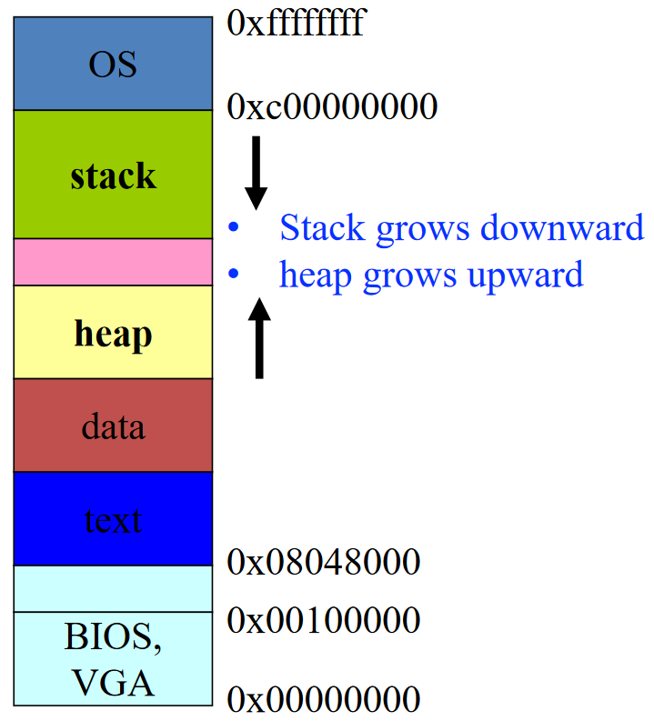
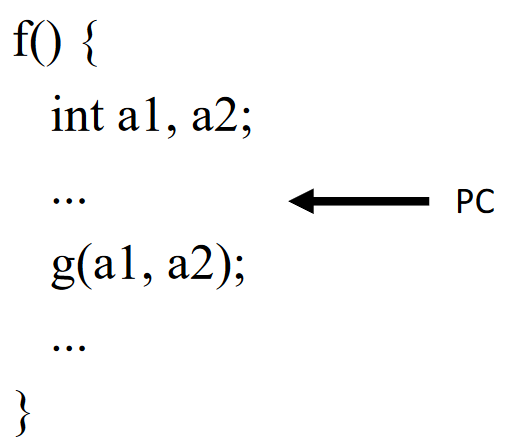
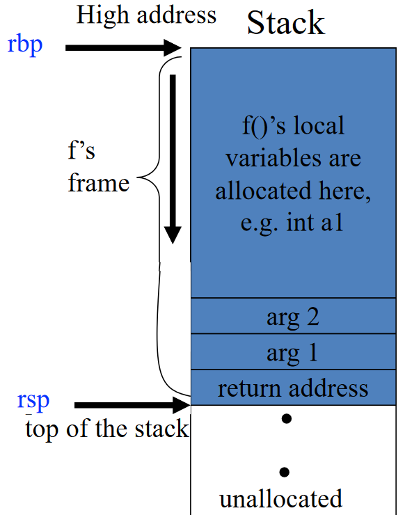
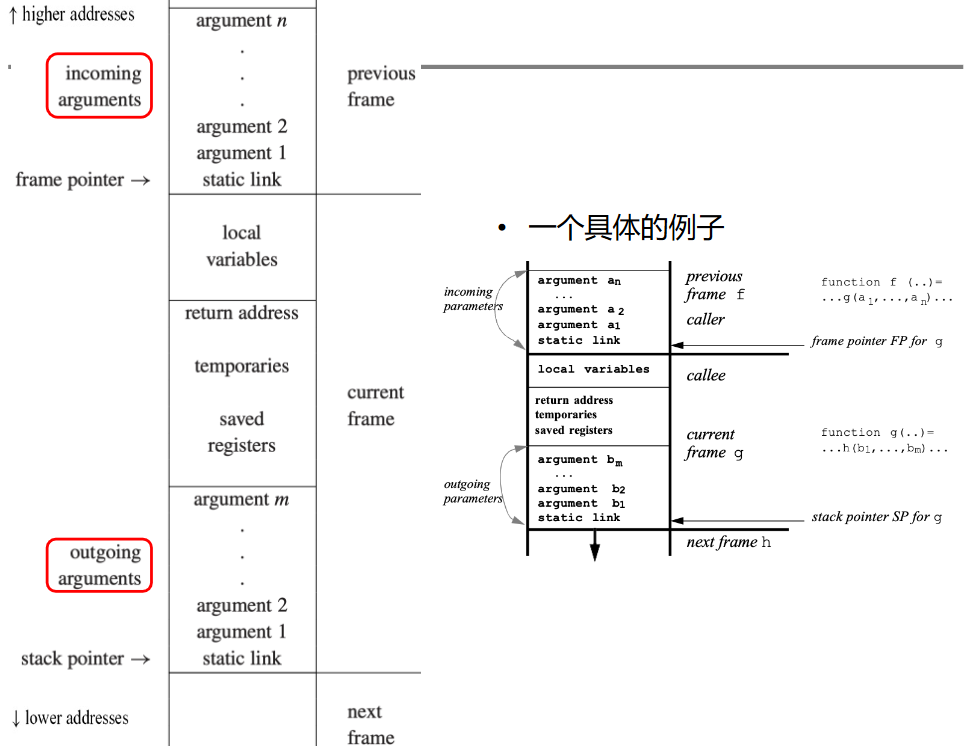

# 活动记录

编译器应该将所有“代码”（Code）翻译为汇编指令并为“数据”（Data）分配空间。要做到这一切，必须了解现代处理器的细节，以及对代码生成的影响


现代处理器有几大部分构成：

- ALU
- Contorl
- Memory
- Registers

??? example "32-bit x86 Linux 内存布局"
    

而在运行时，程序的内存布局如下：


本章重点为其中的活动记录（Activation Record）

## 活动记录/栈帧

### 活动记录/栈帧的定义

??? note "问题引入"
    类似于

    ```tiger
    function f(x:int): int =
        let var y :== x+x
        in if y<10
            then f(y)
            else return y-1
    end
    ```

    我们称对函数 P 的调用是 P 的一次活动（Activation）。在如上的例子中，有递归调用，其中许多 `x` 同时存在，那么如何保存局部变量？

    - 每个调用都有自己的局部变量实例化
    - 函数调用以后进先出（LIFO）方式运行
    - 使用 LIFO 数据结构 —— 栈（Stack）

活动记录（Activation Record）或栈帧（Stack Frame）是一个函数在栈上的一片内存区域，用于存储函数调用时的信息，从而连接函数调用者（Caller）和被调用者（Callee）

其包含的信息可以包括：

- 相关机器状态（保存的寄存器、返回地址）
- 返回值的内存空间
- 本地数据的内存空间
- 指向用于访问非本地数据的栈帧的指针

主要的问题“在于如何布局活动记录，使得调用者和被调用者能够正常通信？”

### 活动记录/栈帧的设计

!!! note "活动记录的具体组织和实现不唯一"
    即使是同一语言，过程调用序列、返回序列和活动记录中各域的排放次序，也会因实现而异

考虑栈帧从高地址向低地址增长。在 x86 及 ARM 等指令集的体系结构中，都有栈指针/栈顶寄存器（Stack Pointer）和帧指针/基址寄存器（Frame Pointer/Base Pointer）

- 栈顶寄存器
    - x86: ESP, RSP; ARM: SP
    - 指向当前栈帧的低地址（结束地址）
    - 代表栈顶
- 基址寄存器
    - x86: EBP, RBP; ARM: FP
    - 指向当前栈帧的高地址（起始地址）
    - 编译后的代码通过使用帧指针的偏移量来引用局部变量和参数

??? example "栈顶寄存器和基址寄存器"
    当在 `f` 里调用 `g` 时

    

以如下的代码为例：

```tiger
f() {
    int a1;
    ...
    g();
    ...
}
```

当 `f` 调用 `g` 时：

- 帧指针 RBP 指向 `g` 帧的开头
- 栈指针 RSP 指向栈顶


??? example "f 调用 g 的完整过程"
    1. Caller 做调用函数准备
        1. 当 PC 在调用 `g` 之前，当前指令执行和栈帧如下所示
            
            
        2. 将参数和返回地址压入栈
            
            
        3. 在栈上保存 Caller-save 寄存器
        4. 跳转到函数 `g` 的入口（通过改变 PC）
    2. 进入 Callee
        1. push RBP: 通过将旧帧指针压入栈来保存它，从而方便返回 caller f 时恢复 f 的栈帧与访问 f 的局部变量。另外注意 RSP 已经向下移动了
            
            
        2. mov RBP, RSP: 将栈指针的值赋给帧指针，这样帧指针就指向了当前栈帧的底部，从而表示当前栈帧的开始
            
        3. 在栈上保存 Callee-saved 寄存器
        4. 在栈上通过减小 RSP 来分配局部变量的空间
            
    3. 从 Callee 返回
        1. 恢复 Callee-save 寄存器
        2. mov RSP, RBP: 通过把帧指针的值赋给栈指针，清除当前栈帧的局部变量
            
        3. pop RBP: 通过弹出旧帧指针来恢复 caller 的栈帧
            
        4. ret: 通过弹出返回地址和跳转到返回地址来返回 caller
            

### 总结

!!! note "和上述 x86 例子略有些差异"
    主要在返回地址和帧的分配上

假设函数 `f(...)` 调用函数 `g(a1, ..., an)`

- 当 `f` 调用 `g` 时：
    - 栈指针指向 `f` 传递给 `g` 的第一个参数
    - `g` 通过简单地从栈指针（SP）中减去帧大小来分配帧
- 当进入 `g` 时
    - 将旧帧指针 FP 保存在帧内存中
    - FP = SP
- 当 `g` 返回时
    - SP = FP
    - 取回保存的旧帧点（FP）

此外，栈帧的限制在于难以支持高阶函数，如嵌套函数（Nested functions）和作为参数和返回值的函数（Procedure as arguments and results），如：

||Pascal, Tiger|C|ML, LISP, Haskell|
|:-:|:-:|:-:|:-:|
|Nested functions|√|×|√|
|Procedure as arguments and results|×|√|√|

在支持高阶函数的语言中，函数返回后可能需要保留局部变量，但我们假设 `f` 返回后不会使用局部变量（也因此我们使用堆栈）

## 寄存器使用

访问寄存器比访问内存快得多，将所有内容放入栈帧中可能会导致内存访问频繁（memory traffic），从而导致性能下降。因此，可以在寄存器中保留尽可能多帧的内容

- （一些）函数参数
- 函数返回地址
- 函数返回值
- （一些）局部变量
- （一些）表达式的中间结果（临时变量）

### 参数传递

!!! note "背景知识"
    - Tiger 的参数方式：Call-by-value
        - 实际参数的值作为形式参数的值进行传递和建立
        - 对形式参数的修改对实际参数没有影响
    - 对于 20 世纪 70 年代设计的大多数机器，参数都是在栈上传递的
        - 问题：导致 memory traffic 过多

现代机器上的使用参数传递约定

- 前 k 个参数（k = 4 或 6）在寄存器中传递
    - x86-64: RDI, RSI, RDX, RCX
    - ARM: R0, R1, R2, R3
- 其余的在栈上传递

但是这也带来了新的问题：寄存器中传递参数导致额外的 memory traffic，因为有“保存”寄存器状态的需要

- 假设 `f` 使用寄存器 `r` 保存局部变量并调用 `g`，并且 `g` 也使用 `r` 进行自己的计算
- `r` 必须在 `g` 使用之前保存（存储到栈帧中），并在 `g` 使用完毕后恢复（从帧中取回）

??? note "Caller-save 和 Callee-save 寄存器"
    - Caller-save 寄存器：在调用函数之前，调用者保存寄存器的内容
    - Callee-save 寄存器：在调用函数之前，被调用者保存寄存器的内容

??? example "Callee-Save 寄存器保存"
    

为了解决这些问题，假设有一个函数 `f(x)` 调用函数 `g(z)` 时（均使用 `r1` 进行传递）：

- 寄存器覆盖：参数 `x` 在调用 `h(z)` 时是一个死变量，则可以覆盖 `r1`，不需要保存
- 使用全局寄存器分配（global register allocation）：不同的函数使用不同的寄存器组来传递参数，如使用 `r1` 传递参数 `x`，使用 `r2` 传递参数 `z`，这样就不会覆盖
- 叶过程（Leaf procedures）：叶过程的参数可以在寄存器中分配，而不会导致任何额外的内存流量（因为不调用其他过程，不需要保存）
- 使用寄存器窗口（register windows）：每个函数调用都可以分配一组新的寄存器（如在 SPARC 上）

### 返回地址

如果 `g` 中的调用指令位于地址 `a`，则（通常）返回的正确位置是 `a + 1`，即 `g` 中的下一条指令，这称为返回地址

调用指令仅将返回地址放入指定的寄存器中。调用时非叶过程必须将原有的值写入栈（除非使用过程间寄存器分配），叶过程则不会

### 返回值

由被调用函数放置在指定的寄存器中，如

- x86-64 系统整型返回值：rax

### 局部变量和临时变量

一些局部变量、临时变量（表达式的中间结果）可以放置在寄存器中，将在寄存器分配部分讨论

## 框架驻留变量

很多地方都可以用寄存器，但是栈帧里的变量仍然需要，例如一个变量

- 它是通过引用传递的，因此它必须有一个内存地址
- 其地址被传递，例如 C 语言中的 &a
- 它由嵌套在当前过程中的过程访问
- 该值太大，无法放入单个寄存器中
- 变量是一个数组，需要进行地址运算才能提取元素
- 保存变量的寄存器是为了特定目的而需要的，例如参数传递（如上所述）
- 本地人员和临时人员太多，发生“溢出”（将在寄存器分配中讨论）

## Block Structure

Block Structure: 允许嵌套函数声明的语言（例如 Tiger），内部函数可以使用外部函数中声明的变量，可以通过帧指针访问


### Static Link

#### 定义

每当调用 `g` 时，都会传递指向 `f` 的最新活动记录的指针，该记录立即将 `g` 括在程序上下文中，该指针即是 static link

使用静态链接访问非本地数据的过程如下：

- 每个函数都用其调用深度进行注释
- 当深度为 `n` 的函数访问深度为 `m` 的变量时
    - 向上爬 `n-m` 个链接来访问相应的活动记录


类似于每次多传一个 Caller 的帧指针作为参数，这样就可以访问到 Caller 的变量

??? example "Static Links 实际调用示例"
    

#### 优缺点

- 优点
    - 参数传递的额外开销很小
- 缺点
    - 向上爬静态链接链以访问非局部变量的开销
    - 每个变量访问都需要一系列间接内存引用
    - 间接引用的数量 = 变量声明函数和使用函数之间的嵌套深度差异
    - 函数可能嵌套很深

### Lambda Lifting

当 `f` 调用 `g` 时，`g`（或 `g` 中嵌套的任何函数）实际访问的 `f` 的每个变量都会作为额外参数传递给 `g`，这称为 lambda lifting

这样即通过将非局部变量视为形参来重写程序，且翻译/转换过程需要从最内部的程序开始，然后向外进行

??? example "Lambda Lifting 实际调用示例"
    

### Display

可以维护一个跟踪程序词法嵌套结构的全局数组，其中在位置 `i` 包含指向最近进入的过程的帧的指针，该过程的静态嵌套深度为 `i`，这个数组称为 display

本质上，它指向当前包含可访问变量的活动记录集

??? example "Display 实际调用示例"
    

## Tiger 的典型栈帧布局



TODO