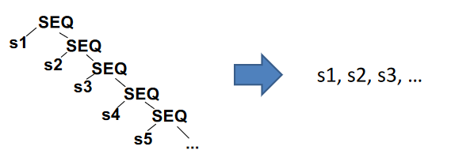
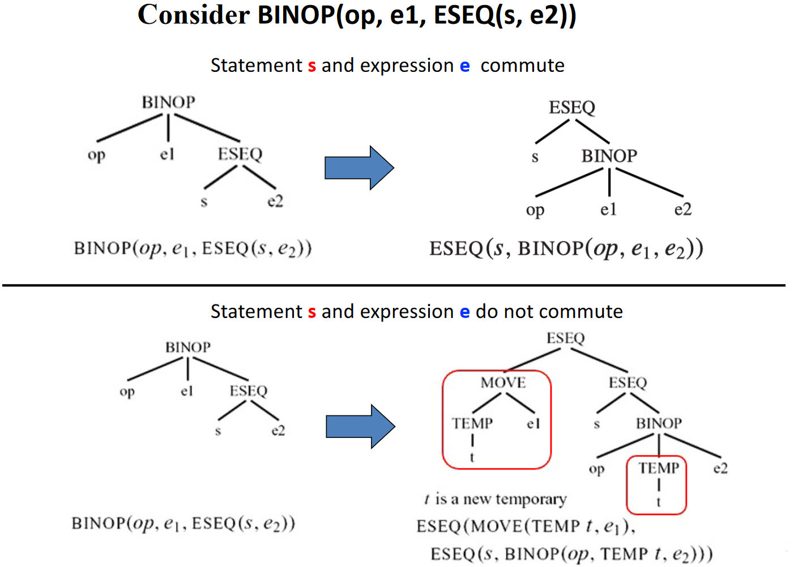
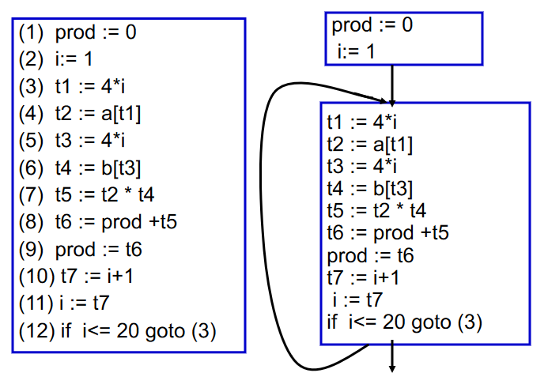
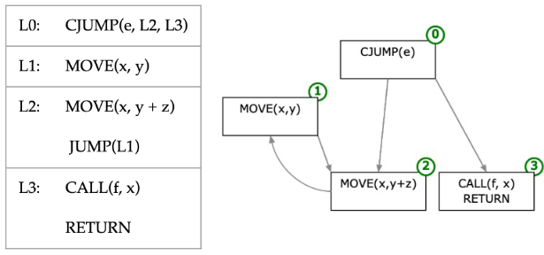
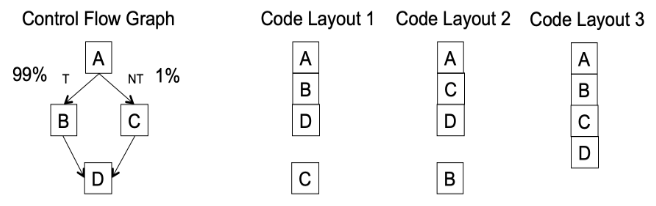
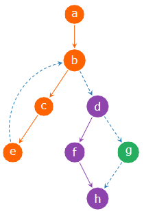

# 基本块和 Traces

## 规范形式

语义分析阶段生成的树必须翻译成汇编语言或机器语言。Tree 语言的运算符经过精心选择，以匹配大多数机器的功能，但是

- Tree 语言的某些方面与机器语言并不完全对应
- Tree 语言的某些方面会干扰编译时优化分析

例如

- `CJUMP` 会在两个分支之间选择一个跳转
    - 真正的汇编指令里有 conditional jump，在条件成立会跳转，条件不成立的情况下就执行自己的后一条指令
    - 而在 IR tree 里无论成立还是不成立，都需要跳转
- 表达式内的 `ESEQ` 节点不方便
    - 评估子树的不同顺序会产生不同的结果（因为执行 `s` 时的副作用）
    - 但是能够以任意顺序计算表达式的子表达式是很有用的
- 表达式中的 `CALL` 节点也依赖于顺序（有副作用）
    - 当尝试将参数放入一组固定的形式参数寄存器时
    - 例如，`CALL(f, [e1, CALL(g, [e2, ...])])`
- 中间代码具有通用树形形式
    - 易于从 AST 生成
    - 但很难直接转换为汇编（汇编代码是一系列语句）

因此，需要将 IR 转换为规范形式以消除以上的问题

这就引入了规范形式的概念：

- 所有 `SEQ` 节点都沿着右链
- 所有语句都带到树的顶层
- 可以直接生成程序集



一个函数只是一个包含所有内容的大 `SEQ` 语句，从而可以更加方便地转换为汇编代码

为了实现转换为规范形式的目标，可以分三个阶段改造 IR 树：

- 将一棵树重写为不带 `SEQ` 或 `ESEQ` 节点的一系列规范树（canonical trees）
- 该列表被分组为一组基本块（basic blocks），其中不包含内部跳转或标签
- 基本块被排序为一组 traces，其中每个 `CJUMP` 后面紧跟着其错误分支的标签

## 规范树（线性化）的过程

规范树（Canonical Trees）具有如下的性质：

- 无 `SEQ` 或 `ESEQ`
- 每个 `CALL` 的父级是 `EXP(...)` 或 `MOVE(TEMP t, ...)`

因此：

- 每棵规范树只包含一个语句节点，即根节点，其他节点均为表达节点
- `CALL` 节点的父节点必须是一颗规范树的根节点，且必须是 `EXP(...)` 或 `MOVE(TEMP t, ...)`
- 一棵规范树中只能有一个 `CALL` 节点，因为 `EXP(...)` 和 `MOVE(TEMP t, ...)` 只能包含一个 `CALL`

### 消除 ESEQ（ESEQ 的线性化规则）

!!! question "如何消除 ESEQ 节点"
    将它们在树中提升得越来越高，直到它们成为 `SEQ` 节点

具体的规则包括：

|原始|转换后|
|:-:|:-:|
|ESEQ(s1, ESEQ(s2, e))|ESEQ(SEQ(s1,s2), e)|
|BINOP(op, ESEQ(S, e1), e2)|ESEQ(s, BINOP(op, e1, e2))|
|MEM(ESEQ(s,e1))|ESEQ(s, MEM(e1))|
|JUMP(ESEQ(s, e1))|SEQ(s, JUMP(e1))|
|CJUMP(op, ESEQ(s, e1), e2, l1, l2)|SEQ(s, CJUMP(op, e1, e2, l1, l2))|

接着考虑副作用对线性化规则的影响，考虑 `BINOP(op, e1, ESEQ(s, e2))`，因为 `s` 可能有影响 `e1` 值的副作用，所以不能直接互换 `s` 和 `e1` 的顺序，可以使用临时存储 `e1` 的值

!!! note "交换性"
    交换性（Commutativity）：如果 `s` 不影响 `e` 的值，则语句 `s` 和表达式 `e` 可以交换

    若不可交换，则可能需要引入临时变量来保存 `e` 的值，从而得到规范树



由此，我们可以得到在不同交换性下的转换规则：

- 如果 `s` `e1` 是可交换的
  
    |原始|转换后|
    |:-:|:-:|
    |BINOP(op, e1, ESEQ(s, e2))|ESEQ(s, BINOP(op, e1, e2))|
    |CJUMP(op, e1, ESEQ(s, e2), l1, l2)|SEQ(s, CJUMP(op, e1, e2, l1, l2))|

- 如果 `s` `e1` 是不可交换的

    |原始|转换后|
    |:-:|:-:|
    |BINOP(op, e1, ESEQ(s, e2))|ESEQ(MOVE(TEMP t, e1),<br>ESEQ(s, BINOP(op, TEMP t, e2)))|
    |CJUMP(op, e1, ESEQ(s, e2), l1, l2)|SEQ(MOVE(TEMP t, e1),<br>SEQ(s, CJUMP(op, TEMP t, e2, l1, l2)))|

但是我们很难静态地确定语句 `s` 与表达式 `e` 是否可以交换，因此需要做一个保守的近似（conservative approximation）。这种近似可以如下：

- 常量可与任何语句交换
- 空语句可与任何表达式交换
- 假设任何其他情况都不具备交换性

??? lab "一些扩展内容"
    `BINOP` 和 `MOVE` 的规则依赖于交换较低位置的语句 `s` 和表达式 `e` 的顺序，当 `s` 无法改变 `e` 中使用的值时，可以安全地完成此操作

    语句 `s` 和表达式 `e` 不能互换的两个条件

    - 该语句可以更改表达式使用的临时变量的值
    - 该语句可以更改表达式使用的内存位置的值

    为了检查这两点

    - 临时变量：很容易确定语句是否更新表达式使用的临时变量，因为临时变量具有唯一的名称
    - 内存：这要困难得多，因为两个内存位置可能是别名（aliases）关系

    因此更精确（但仍然保守）的近似可以使用一些**别名分析**技术

### 将 CALL 移至顶层

在现代处理器中，函数调用的返回值一般保存到专用的寄存器中，那么考虑 `BINOP(PLUS, CALL(...), CALL(...))`，第二次调用的返回值会覆盖第一次调用的返回值

因此，我们可以立即将每个返回值分配到一个新的临时寄存器中，并把 CALL 移至顶层

`CALL(fun, args)` -> `ESEQ(MOVE(TEMP t, CALL(fun, args)), TEMP t)`

### 消除 SEQ

应用上述规则后，我们可以得到 `SEQ(SEQ(SEQ(..., sx), sy), sz)` 的形式，只需要重复利用如下规则

`SEQ(SEQ(a, b), c) = SEQ(a, seq(b, c))`

即可获得如下形式的表达式

`SEQ(s1, SEQ(s2, ..., SEQ(sn-1, sn)...))`

进而将其看作一个简单的语句列表

`s1, s2, ..., sn, ...`

其中每个 `si` 均不包含 `SEQ`/`ESEQ` 节点

## 处理条件分支

`CJUMP` 的问题：在大多数机器上没有双向分支的对应项

目标：重新排列树，使得 `CJUMP(cond, l_t, l_f)` 被 `LABEL(l_f)` 紧跟着


解决方案：

- 将规范树列表形成基本块（basic block）
- 将基本块排序为 traces

### Basic Blocks

基本块（basic block）是始终在开头输入并在结尾退出的语句序列，即：

- 第一个语句是一个 `LABEL`
- 最后一条语句是 `JUMP` 或 `CJUMP`
- 该块中没有其他 `LABEL`、`JUMP` 或 `CJUMP`

构建算法为：

- 从头到尾扫描
- 当找到标签（包括跳转的目的地址）时，结束前一个块并开始一个新块并
- 每当找到 `CJUMP`/`JUMP` 时，当前块就会结束并开始下一个块
- 如果留下了一个没有 `CJUMP`/`JUMP` 结尾的块，则附加一个到下一个块的跳转
- 如果一个块在开始时没有标签，添加一个标签

??? example "Basic Blocks"
    

此外，引入控制流图（Control Flow Graph，CFG）：节点是基本块，边是它们之间的跳转关系。在某些情况下，CFG 的节点是一条语句（如活跃变量分析和寄存器分配部分）

??? example "Control Flow Graph"
    

### Traces

基本块可以按任意顺序排列，执行程序的结果将是相同的。基于这个属性，我们可以优化跳转的性质和次数：

- 选择块的顺序，使得每个 `CJUMP` 都被它的错误分支跟着
- 安排许多无条件 `JUMP` 后紧跟着其目标标签
    - 这样可以允许删除无条件跳转，使得编译后的程序运行得更快一些
- *其他方面：可能还可以优化指令缓存等

??? example "Basic Block Reordering"
    

    99% 和 1% 代表执行频率。可以看到，Code Layout 1 减少了指令预取的中断，提高了 I-cache 的命中率

找到基本块的良好排序的常用技术是构造 trace

Trace: 执行过程中可以连续执行的语句序列（或者说一系列基本块）

A covering set of traces: 每条 trace 都是无循环的，且每个块必须恰好位于一个 trace 中

生成 covering set of traces 的基本算法是对 CFG 的深度优先遍历：

- 从某个 basic block 开始，往后继节点遍历，标记每个被访问的 basic block 并将其附加到当前 trace 中
- 当到达某个 basic block，其后继节点均已标记，这个 trace 就算完了
- 选择一个未标记的 basic block 作为下一个 trace 的起点，不断迭代，直到所有的 basic blocks 都被标记

<pre id="Generating-a-Covering-Set-of-Traces" class="pseudocode">
\begin{algorithm}
\caption{Generating a Covering Set of Traces}
\begin{algorithmic}
\State Put all the blocks of the program into a list $Q$
\While{$Q$ is not empty}
    \State start a new (empty) trace, call it $T$
    \State remove the head element $b$ from $Q$
    \While{$b$ is not marked}
        \State mark $b$; append $b$ to the end of the current trace $T$;
        \State examine the successors of $b$
        \If{there is any unmarked successor $c$}
            \State $b \gets c$
        \EndIf
    \EndWhile
    \State end the current trace $T$
\EndWhile
\end{algorithmic}
\end{algorithm}
</pre>

??? example "Generating a Covering Set of Traces"
    

    Covering set of traces:

    - {a, b, c, d}
    - {d, f, h}
    - {g}

### 考虑跳转

我们更喜欢 `CJUMP` 后跟其错误标签，因为这可以转换为机器代码中的条件跳转，因此：

- 对于任何 `CJUMP` 后跟其真实标签分支的情况
    - 交换真假标签并反转条件
- 对于任何 `CJUMP` 后跟其错误标签分支的情况
    - 这是我们想要的情况，不需要做任何事情
- 对于任何后面没有标签的 `CJUMP(cond, a, b, lt, lf)`
    - 替换为
        ```
        CJUMP(cond, a, b, lt, lfʹ)
        LABEL lfʹ
        JUMP(NAME lf )
        ```

对于无条件跳转 `JUMP`，若一个 `JUMP` 被其目标标签紧跟着，则可以删除这个 `JUMP`

### 最优 Traces

“最优”需要标准，例如，任何频繁执行的指令序列（例如循环体）应该具有自己的 trace：

- 这有助于减少无条件跳转的数量
- 这有助于其他类型的优化
    - 寄存器分配
    - 指令调度
    - ...

??? example "Optimal Traces"
    

    (a): While循环的每个迭代有一个 `CJUMP` 和一个 `JUMP`  
    (b): 使用了不同 traces, 但每个迭代仍有一个 `CJUMP` 和一个 `JUMP`  
    (c): 每个迭代都没有 `JUMP`