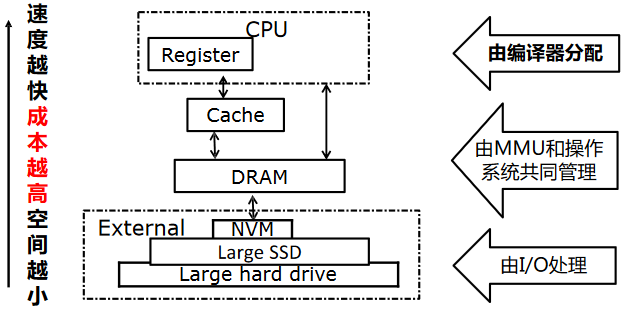

# 指令选择

## 指令选择概述

### 指令选择问题

将 IR 映射为抽象汇编代码（abstract assembly code），即具有无限寄存器的汇编：

- 为中间结果发明新的临时对象
- 稍后映射到实际寄存器

但是翻译给定陈述的方式不只一种，因此需要选择最佳的指令序列，其中标准包括

- 指令选择技术
    - 必须产生好的代码
    - 必须跑得快
- “好”的几个指标
    - 最快的
    - 最小
    - 最大限度地减少功耗

综合来看，需考虑指令代价、运算对象和结果如何存储等多重因素



在实现上，可以使用模式匹配技术（pattern matching techniques）来挑选与程序 IR 片段相匹配的机器指令。具体方式包括：

- 面向树的 IR（Tree-oriented IR）可以对树进行模式匹配
    - 树模式（tree-patterns）作为输入，匹配器（matcher）作为输出
    - 例如，基于动态规划的匹配
- 线性 IR（Linear IR）可以使用某种字符串匹配
    - 字符串作为输入，匹配器作为输出
    - 例如，Text matching, peephole matching 等

在实践中，两者都运作良好，但是匹配器通常有很大不同

### 基于树覆盖的指令选择

为了说明指令选择，我们使用一个简单的指令集：Jouette architecture

- RISC 风格的加载/存储架构
- 相对较大的通用 register file
    - 数据或地址可以驻留在寄存器中
    - 每条指令可以访问任何寄存器
- `r0` 总为 0
- 每条指令都有一个周期的延迟
    - MOVEM 除外
- 每个周期仅执行一条指令


??? example "The Jouette Architecture"
    

??? question "为什么不使用 Macro Expansion 进行指令选择？"
    宏展开/模版匹配指

    - 对于每条 IR，有一条或多条机器指令与其相对应
    - 使用预制好的指令模板替换对应的每一条输入 IR

    优点在于：实现简单，易于理解
    缺点在于：通常只支持 1:1 或 1:N 的情况，难以处理 N:1 或 N:M 的场景（多条 IR 对应一条或者多条机器指令），往往导致生成的指令比较低效

Tree pattern：每个机器指令都可以指定为一个 IR 树片段，这一块就称为 tree pattern，也称为 tile

指令选择的目标：使用一组不重叠的 tree patterns 来覆盖（一个程序片段的）整个 IR 树

??? example "Tree Patterns"
    

    Tree 语言在每个树节点中只表达一种操作（如获取、存储、加法等），而真实的机器指令通常可以执行多个原始操作

    因此，基本想法是每条机器指令对 IR 树的一部分执行计算（一个 tile），并通过新的保存 tile 结果的临时寄存器来连接图块

    

因此，我们可以总结出 Jouette 的 Tree Patterns（`CONST` 和 `TEMP` 节点的实际值在下图中被忽略；有些指令对应多个树模式）


??? example "Generate Instructions from Tilings"
    对于 `a[i] := x`，假设 `i` 在寄存器中，`a` 和 `x` 在堆栈帧中

    

    其中块 1、3 和 7 不对应于任何机器指令，因为它们只是（虚拟）寄存器（`TEMP`）

    此外，不必担心铺不满的问题，因为总是可以用小块来平铺树，每个块只覆盖一个节点

    

### Optimal and Optimum Tilings

??? problem "如何以最短的执行时间挑选覆盖 IR 语句树的 tiles"
    - 需要选择好的 tiles
        - 小 tiles，确保我们可以铺上每棵树
        - 大 tiles 提高效率
    - 通常要挑选大块的瓷砖
        - 可以产生更少的指令
    - 指令 ≠ 周期：RISC 核心指令需要 1 个周期，其他指令可能需要更多

我们希望找到一个成本最低的指令序列

- 执行时间最短的指令序列
- 对于 single issue fixed-latency 机器，意味着指令数量最少

因此，有两类最优的做法

- Optimum tiling
    - Tiles 总和为尽可能低的值
    - 全局最优
- Optimal tiling
    - 没有任何相邻的 tiles 可以组合成成本更低的单个 tile
    - 局部最优

每个 optimum tiling 也是 optimal 的，但反之则不然

??? example "Optimal and Optimum Tilings"
    Suppose every instruction costs one unit, except for `MOVEM` which costs m units

    

## 指令选择算法

### Maximal Munch

Maximal Munch：找到 optimal tiling

- 自顶向下策略
- 用最大平铺覆盖当前节点
- 在子树上重复
- 平铺放置后以相反顺序生成指令

总体过程：

- 从树的根部开始，找到适合的最大 tile（如果多个 tiles 大小相等，随机选择一个）
- 使用该 tile 覆盖根节点，可能还有根附近的其他几个节点没被覆盖，留下几个子树
- 对每个子树重复相同的算法

??? example "Maximal Munch"
    

    ```
    LOAD  r1 = M[fp + a]
    ADDI  r2 = r0 + 4
    MUL   r2 = ri * r2
    ADD   r1 = r1 + r2
    ADD   r2 = fp + x
    MOVEM M[r1] = M[r2]
    ```

### Dynamic Programming

!!! note "Lemma"
    Once minimum cost tiling of all children of a node is known, can find minimum cost tiling of the node by trying out all possible tiles matching the node

动态规划（Dynamic Programming）：找到 optimum tiling，使得树的 tiles 总成本最小

- 自下而上的策略
- 为每个节点分配成本
- 成本 = 所选 tiles 的成本 + 子树的成本
- 选择成本最小的 tiles 并向上递归

动态规划的大体方法为：

- 维护一个表：节点 $x$ -> 节点 $x$ 的 optimum tiling covering 及其成本
- 对于节点 $x$，令 $f(x)$ 为以 $x$ 为根的整个表达式树的 optimum tiling 的成本
    - $f(x)=\min _{\forall \text { tile } T \text { covering } x}\left(\operatorname{cost}(T)+\sum_{\forall \text { child } y \text { of tile } T} f(y)\right)$

给定根节点为 $n$ 的 IR 树，**具体**来说过程为：

- 首先，递归地找到节点 $n$ 的所有子节点（和孙子节点等）的成本
- 然后，每个 tree-pattern（tile kind）与节点 $n$ 进行匹配
- 每个 tile 都有零个或多个叶子，这些叶子需要被看作子树并计算成本
- 对于在节点 $n$ 处匹配的具有成本 $c_t$ 的每个 tile $t$，总的成本为（$c_i$ 已计算） $c_{t}+\sum_{\text {all leaves } i \text { of } t} c_{i}$
- 选择具有最小成本的 tree pattern

??? example "Dynamic Programming"
    对于 `MEM(PLUS(CONST(1), CONST(2)))`

    

    先考虑叶子里的 `CONST` 节点，唯一匹配的 tile 是 `ADDI`，成本为 1

    
    

    继续考虑 `+` 节点

    
    

    最后考虑 `MEM` 节点

    
    

一旦找到根节点（以及整个树）的成本，指令发射（instruction emission）阶段就开始。算法如下：

<pre id="Instruction-Emission" class="pseudocode">
\begin{algorithm}
\caption{Instruction Emission}
\begin{algorithmic}
\Function{Emission}{$n$}
    \For{each leaf $l_i$ of the tile selected at node $n$}
        \State \Call{Emission}{$l_i$}
    \EndFor
    \State Emit the instruction matched at node $n$
\EndFunction
\end{algorithmic}
\end{algorithm}
</pre>

??? example "Instruction Emission"
    

### *Tree Grammar

对于具有复杂指令集、多个类别寄存器和寻址模型的机器（比如 CISC），使用简单的 tree patterns 和 tiling alg. 可能很困难，另外 Hard-codes the tiles in the code generator: tedious, error-prune!

因此，考虑在单独的规范中定义 tiles，使用通用的 tree pattern 匹配算法来计算 tiling，也就是 *instruction selector generators*

- 使用 tree grammar（一种特殊的上下文无关语法）来描述 tiles
- 将指令选择规约为 parsing problem
- 使用动态规划算法的推广来进行 parsing

图块的关系被编码为重写规则（rewriting rules），每个规则包括

- 树语法中的产生式
- 相关成本
- 代码生成模板


??? note "其他关于树语法的内容"
    树语法可能是不明确的，有许多不同的指令序列会产生相同的表达式

    Chapter 3 讲述的 parsing techniques 不太适用于树语法，需要使用动态规划算法的推广（a generalization of the dynamic-programming algorithm）

    此外，这样多个编译任务都可以形式化描述并自动生成其实现

    

??? example "Tree Grammar"
    

### 总结

#### Tiling 算法的效率

假设：

- $T$：不同 tiles 的数量
- $K$：平均匹配 tiles 包含 K 个非叶节点
- $K'$：为了查看哪些 tile 在给定子树上匹配，需要检查的最大节点数
- $T'$：每个树节点上匹配的不同 patterns（tiles）的平均数量
- $N$：数量输入树中的节点数

Maximal munch: proportional to $\frac{(K' + T')N}{K}$

Dynamic programming: proportional to $(K' + T')N$

$K$、$K'$ 和 $T'$ 是常数，所有这些算法的运行时间都是线性的

#### 指令选择技巧（输入：IR Tree）


## 现代机器

### CISC 与 RISC 对比


CISC 很难通过 tree pattern-based tilings 进行建模

### CISC 存在的问题及解决方案

- 寄存器很少
    - 解决方案：自由生成 `TEMP` 节点，并假设寄存器分配会做得很好
- 多种寄存器类别
    - 例如，Pentium 的乘法指令要求将左操作数放入寄存器 `eax`，结果的高位放入 `rdx`
    - 解决方案：显式移动操作数和结果
    - 示例：实现 `t1 <- t2 × t3`：
        ```asm
        mov eax, t2 ; eax t2
        mul t3      ; eax <- eax × t3, edx <- garbage
        mov t1, eax ; t1 <- eax
        ```
- 双地址指令
    - 解决方案：添加额外的移动指令
    - 示例：实现 `t1 <- t2 + t3`
        ```asm
        mov t1, t2 ; t1 <- t2
        add t1, t3 ; t1 <- t1 + t3
        ```
    - 实际上，我们还希望寄存器分配器能够将 `t1` 和 `t2` 分配到同一个寄存器，这样 `mov` 指令就会被删除
- 算术运算可以寻址内存
    - 指令选择阶段将每个 TEMP 节点变成“寄存器”的引用，这些“寄存器”的引用实际上都是内存位置
    - 解决方案：在操作前将所有操作数取出到寄存器中，然后将它们存储回内存
    - 示例：实现 `add [ebp - 8], ecx`
        ```asm
        mov eax, [ebp - 8]
        add eax, ecx
        mov [ebp - 8], eax
        ```
- 多种寻址模式
    - 优点在于
        - 他们“垃圾”的寄存器更少
        - 更短的指令编码
    - 通过一些工作，可以用 tree-matching instruction selection 来对 CISC 进行指令选择，但使用简单的类 RISC 指令，程序也可以同样快
- 变长指令
    - 对于编译器来说并不是真正的问题
    - 一旦选择了指令，汇编器发出编码就是一件微不足道（尽管很乏味）的事情
- 有副作用的指令
    - 有些机器有一个“下标自动增加”的内存提取指令，其效果是 `r2 <- M[r1]; r1 <- r1 + 4`
    - 使用 tree patterns 很难建模，因为它会产生两个结果
    - 共有三种解决方案：
        - 忽略自动增量指令，不使用它
        - 尝试在 tree pattern-matching code generator 的上下文中以临时方式匹配特殊习惯用法
        - 使用完全不同的指令算法，一种基于 DAG patterns 而不是 tree pattern 的算法

### 指令选择算法

Optimal tilings 算法比 optimum tilings 算法更简单

- 对于 CISC，两种算法的差异是显而易见的
    - 因为有些指令每条指令完成多个操作
- 对于 RISC，两种算法通常没有区别
    - 因为 tiles 很小且成本统一

对于 RISC，更简单的平铺算法就足够了

### 现代处理器的指令选择

执行时间不是 tiles 时间的总和，因为成本是一个近似值

此外，指令顺序也很重要

- 在流水线中，不同指令有部分重叠
- 错误的顺序会阻碍流水线
- 指令调度有帮助