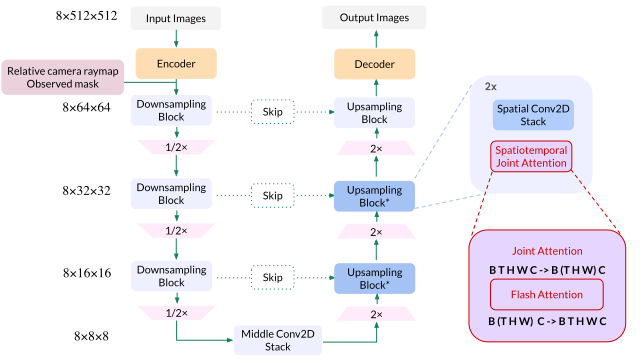

# CAT3D

!!! note "论文简介"
    CAT3D: Create Anything in 3D with Multi-View Diffusion Models

    就目前 3D 重建需要大量的数据的问题，CAT3D 通过使用扩散模型生成高度一致的场景新视角作为 3D 重建技术的输入，以创建 3D 场景

## 简介

NeRF、Instant-NGP 和 Gaussian Splatting 等方法允许通过拍摄真实场景的照片并优化该场景的底层 3D 几何和外观的表示来创建 3D 内容，但创建详细的场景需要捕捉数百到数千张照片，场景覆盖不足的捕获可能会导致不适定的优化问题，例如导致几何形状和外观不正确，从而在从新的视点渲染恢复的 3D 模型时产生不可信的图像

先前工作尝试

- 针对稀疏视图重建的几何正则化技术
- 从单个图像创建 3D 对象的前馈模型
- 优化过程中使用图像或文本条件式生成先验

但在质量、效率和通用性方面存在相关的限制

本文提出的 CAT3D 着力于解决监督视图数量不足的问题，通过创建更多的观察结果来进行完全约束、完全观察的 3D 重建。这就将问题转化为如何生成 3D 场景一致的新观察集合。CAT3D 使用专门针对新视图合成而训练的多视图扩散模型来实现这一目标

## 相关工作

### 2D 先验

!!! note "需要了解的内容"
    - DreamFusion
    - Score Distillation Sampling
    - NeRFs

给定有限的信息（例如文本），预训练的文本到图像模型可以为文本到 3D 的生成提供生成先验，但将图像的先验中存在的知识提炼成连贯的 3D 模型需要迭代提炼方法。目前这方面研究旨在

- 改进蒸馏策略
- 改用其他 3D 表示
- 并分摊优化过程

这种方法要在图像观察和附加约束之间进行复杂的平衡，且往往会导致全局几何形状较差

### 带相机调节的 2D 先验

文本到图像模型缺乏对图像姿势的精确控制，因此需要耗时的 3D 蒸馏过程来促使 3D 模型符合 2D 先验。为了克服这一限制，可以通过显式图像和姿势调节来训练或微调生成模型。但当内容存在一些不确定性时，这些方法仍然需要昂贵的 3D 蒸馏来解决不同新视图之间的不一致问题

### 多视图先验

对多个视图之间的相关性进行建模可以为 3D 内容与部分观察结果的一致性提供更强的先验信息，例如 MVDream、ImageDream、Zero123++、ConsistNet、SyncDreamer 和 ViewDiff 等方法可以微调文本到图像模型以同时生成多个视图

CAT3D 在架构上与 ImageDream 类似，其中多视图是通过类似于具有 3D 自注意力的视频扩散模型的架构来捕获的

### 视频先验

视频扩散模型已可生成逼真视频，被认为可以隐式推理 3D。但当前的模型缺乏精确的摄像机控制，主要工作专注于微调用于摄像机控制或多视图生成的视频扩散模型。但是目前而言这些工作仅限于围绕中心内容的相机轨迹，主要关注 3D 对象生成，不适用于 3D 场景、少视图 3D 重建或上下文中的对象（尚未被遮罩或以其他方式与图像背景分离的对象）

### 前馈方法

前馈模型将一些视图作为输入，并直接输出 3D 表示，而不需要对每个实例进行优化过程。这些方法可以直接有效的生成 3D 表示，但质量通常比基于图像空间先验构建的方法差

## 方法

CAT3D 是分两步进行 3D 创建的方法

1. 使用多视图扩散模型生成大量与一个或多个输入视图一致的新颖视图
2. 在生成的视图上运行强大的 3D 重建管道

### 多视图扩散模型

训练一个多视图扩散模型，该模型将 3D 场景的单个或多个视图作为输入，并在给定相机姿势的情况下生成多个输出图像（其中“视图”是配对图像及其相机姿势）。具体即给定 $M$ 个条件视图（包含 $M$ 张图片 $\text{I}^\text{{cond}}$ 和对应的相机参数 $\text{p}^\text{{cond}}$），模型需要在假定 $N$ 个目标相机参数 $\text{p}^\text{{tgt}}$ 给定的情况下，学习捕获 $N$ 个目标图像 $\text{I}^\text{{tgt}}$ 的联合分布
$$
p(\text{I}^\text{{tgt}} | \text{I}^\text{{cond}}, \text{p}^\text{{cond}}, \text{p}^\text{{tgt}})
$$

#### 模型架构

<figure markdown="span" id="figure-1">

<figcaption>图 1：方法说明。给定一对多视图，CAT3D 有两个阶段：(1) 从多视图潜在扩散模型生成大量合成视图，该模型以输入视图和目标视图的相机姿态为条件；(2) 在观察到的和生成的视图上运行强大的 3D 重建管道以学习 NeRF 表示</figcaption>
</figure>

<figure markdown="span" id="figure-2">

<figcaption>图 2：网络结构</figcaption>
</figure>

架构如 [图 2](#figure-2) 所示，类似于视频潜在扩散模型（Video LDM），但是将时间嵌入修改为相机姿势嵌入。给定一组条件和目标图像，使用 VAE encoder 将图片编码为潜在表示，并训练扩散模型来估计给定条件信号的潜在表示的联合分布

该模型是从在 web-scale 图像数据上训练的 text-to-image 生成 LDM 模型初始化的，输入分辨率为 $512 \times 512 \times 3$，潜在表示形状为 $64 \times 64 \times 8$。模型的主要支柱仍然是预训练的 2D 扩散模型，但具有连接多个输入图像潜在层的附加层，即使用 3D self-attention（空间中的 2D 和跨图像的 1D）替换 LDM 现有的 2D 自注意力层，从而移除了对 PixelNeRF 和 CLIP 的依赖

使用 FlashAttention 进行快速训练和采样，并对 LDM 的所有权重进行微调。此外，noise schedule 需要向高噪声水平移动，将 log 信噪比增大 $\log(N)$，其中 $N$ 是目标图像的数量。训练时，目标图像的潜在表示受噪声扰动，但是条件图像的潜在表示不受噪声扰动，扩散损失只在目标图像上计算。此外，二进制掩码沿着通道维度连接到潜在图像，以表示条件图像与目标图像

为了处理多个 3D 生成设置，作者训练一个通用模型，该模型可以建模总共 8 个条件视图和目标视图 $N + M = 8$，并在训练期间随机选择条件视图的数量 $N$ 为 1 或 3，分别对应 7 个和 5 个目标视图

#### 相机条件

为了调节相机姿势，作者使用与潜在表示具有相同高度和宽度的 camera ray representation (raymap)，对每个空间位置的光线原点和方向进行编码。光线是相对于第一张条件图像的相机姿态来计算的，因此该姿态表示对于 3D 世界坐标的刚性变换是不变的。每个图像的 raymap 按通道维度连接到相应图像的潜在图像上

### 产生新的视图

给定一组输入视图，需要生成大量一致的视图以完全覆盖场景并实现准确的 3D 重建。那么需要决定要采样的相机姿势集，并且需要设计一种采样策略，来使用在少量视图上训练的多视图扩散模型来生成更大的一致视图集

#### 相机轨迹

作者凭经验发现，为不同类型的场景设计合理的相机轨迹对于高质量的少视图 3D 重建至关重要，且相机路径必须足够完整和密集，以完全约束重建问题，但也不能穿过场景中的对象或从不寻常的角度查看场景内容，并总结了四种类型的相机路径

- orbital paths of different scales and heights around the center scene
- forward facing circle paths of different scales and offsets
- spline paths of different offsets
- spiral trajectories along a cylindrical path, moving into and out of the scene

<figure markdown="span" id="figure-3">

<figcaption>图 3：用于生成新视图的相机轨迹。在每个 panel 中，左侧显示侧视图，右侧显示轨迹的顶视图，按视图索引着色。(a)-(b)：单图像转 3D 使用的两种轨迹，观察视图以红色突出显示，而锚视图以橙色突出显示。(c)-(g)：3D 重建使用的轨迹，3 个输入视图以红色突出显示</figcaption>
</figure>

#### 生成大量合成视图

该模型生成新视图的挑战在于它是用一组数量有限的输入和输出视图进行训练的（共 8 个）。为了增加输出视图的总数，将目标视点聚类成更小的组，并在给定条件视图的情况下独立生成每个组，具体过程为

- 将目标视图与接近的相机位置分组
- 特别的，对于单图像调节，采用自回归采样策略
    - 首先生成一组覆盖场景的 7 个锚视图
    - 然后在给定观察视图和锚视图的情况下，并行生成剩余视图组
    - 能够有效地生成大量合成视图，并保持锚视图之间的远程一致性与附近视图之间的局部相似性
- 对于单图像设置，生成 80 个视图；对于少视图设置，使用 480-960 个视图

#### 更多的输入视图和非方形图像集

作者尝试在采样过程中简单地增加多视图扩散架构的序列长度，但发现上述最近视图条件控制和分组采样的策略表现更好

为了处理宽纵横比图像，作者结合了如下两种方式

- 从方形裁剪的输入视图中获取方形样本
- 将从输入视图中裁剪的宽样本填充为方形

### 具有鲁棒性的 3D 重建

上述多视图扩散模型生成一组彼此相当一致的高质量合成视图，但却不能保证完全 3D 一致。由于当前 3D 重建方法需要将完全一致的照片作为输入，作者修改了标准 NeRF 训练程序，以提高其对不一致输入视图的鲁棒性

我们以 Zip-NeRF 为基础，在训练过程最小化了光度重建损失、畸变损失、层间损失、归一化 L2 权重正则化器的总和。此外，作者也包括了渲染图像和输入图像之间的感知损失（LPIPS），用于强调渲染图像和观察图像之间的高级语义相似性，而忽略低级高频细节中潜在的不一致

由于生成视图与接近的观察视图往往具有较小的不确定性、更加一致，因此作者根据到最近的观察视图的距离对生成视图的损失进行加权。这种权重在训练开始时是统一的，并逐渐退火为权重函数。该权重函数对生成视图与其更接近的观察视图之间的重建损失进行更强烈的惩罚

## 实验

TODO

## 不足和未来工作

- CAT3D 的训练数据集对于同一场景的视图具有**大致恒定的相机属性**，因此训练后的模型无法很好地处理输入视图由具有**不同属性的多个相机捕获**的测试用例
    - 可以尝试多不同相机属性的视图数据集，修改 raymap 进行编码
- 生成质量依赖于作为**基础的 text-to-image 模型的表达能力**，并且在场景内容**不符合基础模型分布**的情况下，其性能较差
    - 尝试从预先训练的视频扩散模型进行初始化
- 支持的**输出视图数量仍然相对较少**，因此当我们从模型生成大量样本时，**并非**所有视图都可能在 **3D 方面彼此一致**
    - 扩展模型处理的条件和目标视图的数量来提高一致性
- 使用**手动构建**的摄像机轨迹来彻底覆盖场景，导致可能很难针对大规模开放式 3D 环境进行设计
    - 自动确定不同场景所需的摄像机轨迹以增加系统的灵活性
