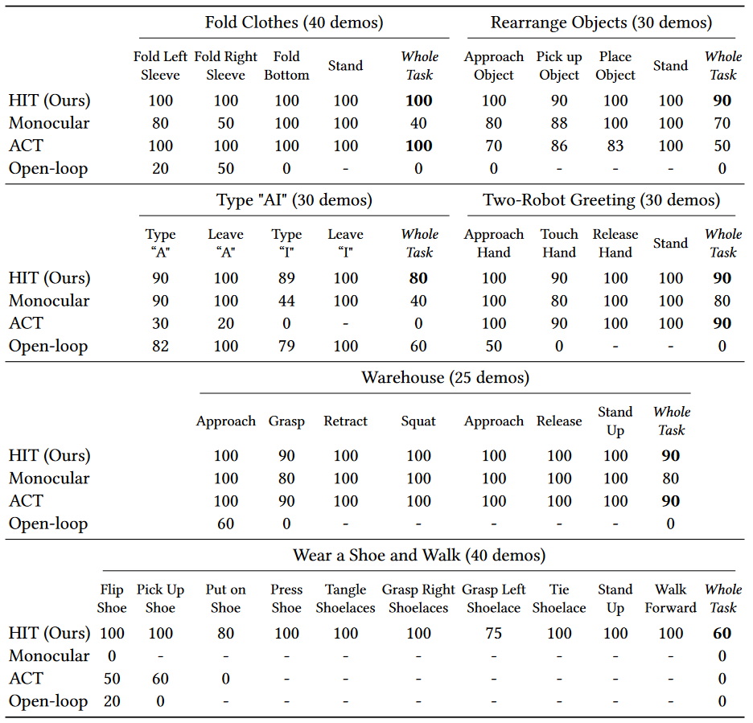

# HumanPlus

!!! note "文章简介"
    HumanPlus: Humanoid Shadowing and Imitation from Humans

    本文提出一个用于人形机器人的全栈系统，以从人类数据中学习运动和自主技能

## 简介

人形机器人由于其类似人类的外形因素，长期以来一直受到机器人界的关注，但是该类机器人从人类数据中学习仍具有挑战

- 复杂的动力学以及高维的状态和动作空间给感知和控制带来了困难
    - 传统方法对各部分控制进行单独模块化，耗时且范围有限
- 人形机器人与人类在形态和驱动方面仍然存在物理差异
    - 包括自由度数量、连杆长度、高度、重量、视觉参数和机制、驱动强度和响应能力
- 缺乏用于人形机器人全身远程操控的可访问数据传输方式
    - 先前的工作使用动作捕捉系统、VR 设备和外骨骼等方式，昂贵且操控受到限制

因此本文提出一个用于人形机器人的全栈系统，可以从人类数据中学习运动和自主技能，具体包括

1. 使用人体运动数据集 AMASS，通过强化学习在模拟中训练低层级策略，并以 zero-shot 方式迁移到现实
2. 使用 shadowing 的系统，利用 RGB 摄像头实时跟踪人体和手部运动，允许操控员远程操控人形机器人来收集全身数据，以学习现实世界中的不同任务
3. 利用收集到的数据进行监督行为克隆，以使用自我中心的视觉来训练技能策略

## 相关工作

### 人形机器人的强化学习

!!! question "待了解内容"
    model-based control

人形机器人的强化学习主要侧重于运动。基于模型的控制（model-based control）在各种人形机器人上已经取得了巨大进展，但基于学习的方法可以实现稳健的运动性能，因为它们在模拟中对高度随机的环境进行了训练，并且具有适应能力。例如通过在模拟中建模场景和任务的方式，将强化学习和 sim-to-real 应用于人形机器人，实现搬箱子的能力（[Sim-to-real learning for humanoid box loco-manipulation](https://arxiv.org/abs/2310.03191)）/生成不同的上半身运动（[Expressive Whole-Body Control for Humanoid Robots](https://arxiv.org/abs/2402.16796)）

本篇工作使用强化学习来训练与任务无关的全身控制的低层级策略，不需要对模拟中的真实场景和任务进行显式建模

### 人形机器人的远程操控

先前的工作通过使用人体动作捕捉服、外骨骼、触觉反馈设备和 VR 设备等进行开发，但也有使用 RGB 摄像头捕捉人体运动的工作（[Learning human-to-humanoid real-time whole-body teleoperation](https://arxiv.org/abs/2403.04436)）

相比之下，本篇工作提供了一个使用单个 RGB 摄像头控制人形机器人的每个关节的系统，用于学习自主操纵和运动技能，最终实现穿鞋站立和行走等复杂技能

### 让机器人从人类数据中学习

!!! question "一些疑惑"
    *在线人类数据*

    通过项目源码看起来本文是通过跟踪获得数据集，然后再在这个数据集上进行训练的，这也算是在线吗？

人类数据已广泛用于机器人学习，包括

- 利用互联网规模数据对视觉/中间的表征/任务进行预训练
- 基于 in-domain 人体数据进行模仿学习

相比之下，本文既使用离线人类数据来学习低层级全身策略以进行实时跟踪，也通过跟踪的方式使用*在线人类数据*让类人机器人模仿人类技能

## HumanPlus 硬件

<figure markdown="span">

<figcaption>图 1：HumanPlus 硬件</figcaption>
</figure>

详见 [HumanPlus Hardware](https://docs.google.com/document/d/1SOrTv9INAKD5Yd9oLjfND1N75sRkg6ILJWmE74H1zJ8)

## 人体和手部数据的处理

<figure markdown="span" id="figure-2">

<figcaption>图 2：跟踪和重定向，使用一台 RGB 相机来估计身体和手部姿势</figcaption>
</figure>

### 离线人类数据

使用基于光学标记的人体运动数据集 AMASS 来训练低层级策略（low-level Humanoid Shadowing Transformer），使用 [Perpetual humanoid control for real-time simulated avatars](https://arxiv.org/abs/2305.06456) 的方法对数据进行过滤以保证质量，人体和手部运动使用 [SMPL-X](https://arxiv.org/abs/1904.05866) 模型进行参数化，其中包括 22 个身体和 30 个手部 3-DoF 球形关节、3 维全局平移变换和 3 维全局旋转变换

### 重定位

H1 人形机器人的身体自由度是上述 SMPL-X 身体自由度的子集，仅由 19 个旋转关节组成。为了重新定位身体姿势，作者将相应的欧拉角从 SMPL-X 转移到到人形模型中，具体过程略

### 实时身体姿势估计和重定位

为了估计现实世界中的人体运动来为 shadowing 服务，本篇工作基于 [World-Grounded Humans with Accurate Motion (WHAM)](https://arxiv.org/abs/2312.07531)，使用单个 RGB 相机实时估计人体姿势和全局变换。因为 WHAM 使用 SMPL-X 进行人体姿势参数化，所以套用 [重定位](#_8) 的方法将其转换为 H1 人形机器人的身体姿势

这在 NVIDIA RTX4090 GPU 上以 25 fps 运行

### 实时手势估计和重定位

本篇工作基于 [HaMeR](https://arxiv.org/abs/2312.05251v1) 模型使用单个 RGB 相机来实时估计手部姿势。HaMeR 使用 [MANO](https://arxiv.org/abs/2201.02610) 手部模型预测手部姿势、相机参数和形状参数，也可以用于重定位到 H1 人形机器人的手部姿势

这在 NVIDIA RTX4090 GPU 上以 10 fps 运行

## 人体运动的 shadowing

<figure markdown="span" id="figure-3">

<figcaption>图 3：模型架构，由用于低层级控制的 decoder-only transformer (Humanoid Shadowing Transformer) 和用于模仿学习的 decoder-only transformer (Humanoid Imitation Transformer) 组成</figcaption>
</figure>

低层级策略 Humanoid Shadowing Transformer 是 decoder-only transformer，如 [图 3](#figure-3) 左侧所示，过程包括

- 在每个时间步，策略的输入是人形机器人的本体感受和目标姿势
    - 人形机器人的本体感觉包含根状态（行、俯仰和基础角速度）、关节位置、关节速度和最后动作
    - 人形机器人的目标姿势由目标前向和横向速度、目标横滚和俯仰、目标偏航速度和目标关节角度组成
- 根据前文提及的方式进行重新定位
- 策略的输出为 19 个人形机器人身体关节的三维关节位置设定点（position setpoints），并使用 1000Hz PD 控制器转换为扭矩
    - 目标手关节角度直接传递至 PD 控制器

低层级策略以 50Hz 运行，上下文长度为 8，以适应在给定观察历史下的不同环境

训练时，使用 [PPO](https://arxiv.org/abs/1707.06347) 最大化折扣预期回报 $\mathbb{E} \left[ \sum_{t=0}^{T-1} \gamma^t r_t \right]$，其中

- $r_t$ 是时间步 $t$ 的奖励
- $T$ 是最大 episode 长度
- $\gamma$ 是折扣因子
- $r$ 是匹配目标姿势、节省能量并避免脚打滑的奖励总和，具体见下表

|Reward Teams|Expressions|
|:-:|:-:|
|target xy velocities|$\exp(-\| [v_x, v_y] - [v_x^{tg}, v_y^{tg}] \|)$|
|target yaw velocities|$\exp(-\| v_{yaw} - v_{yaw}^{tg} \|)$|
|target joint positions|$-\| q - q^{tg} \|_2^2$|
|target roll & pitch|$-\| [r, p] - [r^{tg}, p^{tg}] \|_2^2$|
|energy|$-\| \tau \dot{q} \|_2^2$|
|feet contact|$c == c^{tg}$|
|feet slipping|$-\| v_{feet} \cdot$𝟙$[F_{feet} > 1] \|_2^2$|
|alive|$1$|

此外，模拟环境和人形机器人的物理参数进行了随机化，详细信息见下表

|Environment Params|Ranges|
|:-:|:-:|
|base payload|$[-3.0, 3.0]kg$|
|end-effector payload|$[0, 0.5]kg$|
|center of base mass|$[-0.1, 0.1]^3m$|
|motor strength|$[0.8, 1.1]$|
|friction|$[0.3, 0.9]$|
|control delay|$[0.02, 0.04]s$|

在模拟中训练 Humanoid Shadowing Transformer 后，将其 zero-shot 部署到现实世界中的人形机器人上以进行实时 shadowing，如 [图 2](#figure-2) 所示，使用单个 RGB 相机实时估计人体和手部姿势，并将人体姿势重定位为人形机器人的目标姿势

在实际操控时，人类操控员站在人形机器人附近，将他们的实时全身运动投射到人形机器人上，并观察人形机器人的环境和行为，确保远程操控系统的响应；在这个过程中，人形机器人通过双目 RGB 摄像头收集以自我为中心的视觉数据

!!! note "关于 sit"
    When the humanoid sits, we directly send the target poses to the PD controller, since we don’t need the policy to compensate gravity, and simulating sitting with rich contacts is challenging.

## 模仿人类技能

!!! question "关于生成的 50 个目标姿势"
    看论文和源码没太看明白这 50 个目标姿势要怎么给 HST 使用

    目前的感觉是 50 个目标姿势是未来 50 个时间步的一个预测序列，和未来 50 个真实的姿势做 L1 损失用以训练 HIT，但是实际推理的过程只会用到部分目标姿势

通过上一步骤收集的现实世界数据，作者使用模仿学习的方法训练人形机器人的技能策略

作者通过将已有工作（[Learning Fine-Grained Bimanual Manipulation with Low-Cost Hardware](https://arxiv.org/abs/2304.13705)）的 encoder-decoder 架构修改为 decoder-only Humanoid Imitation Transformer (HIT) 以使用有限的机载计算实现更快的推理，并在双目感知和高自由度控制的情况下实现高效的模仿学习，如 [图 3](#figure-3) 右侧所示

- HIT 把来自两个以机器人自己为中心的 RGB 摄像头的图像特征、本体感觉和固定的位置嵌入（positional embeddings）作为输入进行处理
    - 这些图像特征使用预训练的 ResNet 编码器进行编码
- 由于其 decoder-only 设计，HIT 通过基于输入的固定的位置嵌入预测 **50 个目标姿势**，并且可以预测与**相应位置处的图像特征相对应的 token**
    - 在这些预测的图像特征上加入了 L2 特征损失，迫使 Transformer 在执行真实目标姿势序列后，预测未来状态的相应图像特征 token
    - 也就是迫使结合视觉，防止过度拟合机器人的本体感觉来提高性能

在部署时，HIT 在机器人上以 25Hz 运行，将预测的目标姿势异步发送到低层级的 HST 上，同时丢弃预测的未来图像特征标记（因为在部署过程中不再有用）

## 实验

### 任务

<figure markdown="span" id="figure-4">

<figcaption>图 4：任务定义，包括说明了 5 个自主任务，以及 5 个 shadowing 任务</figcaption>
</figure>

作者选择了六个模仿任务和五个需要双手灵活性和全身控制的 shadowing 任务，如 [图 4](#figure-4) 所示，涵盖了与实际应用相关的各种功能和对象

- 模仿任务
    - Wear a Shoe and Walk
    - Warehouse
        - 抓取油漆喷雾，蹲下后放在运输的容器中，再站起来
    - Fold Clothes
    - Rearrange Objects
    - Type "AI"
    - Two-Robot Greeting
- shadowing 任务
    - 拳击
    - 打开两门柜子放锅
    - 投掷
    - 弹钢琴
    - 打乒乓球
    - 打字 "Hello World"

### 关于 shadowing 的实验

#### 与其他远程操控方法的比较

<figure markdown="span" id="figure-5">

<figcaption>图 5：Baseline 远程操控系统</figcaption>
</figure>

<figure markdown="span" id="figure-6">

<figcaption>图 6：远程操控比较和用户研究，包含 6 名参与者完成 2 项任务的平均时间</figcaption>
</figure>

本文的 shadowing 方法与其他远程操控方法（作为 baseline）进行了比较，如 [图 5](#figure-5) 所示，包括

- Kinesthetic Teaching
- [ALOHA](https://arxiv.org/abs/2304.13705)
- Meta Quest

结果如 [图 6](#figure-6) 所示

- 所有 Baseline 都不支持全身控制，并且需要至少两个操作员，而本文的 shadowing 方法可以在单个操作员的情况下完成任务
- ALOHA 和 Meta Quest 比较昂贵，而本文的 shadowing 方法只需要一个 RGB 摄像头

此外，如 [图 6](#figure-6) 所示，作者对 6 名参与者进行了用户研究，以将 shadowing 系统与三个 baseline 的**远程操作效率**和远程操作期间**稳定站立的平均成功率**进行比较。两名参与者之前没有远程操作经验，而其余四名参与者则拥有不同程度的专业知识，没有一个参与者有使用 shadowing 系统的经验。具体任务是执行“重新排列物体”任务及其变体“重新排列较低物体”，后者将一个物体放置在高度为 0.55m 的较低桌子上（要求机器人蹲下，从而需要全身控制）。每人进行 3 次试验，并在之前进行 3 轮不记录的练习

- ALOHA 虽然可以精确控制机器人关节角度，但其固定的硬件使其难以适应不同身高和体型的人，并且不支持人形机器人的全身控制
- 由于手臂和手腕 5-DoF 的限制，Meta Quest 经常会导致笛卡尔空间中目标与实际姿势之间的奇点（singularities）和不匹配，从而导致最长的完成时间和在手臂奇点处的不稳定站立
- Kinesthetic Teaching 虽然直观且完成时间短，但它需要多个操作员，并且有时在教学过程中手臂上的外力会导致人形机器人绊倒
- Shadowing 系统完成时间最短，稳定站立的成功率最高，并且是唯一可用于全身远程操作的方法，解决了重新排列较低物体的任务

!!! question "待了解内容"
    什么是 singularities

#### 稳健性评估

<figure markdown="span" id="figure-7">

<figcaption>图 7：作者的低级策略（Ours）可以承受较大的扰动力，恢复时间更短，并且比制造商的默认控制器（H1 Default）能够实现更多的全身技能</figcaption>
</figure>

如 [图 7](#figure-7) 所示，通过与制造商默认控制器进行比较来评估本文的低级策略。机器人在操纵物体时必须保持平衡，因此作者通过向人形机器人骨盆施加力来评估鲁棒性，并记录导致机器人不稳定的最小力。可见本篇工作的策略能够承受更大的力并且恢复时间更短，且可以实现默认控制器无法实现的更多全身技能，例如蹲下、跳高、从椅子上站起来

### 关于模仿的实验

与三个 baseline 进行比较

- HIT policies with monocular inputs (Monocular)
- [ACT](https://arxiv.org/abs/2304.13705)
- Open-loop trajectory replay

因为每个技能策略（skill policy）都不间断地连续（执行子任务）自主地尝试解决其任务，所以作者记录了连续子任务的成功率以更好地分析每个任务。其中子任务的成功率定义为：成功尝试次数除以总尝试次数（上一个子任务的成功次数）

<figure markdown="span" id="figure-8">

<figcaption>图 8：模仿任务的比较，包括 6 个模仿任务的平均成功率</figcaption>
</figure>

- HIT 在所有任务中都取得了比其他 baseline 更高的成功率，且是是解决 Wear a Shoe and Walk 任务的唯一方法
    - 作者归因于使用双眼感知，并避免过度拟合本体感觉
- ACT 在穿鞋行走和输入“AI”任务中失败
    - 作者归因于与本体感觉过度拟合，没有使用视觉反馈，导致机器人在成功完成任务后反复尝试
- 单目相机的成功率较低
    - 作者归因于只有一个摄像头缺乏深度信息
- Open-loop 仅在没有随机化的情况下可以成功完成键入“AI”任务

## 未解决的问题和未来工作

### 作者提出

!!! question "待了解的内容"
    Long-horizon navigation

- 与人体相比，该硬件平台提供的自由度较少
    - 它 1-DoF 脚踝的脚限制了机器人执行敏捷动作的能力，例如抬起和摇动一条腿，而另一条腿保持静止
    - 每个手臂只有 5 个自由度（包括手腕），这限制了 6-DoF 操作空间控制的应用，并可能导致 shadowing 系统产生无法到达的区域
- 以自己为中心的摄像头固定在人形机器人的头上，无法活动，导致手部和交互始终存在脱离视野的风险
- 目前使用从人类姿势到人形机器人姿势的固定重定位映射，省略了我们的人形机器人硬件上不存在的许多人类关节
    - 这可能会阻碍人形机器人学习一小部分人类动作
- 基于视觉的姿态估计方法在大面积遮挡的情况下效果不佳，限制了人类操作员的操作区域
- Long-horizon navigation 尚未处理
    - 需要更大尺寸的人体演示和现实世界中准确的速度跟踪

### 个人感受

作者提出的方法综合性很强，从数据集的处理到模型的设计，结合了很多现有的优秀工作，并开源了一套差不多完整的系统（感觉缺少 shadowing 视觉感知的部分）

另外不太清楚这种利用 shadowing 获取动作和视觉数据的方式是不是也算所谓的 *online human data*

~~后续可以 HIT 加指令输入做泛化？~~