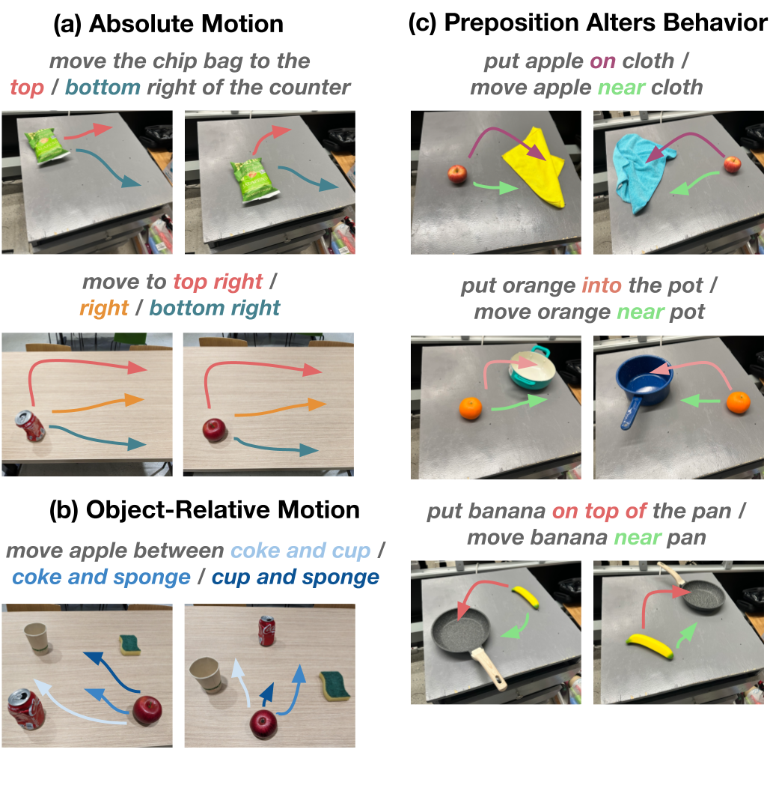

# Open X-Embodiment

!!! note "文章简介"
    Open X-Embodiment: Robotic Learning Datasets and RT-X Models

    本文以 NLP/CV 等领域的大规模数据和预训练模型为 motivation，想要在 Robotics 领域实现类似的效果，即结合多 embodiment 的数据进行训练，以提高机器人的泛化能力

## 简介

在 ML/AI 领域中，通常在大型且多样化的数据集上训练的大规模通用模型通常可以胜过在较小但更特定于任务的数据上训练的目标狭窄的模型。但是这些经验很难应用到机器人领域

- 任何单一的机器人领域都可能过于狭窄
- 很难获得用于机器人交互的相对大型和广泛的数据集
    - 即使是最大的数据收集工作，最终得到的数据集的大小和多样性仍然只是 vison (5-18M) 和 NLP (1.5B-4.5B) 中基准数据集的一小部分
    - 也许更重要的是，此类数据集通常在某些变化轴上仍然很窄，要么专注于单一环境、一组对象，要么专注于狭窄的任务范围

受 NLP/CV 的启发，作者认为训练可泛化机器人策略的目标需要 X-embodiment training，即使用来自多个机器人平台的数据（虽然每个单独的机器人学习数据集可能太窄，但所有此类数据集的联合可以更好地覆盖环境和机器人的变化），那么也就需要开发可以利用 X-embodiment 数据的方法。因此，作者在这篇工作中有两个主要目标

- 证明根据来自许多不同机器人和环境的数据训练的策略享有正迁移的好处，即比仅根据每个评估设置的数据训练的策略获得更好的性能
- 为机器人社区提供数据集、数据格式和模型，以实现未来 X-embodiment 模型的研究

针对这两个目标，作者有如下贡献

- 证明最近的几种机器人学习方法，只需进行最小的修改，就可以利用 X-embodiment 数据并实现正迁移，并表现出更好的泛化能力和新功能
- 提供了 Open X-Embodiment (OXE) 仓库，其中包括一个数据集，包含来自 21 不同机构的 22 不同机器人 embodiment，提供模型、数据和工具

## 相关工作

### 跨 embodiment 迁移

许多先前的工作已经研究了在模拟中和真实机器人上跨机器人 embodiment 迁移的方法，这些方法通常引入专门设计的机制来解决不同机器人之间的 embodiment 差距，例如

- 共享动作表示（shared action representations）
- 结合表示学习目标（incorporating representation learning objectives）
- 根据 embodiment 信息调整学习策略（adapting the learned policy on embodiment information）
- 解耦机器人和环境表示（decoupling robot and environment representations）
- X-embodiment 训练和使用 Transformer 模型进行迁移的初步演示

类似地，跨人类和机器人实施例的迁移方法也经常采用减少 embodiment 差距的技术，包括

- 通过在域之间进行迁移或学习可迁移的表示
- 通过问题的子方面解决
    - 例如学习可迁移的奖励函数、目标、动态模型或来自人类视频数据的视觉表示

而作者研究互补架构（complementary architectures）并提供互补分析（complementary analyses），特别是研究 X-embodiment 迁移和 web-scale pretraining 之间的相互作用，并直接在 X-embodiment 数据上训练策略，没有任何机制来减少 embodiment 差距，并通过利用该数据观察正迁移现象

!!! question "没读懂的地方"
    Complementary architectures/analyses 和 web-scale pretraining 是什么

### 大规模机器人学习数据集

机器人学习社区创建了开源机器人学习数据集，涵盖

- 抓取
- 推动交互
- 对象和模型集
- 遥控演示

除了 RoboNet 之外，这些数据集包含相同类型机器人的数据，而 OXE 专注于跨越多个 embodiment 的数据，将大量先前的数据集处理并聚合到一个单一的标准化仓库中

### 语言条件下的机器人学习

先前的工作旨在赋予机器人和其他智能体理解和遵循语言指令的能力，通常是通过学习语言条件策略。像许多先前的工作一样，这篇工作通过模仿学习来训练语言条件策略，但使用大规模多 embodiment 演示数据。在实验中，作者研究了两种形式的预训练，特别是遵循 RT-1 和 RT-2 的方法

## Open X-Embodiment 仓库

[Open X-Embodiment 仓库](robotics-transformer-x.github.io) 向社区提供并维护以下开源资源

- Open X-Embodiment 数据集：机器人学习数据集
    - 包含 100 万多个真实机器人轨迹，涵盖 22 个机器人 embodiment，包括单、双臂机器人和四足机器人
    - 该数据集是通过汇集来自世界各地 34 机器人研究实验室的 60 个现有机器人数据集，并将其转换为一致的数据格式而构建的
    - 我们使用 RLDS 数据格式，它将数据保存在序列化的 tfrecord 文件中，并适应不同机器人设置的各种动作空间和输入模式，例如不同数量的 RGB 相机、深度相机和点云
    - 它还支持所有主要深度学习框架中高效、并行的数据加载
- 预训练检查点：精选的 RT-X 模型检查点，可供推理和微调。

## RT-X 设计

为了评估 X-embodiment 训练可以在多大程度上提高单个机器人的学习策略的性能，需要具有足够能力的模型来有效地利用如此庞大的异构数据集。为此，本篇工作的实验将建立在最近提出的两个基于 Transformer 的机器人策略之上

- RT-1 (RT-1: Robotics transformer for real-world control at scale)
    - 一种专为机器人控制而设计的高效的基于 Transformer 的架构
- RT-2 (RT-2: Vision-language-action models transfer web knowledge to robotic control)
    - 一种 co-fine-tuned 大型视觉语言模型，使用自然语言 token 来输出将机器人动作

!!! question "待了解内容"
    RT-1 和 RT-2 的具体设计是什么，co-fine-tuned 是怎么微调的

### 数据格式整合

不同机器人的观察和动作空间存在显著差异，因此在数据集中使用粗略对齐的动作和观察空间，接收最近图像和语言指令的历史记录作为观察结果，并预测控制末端执行器的 7 维动作向量（x、y、z、翻滚、俯仰、偏摆和夹具张开度，或者这些量的速率）

- 从每个数据集中选择一个规范相机视图作为输入图像，将其大小调整为通用分辨率，并将原始动作集转换为 7 DoF 末端执行器动作
- 在离散化之前对每个数据集的行为进行标准化
    - 模型的输出可以根据所使用的实施例被不同地解释（去标准化）

尽管有这种粗略的对齐，但相机观察结果在数据集中仍然存在很大差异，例如由于相对于机器人的相机姿势不同或相机属性不同，参见下图

此外对于动作空间，不会跨控制末端执行器的数据集对齐坐标系，并根据为原始控制方案使用表示绝对或相对的位置或速度的动作值。因此，相同的动作向量可能对不同的机器人产生非常不同的运动方式

### 策略架构

RT-1 和 RT-2 都接受描述任务的视觉输入和自然语言指令，并输出 tokenized 动作—— for each model, the action is tokenized into 256 bins uniformly distributed along each of eight dimensions (one dimension for terminating the episode and seven dimensions for end-effector movement)

!!! question "没读懂的地方"
    tokenized action 是什么，是怎么把 7 DOF 的动作向量转换成 token 的

    以及下文的 discrete buckets for RT-1 and all possible language tokens for RT-2 是什么

### 训练和推理细节

两个模型都在各自的输出空间上都使用标准分类交叉熵作为优化目标（discrete buckets for RT-1 and all possible language tokens for RT-2）

在实验中，使用来自 9 个 embodiment 的混合数据（因为在实验时仅有这些数据可用，后续才扩充到当前版本论文的 22 个 embodiment 规模）

RT-1-X 仅根据该混合数据进行训练；RT-2-X 以大约 1:1 的比例分割原始 VLM 数据和该混合数据，通过 co-fine-tuned 进行训练

在推理时，每个模型都以机器人所需的速率（3-10 Hz）运行；RT-1 在本地运行，RT-2 托管在云服务上运行并通过网络查询

## 实验

作者对 6 个不同的机器人进行了总计 3600 次评估试验，以研究

- 在 X-embodiment 数据集上训练的策略能否有效地实现正迁移，从而使利用多个机器人上收集的数据进行联合训练的方式可以提高训练任务的性能
- 来自多个平台和任务的数据的协同训练模型是否可以提高对新的、未见过的任务的泛化能力
- 不同的设计维度，例如模型大小、模型架构或数据集组成，对最终策略的性能和泛化能力有何影响

!!! note "In-/Out-of- distribution"
    > From [Out-of-distribution Detection调研](https://fangkaipeng.com/?p=2119)

    Distribution shift 主要分为两种

    - semantic shift
    - covariant shift

    前者表示训练集和测试集的 label space 不同，后者表示训练集和测试集数据本身的分布不同。而 OOD (out-of-distribution) 主要关注的是 semantic shift，因为 OOD 提出的背景是在 open-set 的场景下，模型可能会遇到很多在训练阶段没见过的类别，而模型依然会给这些样本预测一个很高的置信度（认为其属于某一类训练集中的类别），这也称为 over-confidence。理想情况是，当模型遇到没见过的样本，会学会拒绝，不进行分类，只对见过的样本进行分类，因此提出了 OOD detection 任务。

### 不同 embodiment 的 in-distribution 性能

为了评估 RT-X 模型变体从 X-embodiment 数据中学习的能力，作者评估了它们在 in-distribution 任务中的表现，具体根据两种类型的用例进行评估

- 对仅具有小规模数据集的域进行评估
    - 期望从较大数据集进行迁移以显着提高性能
- 对具有大规模数据集的域进行评估

对于小规模数据集实验，使用与相应文章中相同的评估方法和 embodiment，比较 RT-1-X 模型的性能；对于大规模数据集实验，考虑使用 Bridge 和 RT-1 数据集，并使用各自对应的 WidowX 和 Google Robot，同时考虑 RT-1-X 和 RT-2-X 模型的性能。模型都在完整的 X-embodiment 数据集上进行联合训练

在整个评估过程中，与两个 baseline 模型进行比较

- 由数据集创建者开发的模型，仅在相应数据集上进行训练（*Original Method* model）
    - 因为可以预期模型已经过优化，可以与相关数据很好地配合，所以是合理的
- 在相应数据集上单独训练的 RT-1 模型
    - 用以评估 RT-X 模型架构是否有足够的能力来同时表示多个不同机器人平台的策略，以及多实施数据的协同训练是否会带来更高的性能

#### 小规模数据集域

在 5 个数据集中，有 4 个数据集 RT-1-X 的表现优于原始方法

#### 大规模数据集域

|Evaluation Setting|Bridge|Bridge|RT-1 paper 6 skills|
|:-:|:-:|:-:|:-:|
|Evaluation Location|IRIS (Stanford)|RAIL Lab (UCB)|Google Robotic Lab|
|Robot Embodiment|WidowX|WidowX|Google Robot|
|Original Method|LCBC|LCBC|-|
|Original Method|13%|13%|-|
|RT-1|40%|30%|**92%**|
|RT-1-X|27%|27%|73%|
|RT-2-X (55B)|**50%**|**30%**|**91%**|

在大数据集中，RT-1-X 模型的性能并不优于仅在特定实施例的数据集上训练的 RT-1 baseline，这表明 RT-1-X 模型有欠拟合的现象。参数量较大的 RT-2-X 模型优于原始方法和 RT-1，这表明 X-embodiment 训练可以提高 data-rich 领域的性能，但前提是利用具有足够规模的架构

### 提高 out-of-distribution settings 的泛化能力

!!! question "待了解内容"
    什么是 high-data

针对 X-embodiment 训练如何能够更好地泛化到 out-of-distribution settings 以及更复杂和新颖的指令的问题，作者侧重于高数据领域，并使用 RT-2-X 模型进行评估

<i id="impact-of-design-decisions-on-generalization-and-emergent skills"></i>

|Row|Model|Size|History Length|Dataset|Co-Trained w/ Web|Initial Checkpoint|Emergent Skills Evaluation|RT-2 Generalization Evaluation|
|:-:|:-:|:-:|:-:|:-:|:-:|:-:|:-:|:-:|
|(1)|RT-2|55B|none|Google Robot action|Yes|Web-pretrained|27.3%|**62%**|
|(2)|RT-2-X|55B|none|Robotics data|Yes|Web-pretrained|**75.8%**|**61%**|
|(3)|RT-2-X|55B|none|Robotics data except Bridge|Yes|Web-pretrained|42.8%|54%|
|(4)|RT-2-X|5B|2|Robotics data|Yes|Web-pretrained|44.4%|52%|
|(5)|RT-2-X|5B|none|Robotics data|Yes|Web-pretrained|14.5%|30%|
|(6)|RT-2-X|5B|2|Robotics data|No|From scratch|0%|1%|
|(7)|RT-2-X|5B|2|Robotics data|No|Web-pretrained|48.7%|47%|

#### 未学习的物体、背景和环境

RT-2 和 RT-2-X 的性能大致相当（[上表](#impact-of-design-decisions-on-generalization-and-emergent skills)行 (1) 和 (2)，最后一列）。这并不意外，因为 RT-2 的 VLM 主干已经在这些维度上很好地泛化了

#### 新型技能评估

为了研究机器人之间的知识转移，作者使用 Google Robot 进行了实验，评估 RT-2 数据集中不存在，但出现在另一个机器人（WidowX）的 Bridge 数据集中的对象和技能（新型技能，emergent skills，如下图所示）

结果显示在[上表](#impact-of-design-decisions-on-generalization-and-emergent skills) Emergent Skills Evaluation 栏中。比较[上表](#impact-of-design-decisions-on-generalization-and-emergent skills)第 (1) 行和第 (2) 行，可以发现 RT-2-X 的性能优于 RT-2 大约三倍，这表明将其他不同类别的机器人的数据纳入训练中，也可以改善可以执行的任务范围（即使是已经拥有大量可用数据的机器人）。这表明与其他平台的数据进行联合训练可以为 RT-2-X 赋予该平台原始数据集中不存在的额外技能

继续从 RT-2-X 训练中删除 Bridge 数据集进行消融（见[上表](#impact-of-design-decisions-on-generalization-and-emergent skills)行 (3)），可见 Emergent Skills 的性能显著降低，这表明从 WidowX 数据的传输可能确实是 RT-2-X 与 Google 机器人组合可以执行的额外技能的原因

### 模型设计决策的影响

进行消融来衡量不同设计决策对我们性能最佳的 RT-2-X 模型泛化能力的影响。可以注意到[上表](#impact-of-design-decisions-on-generalization-and-emergent skills)中

- 包含图像的简短历史记录可以显着提高泛化性能（行 (4) 与行 (5)）
- Web-based pre-training 对于实现大型模型的高性能至关重要（行 (4) 与行 (6)）
- 与 5​B 模型相比，55​B 模型在新型技能方面的成功率显着更高（行 (2)与行 (4)）
    - 表明模型规模更高可以实现机器人数据集之间更高程度的迁移
- 与之前的 RT-2 研究结果相反，协同微调和微调在新兴技能和泛化评估（行 (4)与行 (7)）中具有相似的表现
    - 作者将其归因于机器人数据 RT-2-X 中使用的数据集比以前使用的机器人数据集更加多样化

## 未解决的问题和未来工作

### 作者提出

虽然 RT-X 向 X-embodied 的机器人通用化迈出了一步，但要使这一未来成为现实，还需要采取更多步骤

- 没有考虑具有非常不同的传感和驱动方式的机器人
- 没有研究对新机器人的泛化
- 没有提供何时发生或不发生正迁移的决策标准

### 个人感受

感觉确实挺好，涉及挺多先前工作并结合自己提出的数据集和模型进行实验，感觉挺充分的

还是自己读论文数目还是太少，很多都没理解，还需要多去递归学习引用的论文