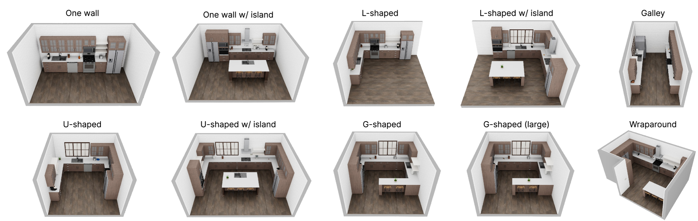
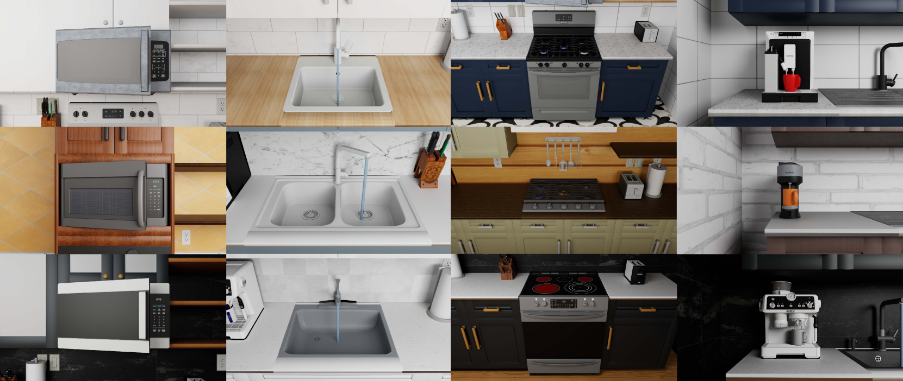
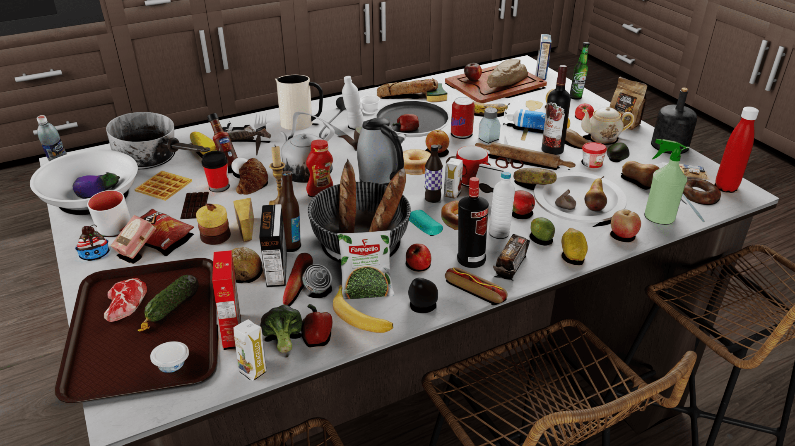
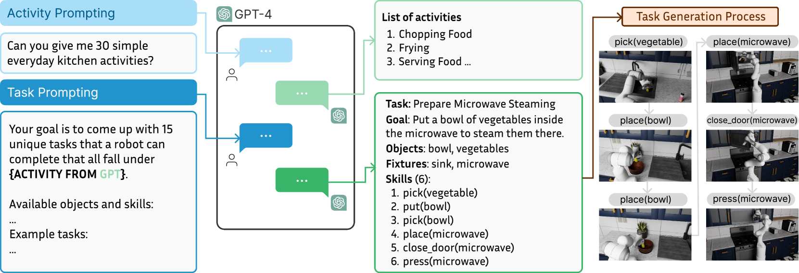
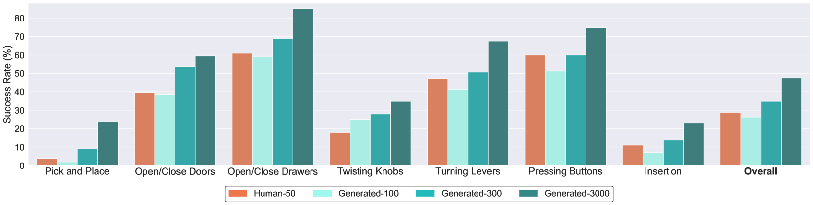

# RoboCasa

!!! note "文章简介"
    RoboCasa: Large-Scale Simulation of Everyday Tasks for Generalist Robots

    AI 的最新进展很大程度上是由规模化推动的，但是在 Robotics 中，由于不存在现实生活中大量的标注数据，难以进行规模化。因此本文提出以厨房环境为中心的逼真且多样化的场景以生成的机器人数据进行大规模模仿学习。

## 简介

Robotics 的一个关键问题是如何获取体现现实世界的巨大多样性和复杂性的机器人训练数据，如

- RT-1: Robotics transformer for real-world control at scale
- Bridge data: Boosting generalization of robotic skills with cross-domain datasets
- Open X-Embodiment: Robotic learning datasets and RT-X models
- Droid: A large-scale in-the-wild robot manipulation dataset

虽然这些数据集可以在狭窄领域提高机器人的泛化能力，但是就通用而言，机器人学习规​​模化的可行路径是什么？这是本文研究的动机

而从方案而言，由于在现实世界中收集越来越大的数据集需要不切实际的大量资本和劳动力，因此可以使用模拟作为生成大量用于模型训练的合成数据的替代方案

- 一旦创建了功能丰富的高保真模拟器，我们就可以以低成本生成大量机器人数据
- 生成式人工智能的快速发展促进了真实模拟的创建
- 这可以加速 robot learning 的进程，让新 idea 可以快速实现原型并可复用

而要实现高质量模拟，模拟器必须满足三个核心标准

- 必须保证物理、渲染和底层模型的真实性，以便能够转移到现实世界
- 必须满足其提供的场景、资产和任务的多样性
- 必须伴随大型机器人数据集，以捕获其所提供的场景和行为的多样性

综上，本文提出以家庭环境为中心的、在 Robosuite: A modular simulation framework and benchmark for robot learning 之上、基于 MuJoCo 的大型模拟框架 RoboCasa，以训练 generalist robots。支持单臂移动平台、人形机器人和带手臂的四足机器人等实体。其中包含 100 项系统评估任务（前 25 项是具有基本机器人技能的原子任务，例如拾取和放置、打开和关闭门以及扭转旋钮，另外 75 项是涉及一系列机器人技能的复合任务），使用从 LLMs 获取活动列表的方法来生成任务。另外，也通过扩展 MimicGen 来为原子任务生成 100K 个额外的 trajectories

## 相关工作

### 流行仿真框架

|Feature|RoboCasa|AI2-THOR|Habitat 2.0|iGibson 2.0|RLBench|Behavior-1K|robomimic|ManiSkill 2|OPTIMUS|LIBERO|MimicGen|
|:-:|:-:|:-:|:-:|:-:|:-:|:-:|:-:|:-:|:-:|:-:|:-:|
|Mobile Manipulation|✓|✓|✓|✓|✗|✓|✗|✓|✗|✗|✓|
|Room-Scale Scenes|✓|✓|✓|✓|✗|✓|✗|✗|✗|✗|✗|
|Realistic Object Physics|✓|✗|✗|✓|✓|✓|✓|✓|✓|✓|✓|
|AI-generated Tasks|✓|✗|✗|✗|✗|✗|✗|✗|✗|✗|✗|
|AI-generated Assets|✓|✗|✗|✗|✗|✗|✗|✗|✗|✗|✗|
|Photorealism|✓|✓|✓|✗|✗|✓|✗|✓|✓|✗|✗|
|Cross-Embodiment|✓|✓|✗|✓|✗|✓|✗|✗|✓|✗|✓|
|Num Tasks|100|-|3|6|100|1000|8|20|10|130|12|
|Num Scenes|120|-|1|15|1|50|3|-|4|20|1|
|Num Object Categories|153|-|46|-|28|1265|-|-|-|x|-|
|Num Objects|2509|3578|169|1217|28|5215|15|2144|72|x|40|
|Human Data|✓|✗|✗|✓|✗|✗|✓|✗|✗|✓|✓|
|Machine-Generated Data|✓|✗|✗|✗|✓|✗|✓|✓|✓|✗|✓|
|Num Trajectories|100K+|-|-|-|-|0|6K|30K|245K|5K|50K|

### Robotics 数据集

论文发表前，有几项机器人方面大规模数据收集工作

- 自监督学习，通过试错来收集抓取和推动等任务的数据
    - 由于试错过程，可能需要花费大量时间才能生成高质量数据
- 通过人类远程操作，控制机器人引导其完成不同的任务来收集数据
- 在模拟中利用 algorithmic trajectory generators
    - 通常利用特权信息和手工设计的启发式方法，需要大量人工参与

### 从大型离线数据集中学习

- Behavioral Cloning
    - 训练策略来模仿数据集中的操作
- Offline Reinforcement Learning
    - 尝试使用奖励函数来优先选择某些数据集操作而不是其他操作

##  RoboCasa 模拟

### 核心模拟平台

因为 RoboSuite 注重物理真实性、高速和模块化设计，方便扩展到大型场景。此外，为了支持房间规模的环境，作者扩展了 RoboSuite 以适应各类形态

另外，也使用 NVIDIA Omniverse 进行高质量渲染以捕捉逼真的图像

### 厨房场景

在 RoboCasa 当前版本中，专注于以厨房活动为中心的家务任务，包含各类布局设计、可交互器具与纹理（MidJourney 生成）

### 资产库

作者使用从 Objaverse 数据集和 Luma.ai（文本转 3D）获取到包括橱柜、抽屉和各种厨房用具（水果和蔬菜、乳制品、家禽、饮料、容器、工具等）的资产，进行存储并在使用时转换为 MuJoCo MJCF 模型格式

## RoboCasa 活动数据集

### 原子任务

执行复杂任务的机器人必须掌握如下基本技能，包括

- 拾取和放置
- 打开和关闭门
- 打开和关闭抽屉
- 扭转旋钮
- 转动杠杆
- 按下按钮
- 插入
- 导航

为此，作者提出 25 项任务，每项任务都涉及这八项技能中的一项，称为原子任务

### 使用大型语言模型创建复合任务

复合任务涉及按一定顺序使用技能来解决语义上有意义的活动，例如烹饪和清洁。作者使用大语言模型来定义任务：先提示 ChatGPT (GPT-4) 列出常见的高级厨房活动，再提示 GPT-4 和 Gemini 1.5 为每个活动标签提出代表性任务，最后过滤或修改它们的一些输出，最终从中获得了 75 个任务并对其进行了代码实现

### RoboCasa 数据集

#### 通过人类远程操作收集一组基本演示

四名操作员组成的团队使用 3D SpaceMouse 为每个原子任务收集 50 个高质量演示，每个任务演示都是在随机厨房场景中收集的

#### 利用 automated trajectory generation 来综合演示

使用 MimicGen 来让人类演示的种子集适应新的设置，自动合成丰富的数据集，具体过程为：将每个人类演示分解为一系列以对象为中心的操作片段，然后对于一个新的场景，根据相关对象的当前姿态变换每个以对象为中心的片段，将这些片段缝合在一起，并使机器人遵循新的轨迹（trajectory）来收集新的任务演示

MimicGen 数据生成有可能失败，且其只保留可以让任务成功的生成轨迹。作者在多个模拟过程中并行化 MimicGen 数据生成，以加快数据生成过程

## 实验

作者在实验中探索以下问题

- 与人类演示相比，MimicGen 机器生成的轨迹在学习多任务策略方面的效果如何
- 随着训练数据集大小的增加，模仿学习策略的泛化性能将如何变化
- 大规模模拟数据集能否促进知识向模拟中下游任务的转移，并促进面向现实世界任务的策略学习（policy learning）

### 原子任务的模仿学习

作者对原子任务进行了系统的研究，以探究在人类数据与机器生成的数据上进行训练时，模仿学习策略的性能如何比较，以及这些数据的规模如何在性能中发挥作用。为此，作者比较以下四种多任务数据设置（训练设置略）

- Human-50：涵盖所有 25 个原子任务的 1250 个人类演示的数据集，每个任务有 50 个人类演示
- generated-3000：MimicGen 在 24 个原子任务中合成的 72,000 个演示的数据集
    - *因为 MinicGen 无法生成移动操作轨迹，删除导航原子任务*
    - 我们将 50 个人类演示作为每个任务的输入，并使用它们自主生成 3,000 条轨迹
- generated-300：完整生成数据集的随机 1/10 子集，其中每个任务生成 300 个演示
- generated-100：完整生成数据集的随机 1/30 子集，其中每个任务生成 100 个演示

训练结束后，对于每项任务通过五个固定评估场景的 50 次试验来评估模型性能，其中每个场景都有不同的平面图和风格。为了测试泛化能力，仅在未见过的对象实例上评估策略。此外，五个场景中的两个包含训练数据中从未遇到过的未见过的风格

可以总结的结论

- 随着生成数据数量的增加，模型性能稳步提高
- 有些技能非常容易学习（如打开和关闭门和抽屉），而其他技能则相当具有挑战性（如拾取和放置）
    - 假设 1：具有高度多样性的任务学习起来更具挑战性
        - One example is the pick and place tasks involving dozens of different object categories with a wide range of affordances. In comparison, opening and closing doors involves six different instances of doors and is thus significantly easier to learn.
    - 假设 2：涉及高水平灵活性的任务（如插入）很难学习

### 复合任务的模仿学习

!!! note "Single-task Policy"
    作者提及这些复合任务更加复杂，所以使用 single-task policy，一次处理一个任务

涉及的复合任务包括

- ArrangeVegetables：机器人必须将水槽中的两种蔬菜放到柜台上的切菜板上
- MicrowaveThawing：机器人必须将柜台上的冷冻食品放入微波炉中并打开微波炉
- RestockPantry：柜子里已经有许多罐子和其他物品，机器人必须找到柜子中现有的罐子（无论是在右侧还是左侧），并将新罐子放在它们旁边
- PreSoakPan：机器人必须拿起一个平底锅和一块海绵放入水槽中，然后打开水龙头准备清洗平底锅
- PrepareCoffee：机器人必须从柜子里取出一个杯子，将其放在咖啡机下方，然后按下咖啡机按钮，将其倒入杯子中

对于每种复合任务，作者收集了 50 次人类演示，对比如下两种策略

- Scratch (Baseline)：通过这 50 个演示从零开始学习
- Fine-tuning：在原子任务使用完整的 MimicGen 生成的数据集上学到的预训练策略的基础上，使用这 50 个演示进行微调

|Activity|Scratch|Fine-tuning|
|:-:|:-:|:-:|
|ArrangeVegetables|2.0%|**12.0%**|
|MicrowaveThawing|0%|**2.0%**|
|RestockPantry|0%|**6.0%**|
|PreSoakPan|0%|**4.0%**|
|PrepareCoffee|0%|0%|

可以总结的结论

- Fine-tuning 策略在所有复合任务上都表现出更好的性能，且在更多的任务上具有非零成功率的性能
    - 一些常见的失败原因包括难以进行细粒度的操作以及难以有效地过渡到任务的下一阶段
- 实际观察到经过微调的模型在质量上表现更好，尤其是具有更稳健的拾取和放置策略
    - 作者将此归因于原子行为的大型预训练数据集，这使得模型能够更好地理解如何执行这些任务

### 转移到现实世界环境

!!! question "没读懂的地方"
    While both the real world and simulated Franka robot are controlled via **workspace end effector control**, our simulated robot uses **Operational Space Control** while the DROID-based real robot does not.

作者使用在 DROID 硬件基础设施上运行的 Franka Emika Panda 机器人在现实厨房环境中进行实验，其中和模拟的机器人有如下区别

- 模拟机器人使用操作空间控制（Operational Space Control），而基于 DROID 的真实机器人则不使用
- 模拟机器人控制器以 20 Hz 频率运行，而真正的机器人控制器以 15 Hz 运行

此外，相机校准、照明条件以及机器人底座相对于场景的放置也存在差异

实验涉及的任务包括

- Counter to sink：从柜台拾取物体并将其放置到水槽
- Sink to counter：从水槽拾取物体并将其放置到柜台
- Counter to cabinet：从柜台拾取物体并将其放置到储藏柜

对于每种任务，作者收集了 50 次人类演示，每个演示都涉及五个不同类别的对象，对比如下两种策略

- Real only：仅针对目标任务进行真实世界演示的训练
- Real + Sim：针对目标任务的真实世界演示以及所有单阶段任务的所有模拟 MimicGen 演示进行联合训练

对于每种任务，通过 5 个已知的对象类别和 3 个未知（**相对于现实世界的演示**来说是未见的）的对象类别进行测试

<table><thead><tr><th>Setting</th><th>Task</th><th>Real only</th><th>Real + Sim</th></tr></thead><tbody><tr><td rowspan="4">Seen Obj</td><td>Counter to sink</td><td>12.7 ± 2.5</td><td><b>22.0 ± 2.8</b></td></tr><tr><td>Sink to counter</td><td>20.0 ± 5.9</td><td><b>29.3 ± 4.1</b></td></tr><tr><td>Counter to cabinet</td><td>8.0 ± 1.6</td><td><b>22.0 ± 5.8</b></td></tr><tr><td>Task average</td><td>13.6</td><td><b>24.4</b></td></tr><tr><td rowspan="4">Unseen Obj</td><td>Counter to sink</td><td>3.3 ± 4.7</td><td><b>8.9 ± 7.9</b></td></tr><tr><td>Sink to counter</td><td>1.1 ± 1.6</td><td><b>7.8 ± 4.2</b></td></tr><tr><td>Counter to cabinet</td><td>3.3 ± 4.7</td><td><b>11.1 ± 11.0</b></td></tr><tr><td>Task average</td><td>2.6</td><td><b>9.3</b></td></tr></tbody></table>

可以总结的结论

- 使用模拟数据进行协同训练的平均成功率为 24.4%，而仅使用真实数据的平均成功率为 13.6%，相对提高了 79%
- 虽然在看不见的物体上性能受到影响，但我们仍然看到 Real + Sim 方式下数据的显着改进
    - *作者将此归因于模拟器的丰富多样性以及视觉和物理真实性*

## 未解决的问题和未来工作

### 作者提出

- 复合任务进行微调会产生相对较低的性能
    - 将研究更强大的策略架构和学习算法，并提高机器生成数据集的质量
    - 虽然生成的轨迹在技术上被认为是成功的，但许多轨迹表现出不良效果，例如急速运动和碰撞
    - 许多这些行为可以通过检查模拟状态来自动检测，并且表现出此类行为的轨迹可以被丢弃
- 使用 LLM 创建任务的过程仍然需要人工指导来编写这些任务的实现
    - 使用 LLM 提出数千个新场景和任务，并编写代码以最少的人工来实现这些场景和任务
    - 随着 LLM 变得更加高效，这将成为可能
- 仅限于厨房，希望在未来的版本中将范围扩展到厨房环境和任务之外
- 数据集包含关键的粗略操作行为，但不包含高度灵巧的技能、可变形操作任务或需要双手操作的任务
- 结合本文和其他模拟器以及互联网视频和真实机器人数据集等不同来源的数据来探索训练

### 个人感受

- 感觉就提出一个框架，基于提出的基础任务和套用 LLM 产生的复合任务结合别人的成果跑了模拟，测了测成果，就发出来了
- 很多地方框架还不完善
    - 虽然提出 25 个原子任务，但是基于 MimicGen 生成时 Navigation 任务因为不支持而被删除了
- 实验对比有些地方不太眼睛
    - 在 [迁移到现实世界环境](#_12) 中，Real + Sim 对于**现实演示中未知类别**的成果率更高，也没有可能是在“基于单阶段任务的所有模拟 MimicGen 演示”里学习到了那个类别的操作
    - 如果这样那是不是可以额外设置实验去做这个对比