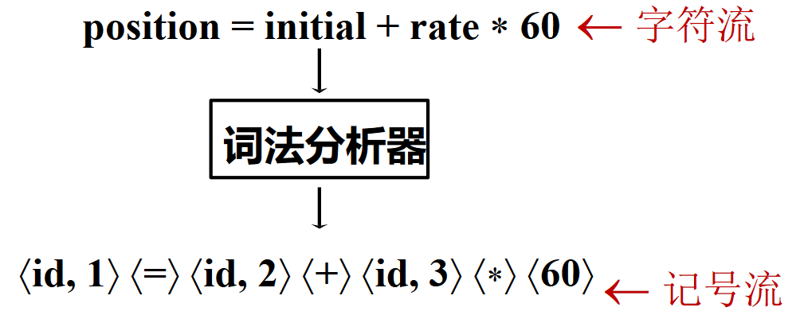
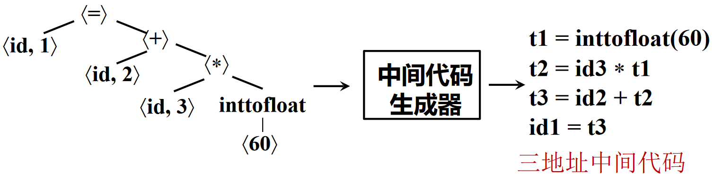
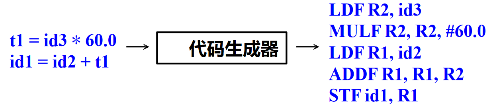

# 概述

## 编程语言及设计

### 编程语言

定义：A programming language is a notation for describing computations to people and to machines.

常见的编程语言泛型包括：

- 过程式 (Procedural): C, Fortran, Pascal
- 函数式 (Functional): Lisp/Scheme, Haskell
- 逻辑式 (Logic): Prolog, Datlog
- 面向对象 (Object-Oriented): Smalltalk, Java, Eiffel

### 语法与语义

- 语法 (Syntax): 语言的结构和形式，指明什么是合法的程序
- 语义 (Semantics): 语言的含义，指明合法程序的行为
    - 操作语义：程序的执行过程
    - 公理语义：程序的推导过程
    - 指称语义：程序计算的函数

## 编译器及其形式

### 编译器

编译器是一个程序，读入源程序并将其翻译成语义等价的目标程序（Translate from the syntax of one language to another but preserve the semantics）


其中，目标程序如果是可执行的机器语言程序，则可以被用户调用，处理输入并产生输出；如果是汇编语言程序，则须经汇编器汇编后方可执行。若从狭义看来：

- 源程序：用某种高级语言编写
- 目标程序：用目标代码或机器语言编写
- 过程如：C++ => 机器语言

若从广义来看：

- 目标程序：介于源语言和机器语言之间的“中间语言”，可以是另一种高级语言
- 过程如：C++ => C，Pascal => C

??? example "C 语言编译器"
    

??? example "Clang 编译器的优化等级"
    |优化等级|简要说明|
    |:-:|:-:|
    |-Ofast|在 -O3 级别的基础上，开启更多激进优化项，该优化等级不会严格遵循语言标准|
    |-O3|在 -O2 级别的基础上，开启了更多的高级优化项，以编译时间、代码大小、内存为代价获取更高的性能|
    |-Os|在 -O2 级别的基础上，开启降低生成代码体量的优化|
    |-O2|开启了大多数中级优化，会改善编译时间开销和最终生成代码性能|
    |-O/-O1|优化效果介于 -O0 和 -O2 之间|
    |-O0|默认优化等级，即不开启编译优化，只尝试减少编译时间|

### 解释器

解释：在一种语言的机器上，直接执行用另一种语言写的程序的过程，称为解释

解释器：接受用户提供的输入，进行解释并逐句执行


### 编译器的其他形式

- 交叉编译器 (Cross Compiler)
    - 在一个平台上生成另一个平台上的代码，如 PC -> `arm-linux-gcc` -> ARM
- 增量编译器 (Incremental Compiler)
    - 增量地编译源程序（只编译修改的部分）
- 即时编译器 (Just-in-time Compiler)
    - 在运行时对 IR 中每个被调用的方法进行编译，得到目标机器的本地代码，如 Java VM 中的即时编译器
- 预先编译器 (Ahead-of-time Compiler)
    - 在程序执行前将 IR 翻译成本地码，如 ART 中的 AOT

??? example "Java 虚拟机"
    

### 编译器的作用

- 提高开发效率
    - 屏蔽硬件架构信息
    - 支持高层编程抽象
- 提高运行性能
    - 硬件无关编译优化
    - 硬件相关编译优化
- 安全可靠
    - 类型安全
    - 功能正确
    - 信息流安全

??? example "编译优化"
    常见的编译优化思路
    
    优化可能在不同的阶段进行，具体的分类包括：局部/全局/过程间，机器无关/及其相关

??? example "一些 LLVM 编译之外的工具链"
    |工具|作用|
    |:-:|:-:|
    |Clang static analyzer|静态代码查错|
    |llcov|动态监控覆盖率|
    |AddressSanitizer (ASan)|动态监控安全问题|
    |DataflowSanitizer (DFSan)|动态污点分析|
    |libFuzzer|模糊测试|
    |LLDB|调试器|

## 编译器的阶段

### 编译过程概览

一个过程划分的示例如下：


过程中涉及到：

- 符号表 (Symbol Table)
    - 记录程序中变量、函数等对象的各种属性
    - 符号表可由编译器的各个步骤使用
- 错误处理 (Error Handler)
    - 语法错误: 如算术表达式的括号不配对
    - 语义错误: 如算符作用于不相容的运算对象

!!! tips "关于过程划分"
    前中后端的划分不一定和上图过程完全一致

### 一些比较重要的过程

#### 词法分析

词法分析（Lexing/Scanning/Lexical Analysis）：将程序字符流分解为 token 序列的过程



??? example "示例"
    以如下程序为例
    ```c
    int main() {
        float initial, rate, position;

        initial = 2;
        rate = 0.1;
        position = initial + rate * 60;

        return 0;
    }
    ```
    可以使用
    ```sh
    clang -cc1 -dump-tokens a.c
    ```
    查看词法分析的结果
    ```
    int 'int'        [StartOfLine]  Loc=<a.c:1:1>
    identifier 'main'        [LeadingSpace] Loc=<a.c:1:5>
    l_paren '('             Loc=<a.c:1:9>
    r_paren ')'             Loc=<a.c:1:10>
    l_brace '{'      [LeadingSpace] Loc=<a.c:1:12>
    float 'float'    [StartOfLine] [LeadingSpace]   Loc=<a.c:2:5>
    identifier 'initial'     [LeadingSpace] Loc=<a.c:2:11>
    comma ','               Loc=<a.c:2:18>
    identifier 'rate'        [LeadingSpace] Loc=<a.c:2:20>
    comma ','               Loc=<a.c:2:24>
    identifier 'position'    [LeadingSpace] Loc=<a.c:2:26>
    semi ';'                Loc=<a.c:2:34>
    identifier 'initial'     [StartOfLine] [LeadingSpace]   Loc=<a.c:4:5>
    equal '='        [LeadingSpace] Loc=<a.c:4:13>
    numeric_constant '2'     [LeadingSpace] Loc=<a.c:4:15>
    semi ';'                Loc=<a.c:4:16>
    identifier 'rate'        [StartOfLine] [LeadingSpace]   Loc=<a.c:5:5>
    equal '='        [LeadingSpace] Loc=<a.c:5:10>
    numeric_constant '0.1'   [LeadingSpace] Loc=<a.c:5:12>
    semi ';'                Loc=<a.c:5:15>
    identifier 'position'    [StartOfLine] [LeadingSpace]   Loc=<a.c:6:5>
    equal '='        [LeadingSpace] Loc=<a.c:6:14>
    identifier 'initial'     [LeadingSpace] Loc=<a.c:6:16>
    plus '+'         [LeadingSpace] Loc=<a.c:6:24>
    identifier 'rate'        [LeadingSpace] Loc=<a.c:6:26>
    star '*'         [LeadingSpace] Loc=<a.c:6:31>
    numeric_constant '60'    [LeadingSpace] Loc=<a.c:6:33>
    semi ';'                Loc=<a.c:6:35>
    return 'return'  [StartOfLine] [LeadingSpace]   Loc=<a.c:8:5>
    numeric_constant '0'     [LeadingSpace] Loc=<a.c:8:12>
    semi ';'                Loc=<a.c:8:13>
    r_brace '}'      [StartOfLine]  Loc=<a.c:9:1>
    eof ''          Loc=<a.c:9:2>
    ```

#### 语法分析

语法分析（Parsing/Syntax Analysis）: 将记号序列解析为语法结构（一般为抽象语法树 AST）的过程


??? example "示例"
    同上一示例代码，可以使用
    ```sh
    clang -cc1 -ast-dump a.c
    ```
    查看词法分析的结果
    ```
    TranslationUnitDecl 0x5a0edc6d2588 <<invalid sloc>> <invalid sloc>
    |-TypedefDecl 0x5a0edc6d2db0 <<invalid sloc>> <invalid sloc> implicit __int128_t '__int128'
    | `-BuiltinType 0x5a0edc6d2b50 '__int128'
    |-TypedefDecl 0x5a0edc6d2e20 <<invalid sloc>> <invalid sloc> implicit __uint128_t 'unsigned __int128'
    | `-BuiltinType 0x5a0edc6d2b70 'unsigned __int128'
    |-TypedefDecl 0x5a0edc6d3128 <<invalid sloc>> <invalid sloc> implicit __NSConstantString 'struct __NSConstantString_tag'
    | `-RecordType 0x5a0edc6d2f00 'struct __NSConstantString_tag'
    |   `-Record 0x5a0edc6d2e78 '__NSConstantString_tag'
    |-TypedefDecl 0x5a0edc6d31c0 <<invalid sloc>> <invalid sloc> implicit __builtin_ms_va_list 'char *'
    | `-PointerType 0x5a0edc6d3180 'char *'
    |   `-BuiltinType 0x5a0edc6d2630 'char'
    |-TypedefDecl 0x5a0edc6d34b8 <<invalid sloc>> <invalid sloc> implicit __builtin_va_list 'struct __va_list_tag[1]'
    | `-ConstantArrayType 0x5a0edc6d3460 'struct __va_list_tag[1]' 1 
    |   `-RecordType 0x5a0edc6d32a0 'struct __va_list_tag'
    |     `-Record 0x5a0edc6d3218 '__va_list_tag'
    `-FunctionDecl 0x5a0edc72a940 <a.c:1:1, line:9:1> line:1:5 main 'int ()'
    `-CompoundStmt 0x5a0edc72ae30 <col:12, line:9:1>
        |-DeclStmt 0x5a0edc72abd0 <line:2:5, col:34>
        | |-VarDecl 0x5a0edc72aa48 <col:5, col:11> col:11 used initial 'float'
        | |-VarDecl 0x5a0edc72aac8 <col:5, col:20> col:20 used rate 'float'
        | `-VarDecl 0x5a0edc72ab48 <col:5, col:26> col:26 used position 'float'
        |-BinaryOperator 0x5a0edc72ac40 <line:4:5, col:15> 'float' '='
        | |-DeclRefExpr 0x5a0edc72abe8 <col:5> 'float' lvalue Var 0x5a0edc72aa48 'initial' 'float'
        | `-ImplicitCastExpr 0x5a0edc72ac28 <col:15> 'float' <IntegralToFloating>
        |   `-IntegerLiteral 0x5a0edc72ac08 <col:15> 'int' 2
        |-BinaryOperator 0x5a0edc72acb8 <line:5:5, col:12> 'float' '='
        | |-DeclRefExpr 0x5a0edc72ac60 <col:5> 'float' lvalue Var 0x5a0edc72aac8 'rate' 'float'
        | `-ImplicitCastExpr 0x5a0edc72aca0 <col:12> 'float' <FloatingCast>
        |   `-FloatingLiteral 0x5a0edc72ac80 <col:12> 'double' 1.000000e-01
        |-BinaryOperator 0x5a0edc72ade0 <line:6:5, col:33> 'float' '='
        | |-DeclRefExpr 0x5a0edc72acd8 <col:5> 'float' lvalue Var 0x5a0edc72ab48 'position' 'float'
        | `-BinaryOperator 0x5a0edc72adc0 <col:16, col:33> 'float' '+'
        |   |-ImplicitCastExpr 0x5a0edc72ada8 <col:16> 'float' <LValueToRValue>
        |   | `-DeclRefExpr 0x5a0edc72acf8 <col:16> 'float' lvalue Var 0x5a0edc72aa48 'initial' 'float'
        |   `-BinaryOperator 0x5a0edc72ad88 <col:26, col:33> 'float' '*'
        |     |-ImplicitCastExpr 0x5a0edc72ad58 <col:26> 'float' <LValueToRValue>
        |     | `-DeclRefExpr 0x5a0edc72ad18 <col:26> 'float' lvalue Var 0x5a0edc72aac8 'rate' 'float'
        |     `-ImplicitCastExpr 0x5a0edc72ad70 <col:33> 'float' <IntegralToFloating>
        |       `-IntegerLiteral 0x5a0edc72ad38 <col:33> 'int' 60
        `-ReturnStmt 0x5a0edc72ae20 <line:8:5, col:12>
        `-IntegerLiteral 0x5a0edc72ae00 <col:12> 'int' 0
    ```

#### 语义分析

语义分析（Semantic Analysis）：收集标识符的类型等属性信息的过程


#### 中间代码生成

中间代码/中间表示（IR）：源语言与目标语言之间的桥梁



??? example "示例"
    同上一示例代码，可以使用
    ```sh
    clang -cc1 a.c -emit-llvm -o a.ll
    ```
    查看词法分析的结果
    ```
    ; ModuleID = 'a.c'
    source_filename = "a.c"
    target datalayout = "e-m:e-p270:32:32-p271:32:32-p272:64:64-i64:64-f80:128-n8:16:32:64-S128"
    target triple = "x86_64-pc-linux-gnu"
    
    ; Function Attrs: noinline nounwind optnone
    define dso_local i32 @main() #0 {
    entry:
      %retval = alloca i32, align 4
      %initial = alloca float, align 4
      %rate = alloca float, align 4
      %position = alloca float, align 4
      store i32 0, ptr %retval, align 4
      store float 2.000000e+00, ptr %initial, align 4
      store float 0x3FB99999A0000000, ptr %rate, align 4
      %0 = load float, ptr %initial, align 4
      %1 = load float, ptr %rate, align 4
      %mul = fmul float %1, 6.000000e+01
      %add = fadd float %0, %mul
      store float %add, ptr %position, align 4
      ret i32 0
    }
    
    attributes #0 = { noinline nounwind optnone "min-legal-vector-width"="0" "no-trapping-math"="true" "stack-protector-buffer-size"="8" "target-features"="+cx8,+mmx,+sse,+sse2,+x87" }
    
    !llvm.module.flags = !{!0}
    !llvm.ident = !{!1}
    
    !0 = !{i32 1, !"wchar_size", i32 4}
    !1 = !{!"clang version 16.0.6"}
    ```

#### 基于中间表示的优化

基于中间表示的优化：基于中间表示进行**分析**与**变换**，以降低执行时间、减少资源消耗等


??? example "示例"
    使用 -O3 优化
    ```sh
    clang -cc1 -S a.c -emit-llvm -O3 -o a.ll
    ```
    与上一示例对比，得到的结果明显更短
    ```
    ; ModuleID = 'a.c'
    source_filename = "a.c"
    target datalayout = "e-m:e-p270:32:32-p271:32:32-p272:64:64-i64:64-f80:128-n8:16:32:64-S128"
    target triple = "x86_64-pc-linux-gnu"

    ; Function Attrs: mustprogress nofree norecurse nosync nounwind willreturn memory(none)
    define dso_local i32 @main() local_unnamed_addr #0 {
    entry:
    ret i32 0
    }

    attributes #0 = { mustprogress nofree norecurse nosync nounwind willreturn memory(none) "min-legal-vector-width"="0" "no-trapping-math"="true" "stack-protector-buffer-size"="8" "target-features"="+cx8,+mmx,+sse,+sse2,+x87" }

    !llvm.module.flags = !{!0}
    !llvm.ident = !{!1}

    !0 = !{i32 1, !"wchar_size", i32 4}
    !1 = !{!"clang version 16.0.6"}
    ```

#### 目标代码生成

目标代码生成：把中间表示形式翻译到目标语言的过程，可涉及指令选择、寄存器分配、指令调度过程



??? example "示例"
    使用
    ```sh
    llc a.ll -o a.s
    ```
    进行代码生成
    ```asm
    	.text
    	.file	"a.c"
    	.globl	main                        # -- Begin function main
    	.p2align	4, 0x90
    	.type	main,@function
    main:                                   # @main
    # %bb.0:                                # %entry
    	xorl	%eax, %eax
    	retq
    .Lfunc_end0:
    	.size	main, .Lfunc_end0-main
                                            # -- End function
    	.ident	"clang version 16.0.6"
    	.section	".note.GNU-stack","",@progbits
    ```

## 整体示例：Tiger 编译器


- AST (抽象语法树): 语法分析 + "Parsing Actions" 生成
- IR Tree: 语义分析后按一定规则生成（树型中间表示）
- Canonicalized IR Tree: 对 IR Tree 做变换所得（方便生成汇编）
- Assem: 指令选择器生成（一种特殊的汇编）
- CFG (Control Flow Graph, 控制流图): 方便进行数据流分析
    - 如活跃变量分析（Liveness Analysis）
- Interference Graph: 从活跃变量分析的结果构造，用于指导寄存器分配

## 其他

推荐一个玩具：[Compiler Explorer](https://godbolt.org/)