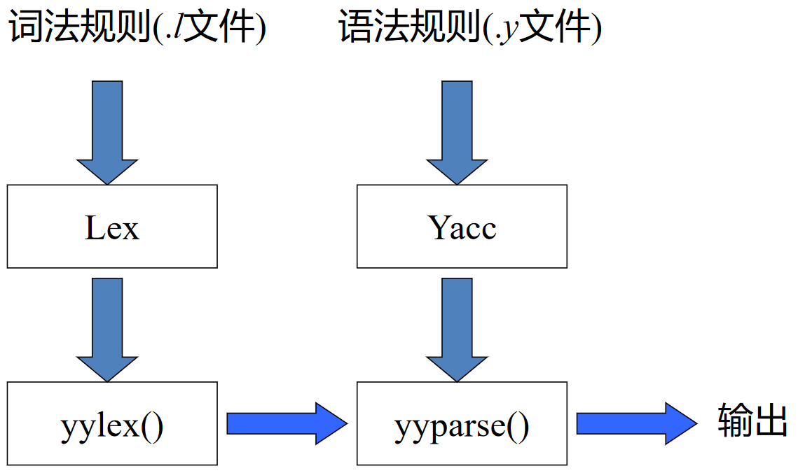
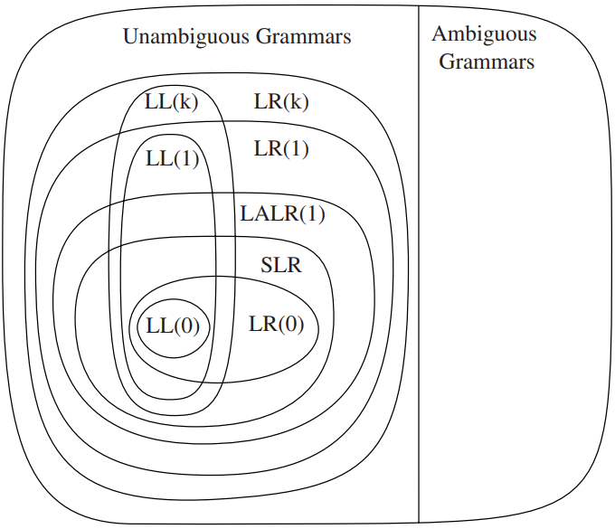
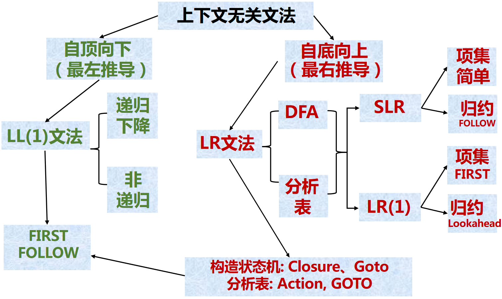

# CFG 及语法分析概述

## 语法分析器的生成器

在 [词法分析](../ch2.md) 中，我们介绍过 Lex/Flex，它们是用来生成词法分析器的工具。类似的，Yacc/Bison 是用来生成语法分析器的工具

### 语法分析器的生成器 Yacc

Yacc: yet another compiler-compiler，是基于 LALR(1) 的语法分析器生成器，需要使用 BNF (Backus-Naur Form) 形式书写文法

Yacc 的 GNU 版叫做 Bison


Yacc 与 Lex 的联系如下：



### Yacc 源程序的结构

Yacc 源程序分为三部分：

- 声明
    - 放置 C 声明和对词法单元的声明
- 翻译规则
    - 指明产生式及相关的语义动作
    - 格式为 `lhs : rhs { action }`
        - `lhs` 是产生式左部，`rhs` 是产生式右部，`action` 是语义动作（在规约动作发生时执行）
        - 一个示例的语义动作是 `$$ = $1 + $3;`
            - `$$` 表示和产生式头相关的属性值（即规约的结果）
            - `$i` 表示产生式体中第 $i$ 个文法符号的属性值
- 辅助性 C 语言例程
    - 被直接拷贝到生成的 C 语言源程序中
    - 可在语义动作中调用
    - 包括 `yylex()`，这个函数返回词法单元，可以由 Lex 生成

```
声明部分
%%
翻译规则部分
%%
辅助性 C 语言例程
```

??? example "Yacc 的使用"
    对于如下文法

    $$
    \begin{aligned}
    exp &\rightarrow exp\ addop\ term\ |\ term \\
    addop &\rightarrow +\ |\ - \\
    term &\rightarrow term\ mulop\ factor\ |\ factor \\
    mulop &\rightarrow * \\
    factor &\rightarrow (\ exp\ )\ |\ number
    \end{aligned}
    $$

    可以使用 Yacc 编写如下的源程序

    ``` yacc
    %{
    #include <stdio.h>
    #include <ctype.h>
    int yylex(void);
    int yyerror (char * s);
    %}
    %token NUMBER
    %%
    command: exp {printf("%d\n", $1);};
    exp: exp '+' term {$$ = $1 + $3;}
    | exp '-' term {$$ = $1 - $3;}
    | term {$$ = $1}
    ;
    term: term '*' factor {$$ = $1 * $3;}
    | factor {$$ = $1;}
    ;
    factor: NUMBER {$$ = $1;}
    | '(' exp ')' {$$ = $2;}
    ;
    ```

### Yacc 文件格式中的几个问题

- 消除二义性：为算符指定优先级与结合律
``` yacc
%left '-' '+'
%left '*' '/'
%right UMINUS /* negation--unary minus */
%right '^'    /* exponentiation */
```
- 冲突解决
    - 归约/归约冲突：选择 Yacc 说明中先出现的产生式
    - 移进/归约冲突：移近优先

> 更通用的方法：改写文法以消除冲突。例如, 消除二义性的同时也可能减少了冲突

## 语法分析小结

### 各种文法的表达能力

\tikzpicture-automata
    \draw [rounded corners=8] (0, 0) rectangle (2, 1)
                            (-0.3, -0.3) rectangle (4, 1.3)
                            (-0.6, -0.6) rectangle (6, 1.6)
                            (-0.9, -0.9) rectangle (8, 1.9)
                            (1, 0.5) node {LR(0)}
                            (3, 0.5) node {SLR(1)}
                            (5, 0.5) node {LALR(1)}
                            (7, 0.5) node {LR(1)};



### SLR 和 LR(1) 分析对比

<table><thead><tr><th colspan="2"></th><th>SLR(1)</th><th>LR(1)</th></tr></thead><tbody><tr><td rowspan="2">动作</td><td>移进</td><td>
$$
A \rightarrow \alpha \cdot a \beta \in I_i \\
\text{Goto}(I_i, a) = I_j \\
\text{Action}[i, a] = sj
$$
</td><td>
$$
A \rightarrow \alpha \cdot a \beta, b \in I_i \\
\text{Goto}(I_i, a) = I_j \\
\text{Action}[i, a] = sj
$$
</td></tr><tr><td>规约</td><td>
$$
A \rightarrow \alpha \cdot \in I_i \\
a \in \text{Follow}(A) \\
\text{Action}[i, a] = rj
$$
</td><td>
$$
A \rightarrow \alpha \cdot, a \in I_i \\
\text{Action}[i, a] = rj
$$
</td></tr></tbody></table>

### LL(1) 和 LR(1) 分析对比

||LR(1) 方法|LL(1) 方法|
|:-:|:-:|:-:|
|建立分析树|自底而上|自顶而下|
|归约 or 推导|规范归约（最右推导的逆）|最左推导|
|分析表|状态×文法符号，大|非终结符×终结符，小|
|分析栈|状态栈，信息更多|文法符号栈（非递归实现）|

此外，尽管都要向前看一个符号，二者也有区别：

- LR(1)：在识别出整个 rhs 后，再往前看 1 个符号，然后确定使用哪条产生式归约 $A \rightarrow \alpha, B \rightarrow \alpha$
- LL(1)：向前看 1 个符号后根据 First, Follow（也就是预测分析表）来确定使用哪条产生式推导 $A \rightarrow \alpha_1 | \alpha_2 | \alpha_3$

### LL(1), SLR和LR(1)对比

