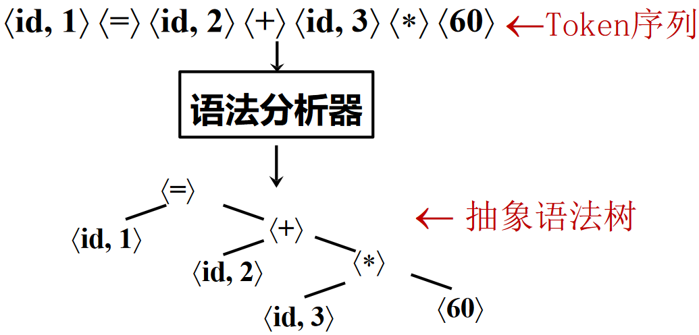

# 语法分析

??? abstract "语法分析器的基本作用"
    从词法分析器获得 Token 序列，确认该序列是否可以由语言的文法生成

    - 对于语法错误的程序，报告错误信息
    - 对于语法正确的程序，生成语法分析树（简称语法树）
        - 通常产生的是抽象语法树 (AST)

    !!! warning "Parse Tree 不是 AST"

    

目前语法分析器的实现有下面两种方法：

- By-hand (recursive descent)
    - Clang, gcc (Since 3.4)
    - Libraries can make this easier (e.g.,parser combinators-parsec)
- Use a parser generator
    - Much easier to get right ("Specification is the implementation")
    - Gcc (Before 3.4), Glasgow Haskell Compiler, OCaml
    - Parser generator: Yacc, Bison, ANTLR, menhir

手写的原因可能包括语法太过复杂，手写反而方便一些 (GCC 3.4 later)

由于语法分析的内容比较多，本章将分为四部分进行记录：

- [CFG 及语法分析概述](ch3-1.md)
- [自顶向下分析](ch3-2.md)
- [自底向上分析](ch3-3.md)
- [语法分析器与小结](ch3-4.md)