# 中间代码生成

## 中间表示概述

??? note "回顾"
    

    - 前端：从源码到IR生成
    - 中端：基于IR的分析与变换（可能生成新IR）
    - 后端：机器相关优化，从IR 到目标代码

### 为什么需要中间语言/表示

直接翻译成真实的机器代码（如直接通过语义动作生成汇编代码）会有以下问题：

- 阻碍模块化
- 阻碍可移植性

例如 N 种语言翻译成 M 种机器代码，需要 N*M 种翻译器，而中间表示可以将这个问题简化为 N+M 种翻译器

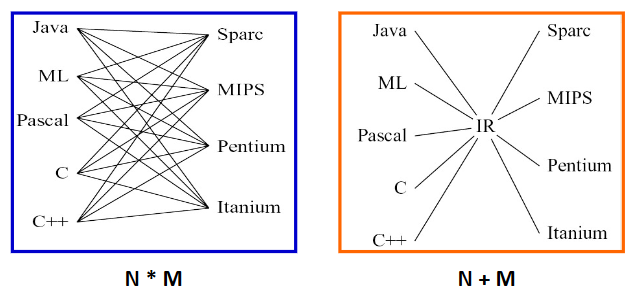

### 中间表示的定义

中间表示（IR）是

- 一种抽象机器语言
- 能够表达目标机器操作
- 无需承诺太多和机器架构有关的细节

设计目标是生成针对不同源语言和不同目标机器的可移植编译器

IR 应该设计简单

- 大块的 AST 转化为 IR
- IR 组合聚集在一起形成“真实”的机器指令

### 中间表示的分类

#### 抽象层次

实际编译器可能采用多层 IR 以支持不同层次的分析和变换


!!! note "划分界限"
    确切地说，三者之间没有严格的界限，很难严格定义给定 IR 是 HIR，MIR 还是 LIR

因此可以分为：

- 高层中间表示 High-level IR
    - 贴近输入语言，方便由前端生成
- 低层中间表示 Low-level IR
    - 贴近目标语言，方面目标代码生成
- 中层中间表示 Middle-level IR

??? example "GCC 编译器的多层 IR"
    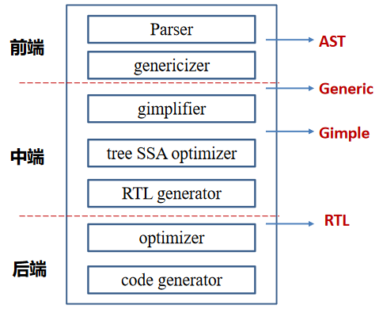

??? example "贴近输入语言的高层 IRs"
    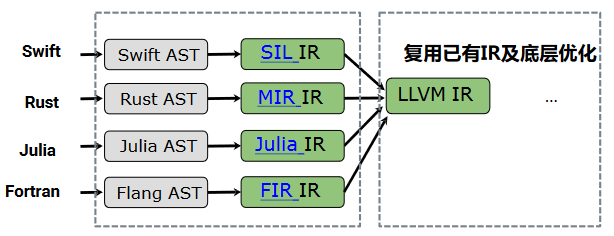
    
    现代编程语言不断推出高级中间表示

    - “高级”类型检查：borrow 检查
    - 从高级编程抽象逐步 "lowering"

#### 结构特征

- 结构化表示 Structural
    - 面向图形（例如：树、DAG ...）
    - 大量用于源到源翻译器
- 线性表示 Linear
    - 存储布局是线性的
- 混合表示 Hybrid
    - 结构化和线性表示的组合

??? example "结构化表示的示例"
    对于 `a = (-b + c * d) + c * d`

    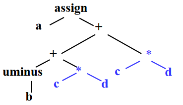

??? example "线性表示示例"
    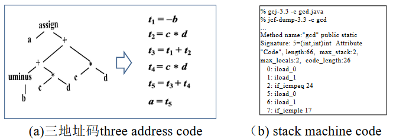

??? example "混合表示示例"
    例如控制流图（Control-flow Graph）

    - 结点内的语句是线性表示
    - 结点间构成图形化表示

    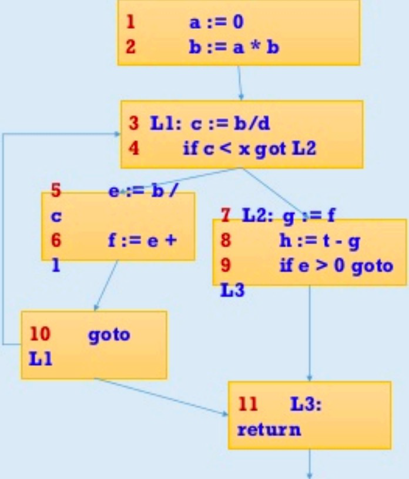

### 三地址码

三地址码的目标

- 接近大多数目标机器的执行模型 (机器码)
- 支持大多数目标机器提供的数据类型和操作
- 提供有限度的、高于机器码的抽象表达能力，更容易表达出大多数(命令式) 高级语言的特性

三地址码的特征

- 以指令为单位
- 每条指令只有有限数量的操作码

三地址码的一般形式：`x = y op z`，每个“指令”最多 1 个算符，最多 3 个操作数（三“地址”）

其中“地址”可以具有如下的形式之一：

- 源程序中的名字（name）
- 常量（constant）
- 编译器生成的临时变量（temporary）

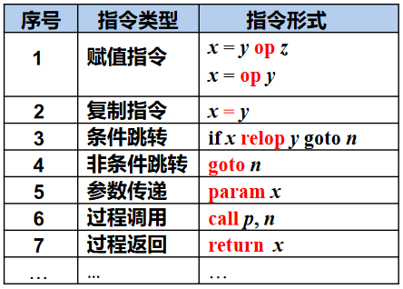

就实现上而言，整个三地址指令序列被实现为链表数组，最常见的实现是将三地址代码实现为四元组：一个字段用于操作，另三个字段用于地址，对于那些需要少于三个地址的指令，一个或多个地址字段被赋予 null 或“空”值


其他实现也有三元组、间接三元组

??? example "三地址码的示例"
    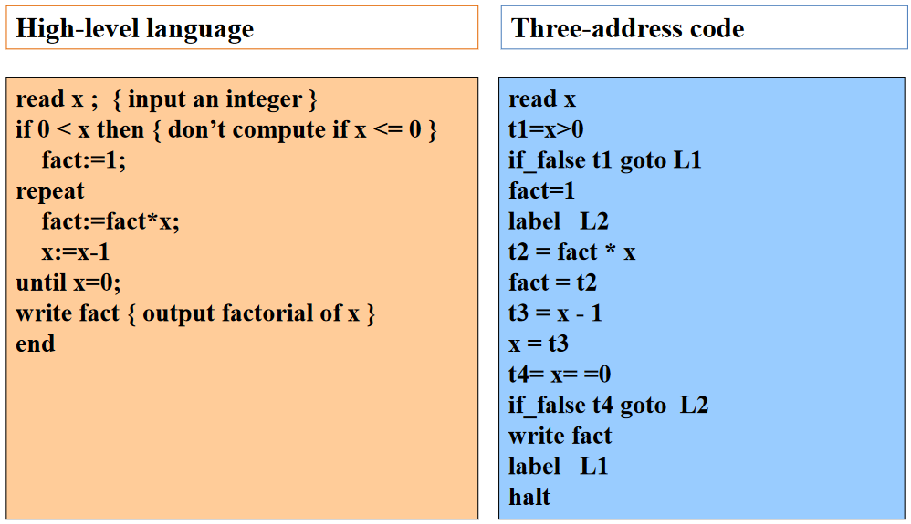

### 静态单赋值

静态单赋值（Static Single Assignment, SSA）是一种特殊的三地址代码，其所有变量在代码中只被赋值一次

基本构造思路为

- 为每个变量维护一个计数器
- 从入口开始遍历函数体
- 遇到变量赋值时，为其生成新名字，并替换
- 将新变量名传播到后续相应的使用处，并替换

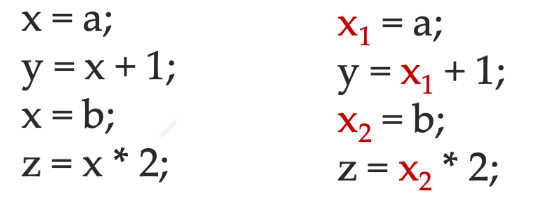

!!! note "SSA 的适用范围"
    通常只针对函数内的变量（即局部变量）计算 SSA，全局变量的 SSA 在实际当中难以计算

使用 SSA 的作用在于：

- 查询 def-use 信息(某些分析的子过程)
- 加速现有算法（基于 SSA 的稀疏分析）
- 有利于严格依赖 SSA 的算法（ssapre, new gvn, ...）
- 可以利用 SSA 的变体(memory SSA, gated SSA ...)

现在已经广泛使用于现代编译器中（如 LLVM）

## 中间表示树

一些现代编译器使用多个 IR，后面阶段的每个 IR 都比前一阶段更接近机器代码；而本教材中 Tiger 编译器只使用一种 IR，即中间表示（IR）树，翻译过程为 `AST -> IR Tree -> Assembly Code -> Machine Code`

接下来我们将介绍 Tiger 中 IR Tree 的设计和实现

!!! note "树表示"
    树表示也用于 GCC 等编译器（称为 RTL）

??? example "IR Tree 的示例"
    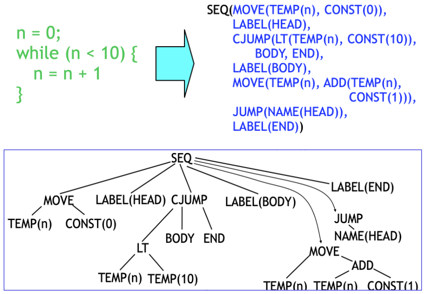

### BNF 形式的文法描述

一种特殊的树型中间语言/中间表示

```bnf
⟨Exp⟩ ::= "CONST" int
        | "NAME" ⟨Label⟩
        | "TEMP" ⟨Temp⟩
        | "BINOP" ⟨Oper⟩ ⟨Exp⟩ ⟨Exp⟩
        | "MEM" ⟨Exp⟩
        | "CALL" ⟨Exp⟩ [{⟨Exp⟩}] "call end"
        | "ESEQ" ⟨Stm⟩ ⟨Exp⟩
⟨Stm⟩ ::= "MOVE" ⟨Exp⟩ ⟨Exp⟩
        | "EXP" ⟨Exp⟩
        | "JUMP" ⟨Exp⟩ [{⟨Label⟩}]
        | "CJUMP" ⟨Relop⟩ ⟨Exp⟩ ⟨Exp⟩ ⟨Label⟩ ⟨Label⟩
        | "SEQ" [{⟨Stm⟩}] "seq end"
        | "LABEL" ⟨Label⟩
⟨Oper⟩ ::= "ADD" | "SUB" | "MUL" | "DIV" | "MOD"
⟨Relop⟩ ::= "EQ" | "NE" | "LT" | "GT" | "LE" | "GE"
```

### 表达式

表达式（Expressions）代表某些值的计算，可能有副作用

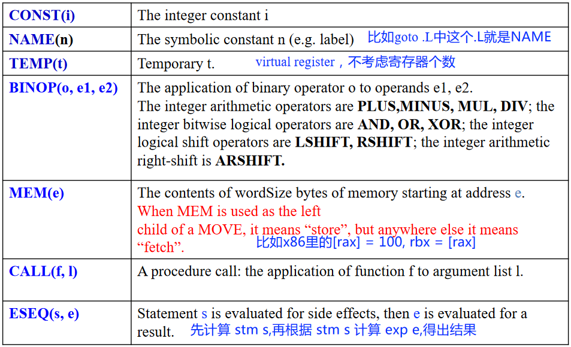

!!! note "关于副作用"
    副作用意味着更新存储单元或临时寄存器的内容

!!! note "关于 ESEQ 的理解"
    `ESEQ(s, e)` 表示执行语句 `s` 并在其副作用下计算 `e` 的结果

    - 假设 `s` 是语句 `a = 5`，`e` 是表达式 `a + 5`
    - 语句（如 `a = 5`）不返回值，但是有副作用
    - `ESEQ(a = 5, a + 5)` 最终的结果是 `10`

### 语句

语句（Statements）执行副作用并控制流程，无返回值

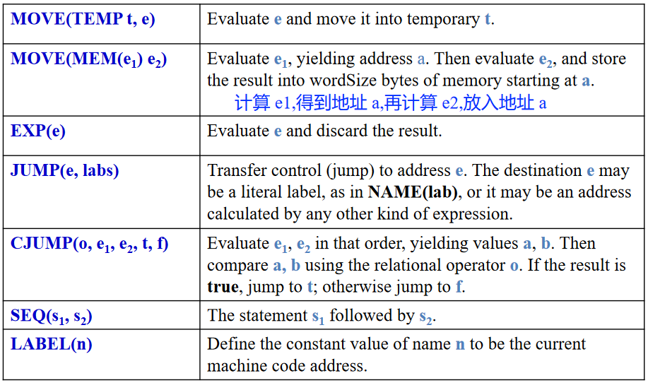

!!! warning "注意 Label 和 Expression 中的 Name 的区别"
    Name是使用这个 symbol，比如 `goto .L`，而 Label 是定义这个 symbol，即 `.L:`

## 中间表示树的生成

### 表达式的翻译

#### 总览

Tiger 编译器不区分 expressions 和 statements，因此可以将 AST 中的 expressions 分为三类：

- 有返回值的表达式
- 无返回值的表达式（例如 `while`）
- 具有布尔值的表达式，例如 `a > b`
    - 条件跳转等

为了表示这三类表达式，我们使用 Ex、Nx 和 Cx 三种类型：

- Ex：计算值的表达式（Tree expression）
- Nx：不计算值的表达式（Tree statement）
- Cx：条件跳转，是一条可以跳转到真标签或假标签的 Tree statement（也可以看作具有布尔值的表达式）

此外，考虑 `flag := (a>b | c<d)`，可见为了给 `flag` 赋值，我们需要将 Cx 转换为 Ex（因为只有 Ex 才有返回值），所以需要在 Ex、Nx 和 Cx 表达式之间进行转换

为此，可以创建 `unEx`、`unNx`、`unCx` 这些在 Ex、Nx 和 Cx 之间转换的实用函数，从而对于不同类型的输出表达式，可以使用不同的转换函数

!!! question "为什么需要unEx, unNx, unCx这几个辅助函数？"
    - 需要考虑到 `a>b` 被使用的“上下文”
    - IR翻译是 context-dependent 问题，难以用 CFG 刻画，但是可以用属性文法、semantic actions 等方式

#### Simple Variables

!!! note "变量的大小"
    对于 Tiger，所有变量的大小相同，都是字大小

对于在当前过程的栈帧中声明的简单变量 `v`，假设帧指针为 `fp`，局部变量 `v` 的偏移量为 `k`，可以翻译为

`MEM(BINOP(PLUS, TEMP fp, CONST k))`

或简写为

`MEM(+(TEMP fp,CONST k))`

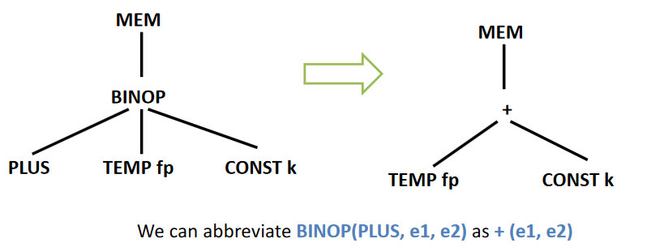

另外，如果变量在寄存器 `t` 中，只需要返回

`TEMP t`

即可

#### Array Variables

不同的编程语言对数组的处理方式不同

- 在 Pascal 中，数组变量代表数组的内容，可以直接使用 `a := b` 进行赋值
- 在 C 中，数组变量代表数组的地址，上述赋值是不合法的
- 在 Tiger 和 ML 中，数组变量的行为类似于指针
    - 没有像 C 中那样的命名的数组常量
    - 新的数组由 `ta[n] of i` 创建（并初始化）
        - `ta` 是数组类型的名称
        - `n` 是数组大小
        - `i` 是数组元素的初始值

??? example "Tiger 中数组的初始化"
    例如

    ```tiger
    let
        type intArray = array of int
        var a:= intArray[12] of 0
        var b:= intArray[12] of 7
    in a:= b
    end
    ```

    最终 `a` 指向和数组 `b` 一样的 12 个 `7`，而原始的 12 个 `0` 会被丢弃

> 此外，Tiger 中的记录（Record，可以看作结构体）本质上也是指针，赋值与数组赋值一样，是指针赋值，不会复制所有字段

??? question "数组访问"
    在上述内容，我们只介绍了数组的结构，如何转换数组访问，例如 `arr[2]`、`arr[x]`？详见 [Subscripting and Field Selection](#subscripting-and-field-selection)

#### Structured L-values

先了解一下左值（L-value）和右值（R-value）的概念：

- 右值（R-value）是出现在等式右边的值
    - 如 `a + 3` 和 `f(x)`
    - 右值并不表示可赋值的位置
- 左值（L-value）是可以出现在赋值语句左侧的表达式的结果
    - 如 `x` 和 `a[i+2]`
    - 表示可以赋值到的位置
    - 可以出现在赋值语句的右侧（在这种情况下，它意味着该位置的内容）

在 Tiger 中，整数或指针值是“标量”（它只有一个组成部分）

- 所有变量和左值都是标量
- 数组或记录变量实际上是一个指针

但是在 C 或 Pascal 中，有结构化的左值（Structured L-values）

- C 中的 struct
- Pascal 中的 array 和 record

这些并不是标量，而是结构化的，地址计算方式应为

`Mem(+(TEMP fp,CONST kn), S)`

其中 `kn` 是结构中该变量的偏移量，`S` 是结构中该变量的大小

此外，Tiger 中左值应表示为地址（没有顶部 MEM 结点），因此需要根据实际情况进行选择：

- 将左值转换为右值：从该地址获取值
- 向左值赋值：存储到该地址

#### Subscripting and Field Selection

计算 `a[i]` 的地址，为 `(i − l) × s + a`，其中：

- `l`：索引范围的下限
- `s`：每个数组元素的大小（以字节为单位）
- `a`：数组元素的基地址

> 如果 `a` 是全局的，具有编译时常量地址，则减法 `a – s ⨉ l` 可以在编译时完成

> 类似的，计算记录 `a` 的字段 `f` 的地址 `offset(f) + a`

正如上文所述，在 Tiger 语言中，所有记录和数组值实际上都是指向记录和数组结构的指针，不存在结构左值。因此，数组的“基地址”实际上是指针变量，因此需要 MEM 操作符。因此 `a[i]` 的 IR 表示为

`MEM(+(MEM(e),BINOP(MUL, i, CONST W)))`

其中 `MEM(a)` 代表 `a` 的地址，`W` 代表数组元素的大小（字节，word size）

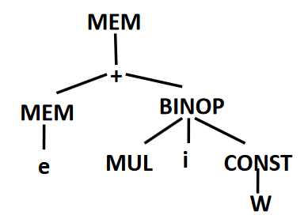

??? example "Record Access"
    对于如下的记录访问

    

    假定 `e` 是表示 `a` 地址的 IR 树，若要访问 `a.f3`，则可以使用

    `MEM(BINOP(PLUS, e, BINOP(MUL, CONST(3), CONST(w))))`

??? lab "A Sermon of (Memory) Safety"
    内存错误非常常见，因此可以插入一些额外的指令进行动态检查，如

    - Array bound check
    - Null check

    相关的工具如 [AddressSanitizer (ASAN)](https://clang.llvm.org/docs/AddressSanitizer.html) 

#### Arithmetic

对于算术表达式，因为 Tiger 中没有浮点数，只需要考虑两种：

- 二元运算（Binaries）
    - 每个算术运算符对应一个树运算符（例如，`BINOP(op, e1, e2)`）
- 一元运算（Unaries）
    - 取负数可以实现为与 0 做减法
    - 逻辑非可以实现为与 1 做异或/与 0 做相等比较
    - 取补码可以实现为与所有 1 做异或

#### Conditionals

比较运算符的结果是一个 Cx 表达式，将根据结果跳转到 true 目标和 false 目标

条件表达式可以轻松地与 Tiger 运算符 `&` 和 `|` 组合，例如 `a > b | c < d`

??? example "x < 5 的翻译"

    ```
    stm = CJUMP (LT, x, CONST(5), NULL_t, NULL_f)
    trues = {t}
    falses = {f}
    ```

那么如何处理 if 语句？以 `if e1 then e2 else e3` 为例，最直接的做法是：

- `e1`：Cx 表达式
- `e2` 和 `e3` ：Ex 表达式
- 将 `unCx` 应用于 `e1`
- 将 `unEx` 应用于 `e2` 和 `e3`
- 为条件创建两个标签 `t` 和 `f`
- 分配临时 `r`
- 在标签 `t` 之后，将 `e2` 移动到 `r`
- 在标签 `f` 之后，移动 `e3` 到 `r`
- 两个分支都通过跳转到新创建的 `join` 标签来结束

```
unCx(e1)
LABEL t
r = unEx(e2)
JUMP join
LABEL f
r = unEx(e3)
JUMP join
...
LABEL join
...
```

此外，如果 `e2` 和 `e3` 都是 statements，`unEx` 是可以的，但最好专门识别这种情况；而如果 `e2` 或 `e3` 是 Cx 表达式，`unEx` 将产生可怕的跳转和标签混乱。因此最好特别处理这种情况：

```c
case Tr_cx: {
    Temp_temp r = Temp_newtemp( );
    Temp_label t = Temp_newlabel( ), f= Temp_newlabel( );
    doPatch(e->u.cx.trues, t);
    doPatch(e->u.cx.falses, f);
    return  T_Eseq(T_move(T_Temp(r),T_Const(1)),
                T_Eseq(e->u.cx.stm,
                    T_Eseq(T_Label(f),
                        T_Eseq(T_Move(T_Temp(r), T_Const(0)),
                            T_Eseq(T_Label(t), T_Temp(r))))));
}
```

??? example "if x < 5 then a > b else 0 的翻译"
    `x < 5` 被翻译为 `Cx(s1)`，`a > b` 被翻译为 `Cx(s2)`，则整体可以表示为

    `SEQ(S1(z,f), SEQ(LABEL Z, s2(t,f)))`

    类似于 `if x < 5 & a > b then 1 else 0`

    

??? example "if (b==0) a = b 的翻译"
    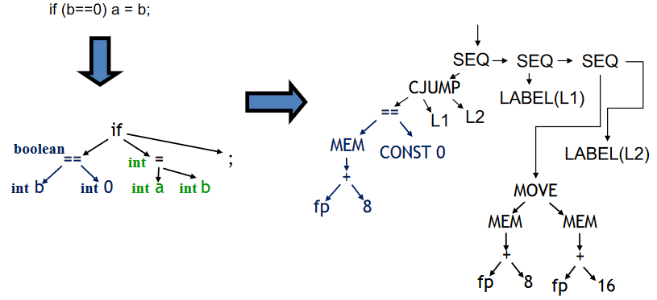

??? example "if (E) S 的翻译"
    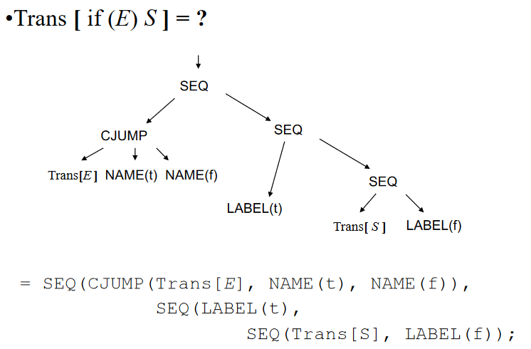

#### While Loops

While 循环的一般布局是

```
test:
    if not(condition) goto done
    body
    goto test
done:
```

如果 `break` 语句出现在主体中（并且没有嵌套在任何内部 `while` 语句中），则转换只需要一个 JUMP 即可完成。其中翻译 `break` 语句（transExp 函数）需要有一个新的形式参数 `break`，其值为最近的封闭循环的 `done` 标签

#### For Loops

翻译 `for` 语句（`lo to hi` 看作 `[lo, hi]`）的一种简单方法是将抽象语法重写为所示的 `let/while` 表达式的抽象语法，即从

```
for i := lo to hi
do body
```

改为

```
let var i := lo
    var limit := hi
in while i <= limit
    do (body; i := i+1)
end
```

但是当 `limit = maxint` 时，`i + 1` 会因为溢出而导致循环不可停，因此可以优化为：

```
if lo > hi goto done
i := lo
limit := hi
test:
    body
    if i >= limit goto done
    i := i+1
    goto test
done:
```

#### Function Call

转换函数调用 `f (a1, ..., an)` 很简单，只是必须将 **static link** 添加为隐式额外参数

`CALL(NAME l_f, [sl, e1, e2, ..., en ])`

其中

- `l_f` 是 `f` 的标签
- `sl` 是 static link，是指向 `f` 父级的指针（a pointer to `f`'s parent level）

!!! note "*还不清楚的点*"
    Both the level of `f` and the level of the function calling `f` are required to calculate `sl`

### 声明的翻译

- 变量声明
    - 需要计算出帧（frame）中的偏移量（offset），然后将右侧表达式的值移动（move）到帧（frame）中的正确位置（slot）
- 类型声明
    - 无需生成任何 IR 树代码
- 函数声明

#### Variable Definition

在语义分析中，`transDec` 函数更新值 t 和 `let` 表达式主体的类型环境。而对于 IR 转换，`transDec` 应该返回一个额外的结果作为变量的初始化

- 将初始化转换为赋值表达式
- 必须将其放在 `let` 主体之前

如果 `transDec` 应用于函数和类型声明，则结果将是“无操作”表达式，例如 `Ex(CONST(0))`

#### Function Definition

函数被翻译成由三个组件组成的“汇编语言段”：

- Prologue
    - 1 标记函数开始的伪指令（特定汇编语言中需要）
    - 2 函数名称的标签定义
    - 3 调整栈指针的指令（分配新帧）
    - 4 将逃逸（escaping）参数（包括静态链接）保存到帧中以及将非逃逸参数移动到新的临时寄存器中的指令
    - 5 存储指令以保存函数内使用的任何被调用者保存寄存器（包括返回地址寄存器）
- Body
    - 6 主体代码翻译后的表达
- Epilogue
    - 7 将返回值（函数的结果）移至寄存器的指令
    - 8 加载指令以恢复被调用者保存寄存器
    - 9 重置栈指针（释放帧）的指令
    - 10 返回指令（JUMP到返回地址）
    - 11 根据需要使用伪指令来宣布函数结束

其中步骤 1、3、9、11 取决于栈帧的确切大小，且这些是较晚生成的（在寄存器分配之后）